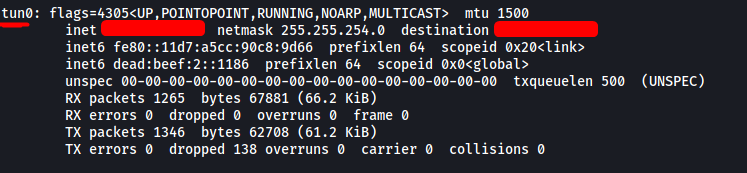
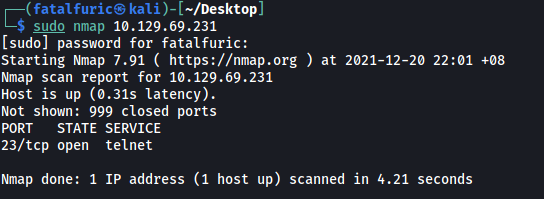
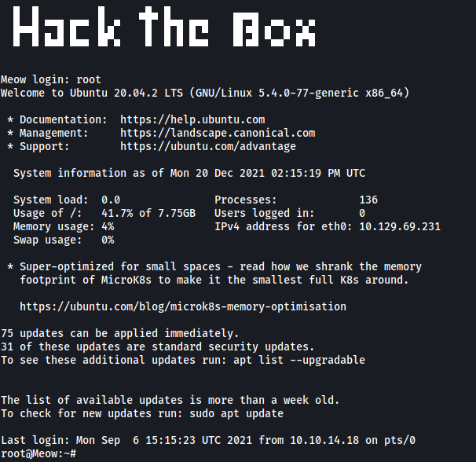
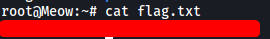

# Meow

##### Difficulty: [ Very Easy ]

**Tags:** `Linux`,  `telnet`,  `Account Misconfiguration`

---

##### Written: 20/12/2021

##### IP address: 10.129.69.231 

---

### [ What does the acronym VM stand for?  ]

**Virtual Machine**

---

### [ What tool do we use to interact with the operating system in order to start our VPN connection? ]

**Terminal**

---

### [ What service do we use to form our VPN connection? ]

**openvpn**

---

### [ What is the abreviated name for a tunnel interface in the output of your VPN boot-up sequence output? ]

We can use `ifconfig` to find out:



Name of tunnel interface: **tun**

---

### [ What tool do we use to test our connection to the target? ]

**Ping**

---

### [ What is the name of the script we use to scan the target's ports? ]

**nmap**

---

### [ What service do we identify on port 23/tcp during our scans? ]

We can run a basic nmap scan with:

```
sudo nmap 10.129.69.231 
```



The service running on port 23 is **telnet**.

---

### [ What username ultimately works with the remote management login prompt for the target? ]

Let's try connecting to the telnet server.

```
telnet 10.129.69.231 
```


We are prompted to log in with a username. Let's try a common username: **root**



Nice it works! The username that works is: **root**

---

### [ Submit root flag ]

The root flag can be found in **/root**:


