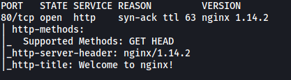
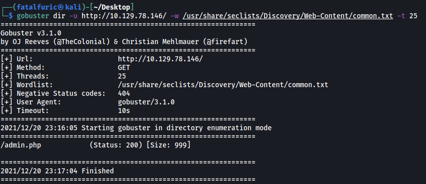
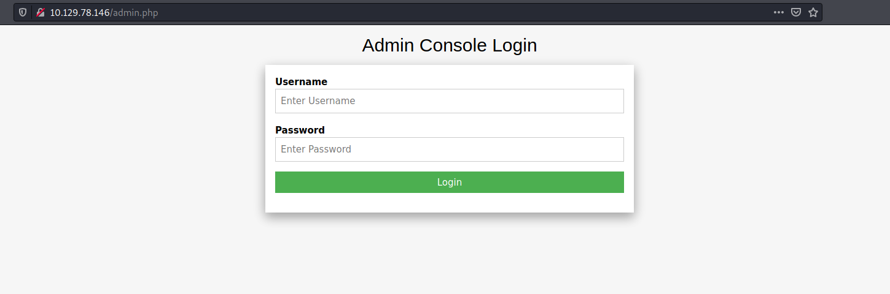
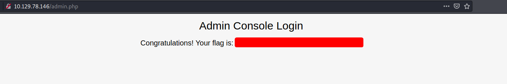

# Preignition

##### Difficulty: [ Very Easy ]

**Tags:** `Linux`,  `Web`,  `PHP`,  `Default Credentials`

---

##### Written: 20/12/2021

##### IP address: 10.129.78.146

---

### [ What is considered to be one of the most essential skills to possess as a Penetration Tester? ]

**Dir Busting**

---

### [ What switch do we use for nmap's scan to specify that we want to perform version detection ]

**-sV**

---

### [ What service type is identified as running on port 80/tcp in our nmap scan? ]

Let's run a basic **Nmap** scan on our target. We use `-sC` to load in standard scripts, `-sV` for version enumeration, `-vv` for increased verbosity and `-T4` for increased aggressiveness:

```
sudo nmap -sC -sV -vv -T4 10.129.78.146
```



From the results, we can see that **http** is running on port 80/tcp.

---

### [ What service name and version of service is running on port 80/tcp in our nmap scan? ]

nmap also reveals that **nginx 1.14.2** is running on port 80.

---

### [ What is a popular directory busting tool we can use to explore hidden web directories and resources? ]

**Gobuster**

---

### [ What switch do we use to specify to gobuster we want to perform dir busting specifically? ]

**dir**

---

### [ What page is found during our dir busting activities? ]

Let's now run a Gobuster scan:

```
gobuster dir -u http://10.129.78.146/ -w /usr/share/seclists/Discovery/Web-Content/common.txt -t 25
```

We'll be using the **common.txt** wordlist from **seclists** (https://github.com/danielmiessler/SecLists).



Gobuster managed to find the **admin.php** page.

---

### [ What is the status code reported by gobuster upon finding a successful page? ]

Status code: **200**

---

### [ Submit root flag ]

Let's go ahead and visit http://10.129.78.146/admin.php:



And we have a login page.

A common default credentials for such login pages is **admin:admin**. Let's see if those creds work:



Nice! We managed to log in and are rewarded with the root flag.
