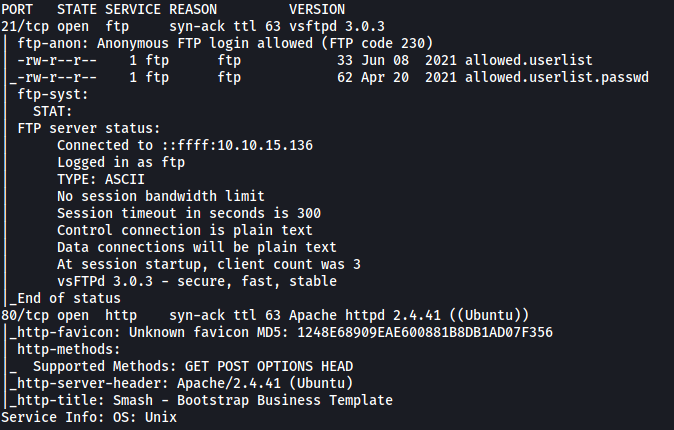
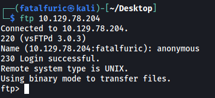
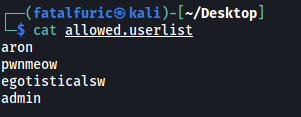
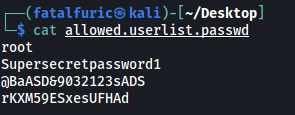
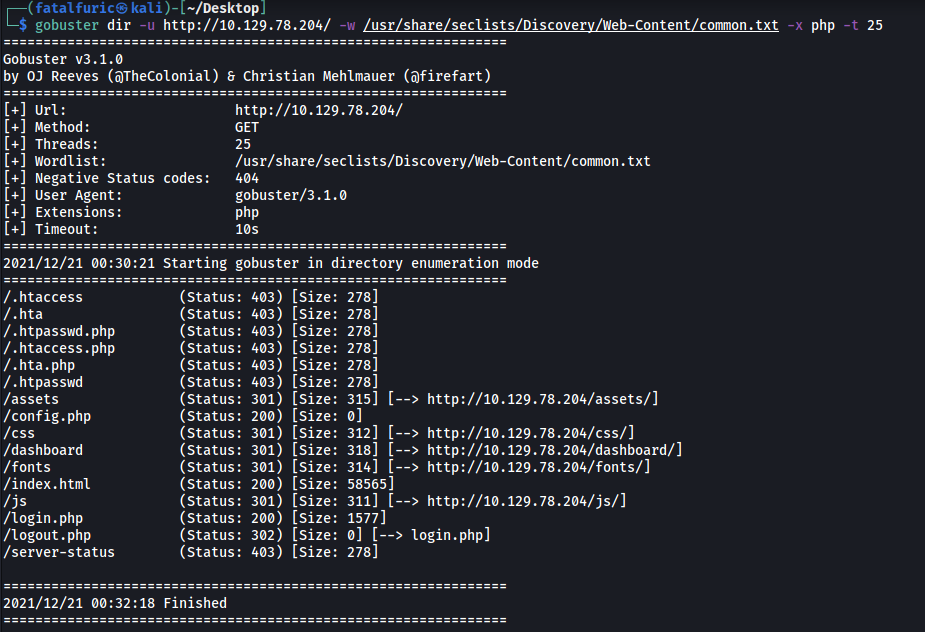
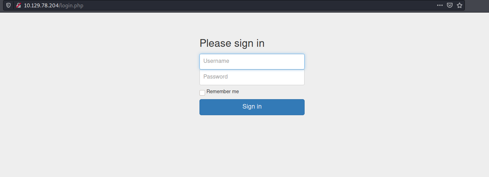
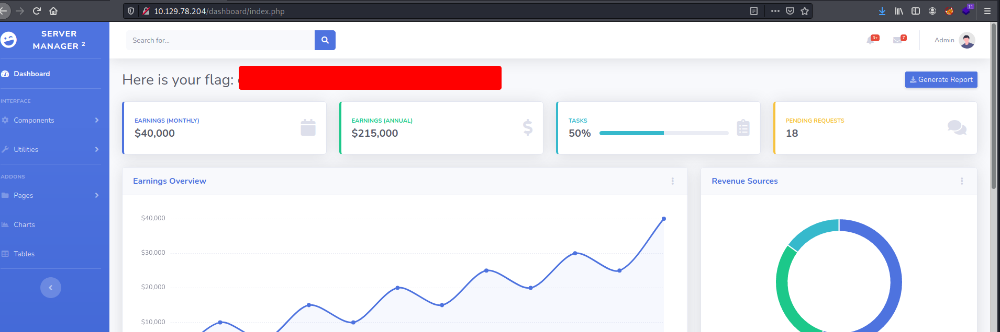

# Crocodile

##### Difficulty: [ Very Easy ]

**Tags:** `Linux`,  `PHP`,  `FTP`

---

##### Written: 21/12/2021

##### IP address: 10.129.78.204

---

### [ What nmap scanning switch employs the use of default scripts during a scan? ]

**-sC**

---

### [ What service version is found to be running on port 21? ]

Let's run a basic **Nmap** scan on the target machine.

```
sudo nmap -sC -sV -vv -T4 10.129.78.204
```



Looks like there are 2 ports open: **21** (FTP) and **80** (HTTP).

**vsftpd 3.0.3** is running on port 21.

---

### [ What FTP code is returned to us for the "Anonymous FTP login allowed" message? ]

FTP code **230** is returned, indicating that **anonymous login** is allowed.

---

### [ What command can we use to download the files we find on the FTP server? ]

**get**

---

### [ What is one of the higher-privilege sounding usernames in the list we retrieved? ]

Let's go ahead and log into the FTP server with the username '**anonymous**'. We will not need to supply a password.

```
ftp 10.129.78.204
```



There are two files in the FTP server: **allowed.userlist** and **allowed.userlist.passwd**.

I downloaded them onto my local machine using `get`.

**Contents of allowed.userlist:**



**Contents of allowed.userlist.passwd:**



From **allowed.userlist**, a higher-privilege username retrieved is: **admin**

---

### [ What version of Apache HTTP Server is running on the target host? ]

Going back to our nmap scan, we can see that version **2.4.41** of Apache is running.

---

### [ What is the name of a handy web site analysis plug-in we can install in our browser? ]

**Wappalyzer**

---

### [ What switch can we use with gobuster to specify we are looking for specific filetypes? ]

**-x**

---

### [ What file have we found that can provide us a foothold on the target? ]

Let's visit the HTTP website:


<br>

Let's go ahead and run a **Gobuster** scan on the target to enumerate any hidden directories. I'll use the `-x` option to look for **.php** files.

```
gobuster dir -u http://10.129.78.204/ -w /usr/share/seclists/Discovery/Web-Content/common.txt -x php -t 25
```



From the results, we can see an interesting file: **login.php**

---

### [ Submit root flag ]

Let's visit http://10.129.78.204/login.php:



As expected, we have a login page.

The **allowed.userlist.passwd** file actually contains the passwords to the various usernames obtained from **allowed.userlist**. From the two files, we can obtain the admin credentials: **admin:rKXM59ESxesUFHAd**

With those credentials, we can log into the admin account and obtain the root flag:


