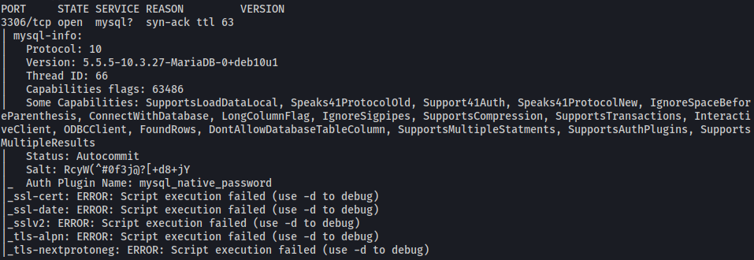
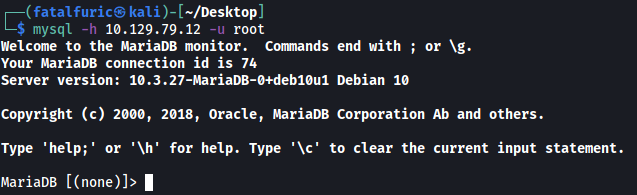
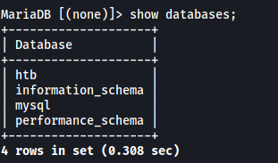
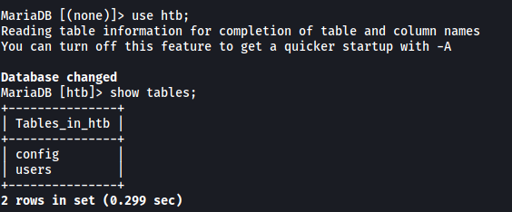

# Sequel

##### Difficulty: [ Very Easy ]

**Tags:** `Linux`,  `SQL`,  `MariaDB`,  `Weak Password`

---

##### Written: 21/12/2021

##### IP address: 10.129.79.12

---

### [ What does the acronym SQL stand for? ]

**Structured Query Language**

---

### [ During our scan, which port running mysql do we find? ]

Let's run a basic **Nmap** scan on the target machine.

```
sudo nmap -sC -sV -vv -T4 10.129.79.12
```



From the results, we know that mysql is running on port **3306**.

---

### [ What community-developed MySQL version is the target running? ]

Nmap also reveals that the MySQL version running is **MariaDB**.

---

### [ What switch do we need to use in order to specify a login username for the MySQL service? ]

**-u**

---

### [ Which username allows us to log into MariaDB without providing a password? ]

Let's try login into the MariaDB server with the username: **root**. Hopefully we are able to log into the server without requiring a password.

```
mysql -h 10.129.79.12 -u root
```



Nice, we're in! The username is: **root**

---

### [ What symbol can we use to specify within the query that we want to display eveything inside a table? ]

**\***

---

### [ What symbol do we need to end each query with? ]

**;**

---

### [ Submit root flag ]

Let's first see what databases are in the server:

```
show databases;
```



The '**htb**' database seems interesting. Let's see what tables are in it:

```
use htb;
show tables;
```



Finally, let's dump out all the data in the '**config**' table:

```
select * from config;
```


And the root flag is in the table!
