# Basic Pentesting

##### Written: 27/08/2020

**IP Address:** 10.10.198.36

<br>

I first navigated to the IP address in Firefox, which led me to this page:

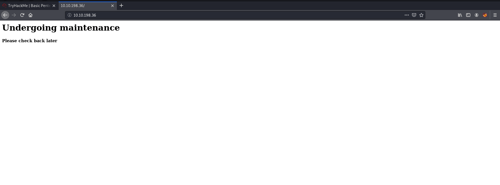

I then ran a **nmap** scan on the IP using the command

```
nmap -sV -p- -vv --script vuln 10.10.198.36 
```

which obtained the following results:

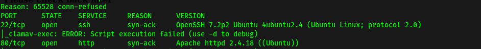

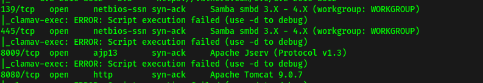

<br>

As we can see, the ports open are **22** (SSH), **80** (HTTP), **139** (samba), **445** (samba), **8009** and **8080**.

At the same time, I was using **DirBuster** (GUI), with their provided wordlist, which told me that **'development'** was a directory that gave us a 200 response code (request succeeded).

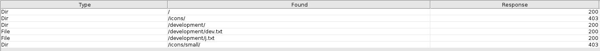

<br>

*An alternate method to find out about the 'development' directory is to use **Nikto**, which is a well-known vulnerability scanner.*

Navigating to the 'development' directory, I can see two files, "**dev.txt**" and "**j.txt**"! "Dev.txt" tells us that struts is configured, and also reveals that there are two users: **K** and **J.** 

"j.txt" tells us that j has a non-secure password that can be easily cracked! Now we know who to target.

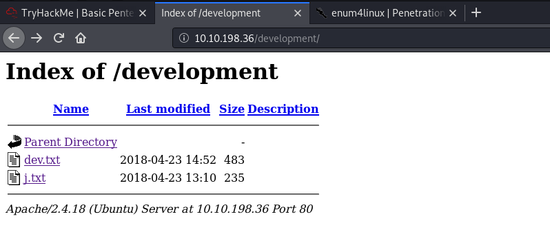

<br>

To find out the actual users, I decided to use **Linux4Enum,** a tool for enumerating information from windows and **samba systems**. In this case, since I know that the server hosts samba, I can use this tool to hopefully find our the users on it.

Using the command 

```
enum4linux 10.10.198.36
```

I obtained the following users:

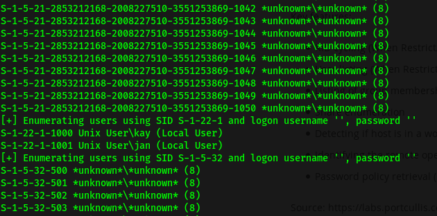

*(NOTE: the command **enum4linux -a 10.10.198.36** can also be used!)*

<br>

Hence, "**jan**" and "**kay**" are the two local users!

I then used **Hydra**, a password-cracking tool, to brute-force into the SSH server which is hosted on port 22. I used the username "jan" since I know that her password is insecure. The wordlist used is **rockyou.txt**. The command used is:

```
hydra -l jan -P /usr/share/wordlists/rockyou.txt 10.10.198.36 -t 4 ssh
```

After awhile, Hydra revealed that the password is "**Armando**"!

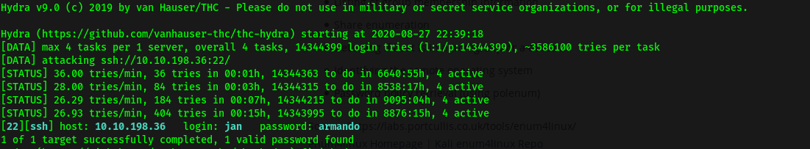

<br>

Now, we can log into the SSH server as jan :smiling_imp: 

Let's explore!

Jan's home directory had nothing on it, while kay had a **"pass.bak"** file (.bak is a type of backup file). Unfortunately, that file is only accessible by kay, which we do not know the password to. We can know this information by using a simple "**ls -al**" command:

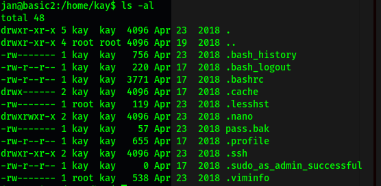

Using 

```
sudo -l 
```

I can also find out that jan is not in the sudoers group, which means she cannot run as root.

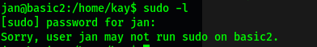

<br>

To speed the enumeration process, I used **linPEAS,** a linux privilege-escalation script that helps us to find attack vectors and other useful information!

I first tried to scp (transfer) the linpeas.sh file into /home/jan. However, I kept getting permission denied. I soon realized that only **root** can write into that directory. I then decided to scp to **/dev/shm** as it can be written into by all users.

<br>

The command used is:

```
 scp linpeas.sh jan@10.10.198.36:/dev/shm
```

With the linpeas shell script successfully sent to the remote server, I used 

```
chmod +x linpeas.sh
```

to make it an executable file. Then I just ran it with **./linpeas.sh**. The linpeas.sh will then proceed to enumerate important information in regards to the machine. Once the script is done, we can look through the results to identify any possible privilege escalation vectors.

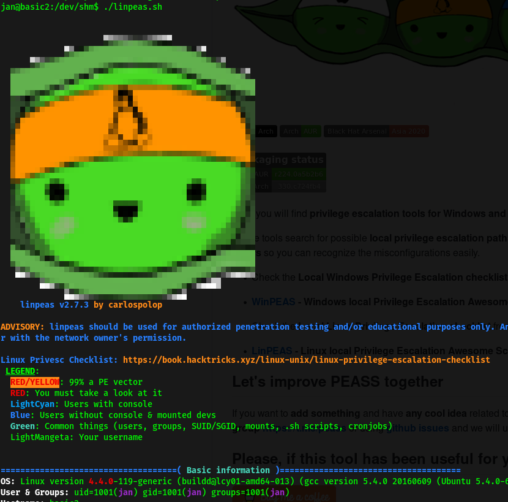

<br>

Upon inspecting the report, I noticed something potentially exploitable:

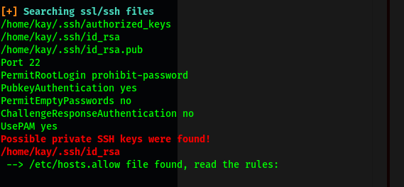

Kay's private SSH keys were found! That means that I could use that to ssh into the server, instead of supplying a password. At first, I tried to scp that file over to my local computer, but I realised that I could not as I did not have the correct permissions. 

However, a "**ls -l**" revealed that I could actually read the file as jan.

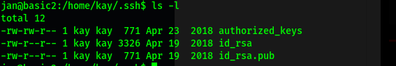

<br>

I then copied the entirety of its contents and saved it into a new text file in my local machine.

Using the command 

```
ssh kay@10.10.198.36 -i id_rsa_kay
```

I tried to ssh into the server as kay, however, I was greeted with this error message:

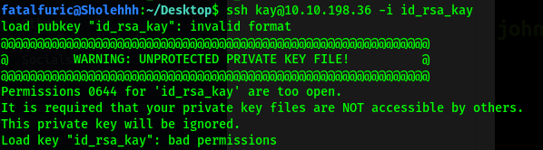

<br>

Turns out that ssh keys prefer to have their permissions set to "rw" by owner only. Hence, we use the command 

```
chmod 600 id_rsa_kay
```

which will set the correct permissions.

*NOTE: you can also use: chmod 400 (readable by owner only) or 600 (readable and writable by owner)*

<br>

I then ran the ssh command again.

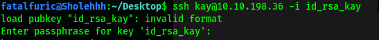

This time, I was greeted with a query for a passphrase. A passphrase just encrypts the key locally using AES-128, so that any attacker on your system will not be able to read the private key contents.

To crack the passphrase, I can use the **ssh2john** tool by **john the ripper**. This tool can be found as a .py file within the john directory in /usr/share. It translates the ssh key file into a file that can be cracked by john. The command used is:

```
/usr/share/john/ssh2john.py id_rsa_kay > forjohn.txt
```

I then used john the ripper on the "forjohn.txt" file, with the rockyou.txt wordlist.

The command used is: 

```
sudo john --wordlist=/usr/share/wordlists/rockyou.txt forjohn.txt
```

John tells us that the password for user kay is "**beeswax"**.

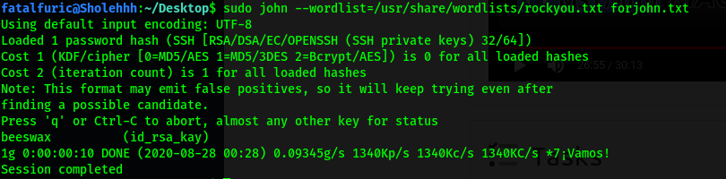

<br>

Now we can ssh into the server as kay. With that, we can finally read the "pass.bak" file, which gives us the flag to the room.

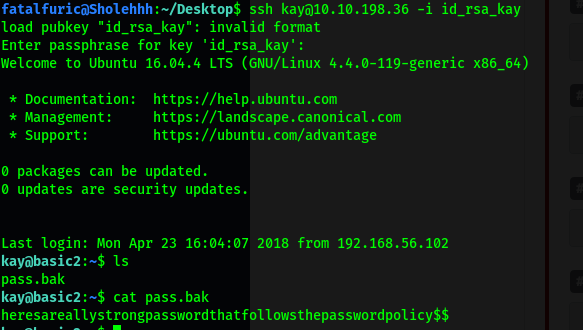