# Pickle Rick

##### Difficulty: [ Easy ]

**Tags:** `Linux`,  `nmap`,  `HTTP source code`,  `robots.txt`,  `gobuster`,  `OS Injection`,  `reverse shell`,  `full sudo privileges`

---

##### Written: 20/09/2020

##### IP Address: 10.10.28.153

---

### Deploy the virtual machine on this task and explore the web application.

### [ What is the first ingredient Rick needs? ]

First, let's run a basic **nmap** scan (top 1000 ports) on the machine.

```
sudo nmap -sC -sV -vv 10.10.28.153
```

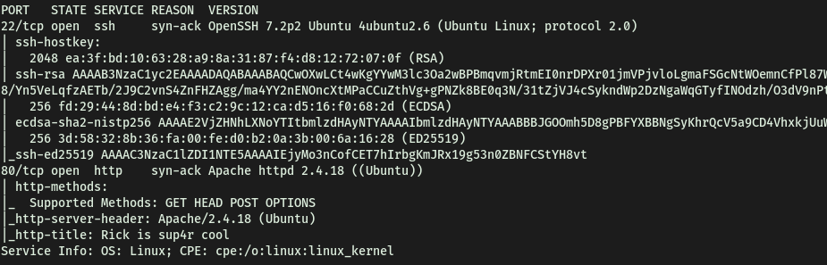

Looks like we got an **SSH** **server** and a **webserver** running. While we continue with our manual enumeration, let's also run another more thorough nmap scan, this time against ALL the ports on the machine.

```
sudo nmap -sC -sV -vv -p- 10.10.28.153
```

<br>

While the thorough nmap scan is running in the background, let's check out that webserver.

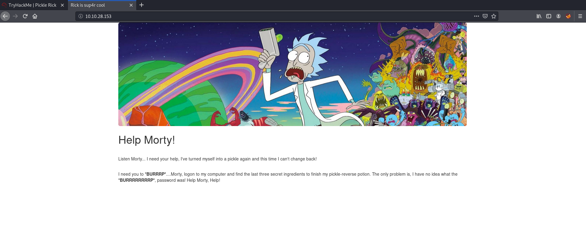

Looks like nothing of significance so far. we can run a **Gobuster** directory brute-force attack against the webserver to see if we can enumerate any hidden directories. We'll also be specifying the extension to search for **.php** as well, using the **-x** tag.

```
gobuster dir -u http://10.10.28.153/ -x php -w /usr/share/wordlists/dirbuster/directory-list-2.3-medium.txt
```

<br>

While Gobuster is working, we can do some manual enumeration. Let's first take a look at the **source code**.

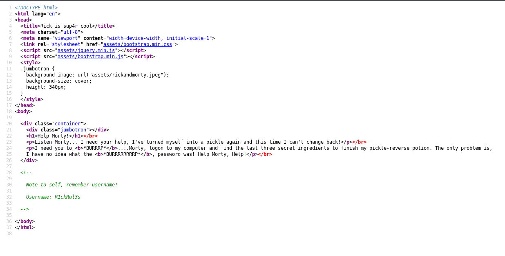

Interestingly enough, we find a username: **R1ckRul3s**

**/robots.txt** also had some funny text:

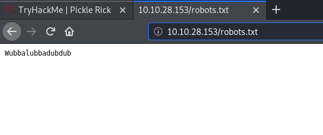

At this moment, our Gobuster scan managed to find two interesting directories: **login.php** and **portal.php**. Let's check them out.

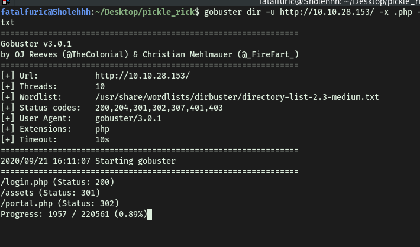

<br>

**/login.php** brings us to this page:

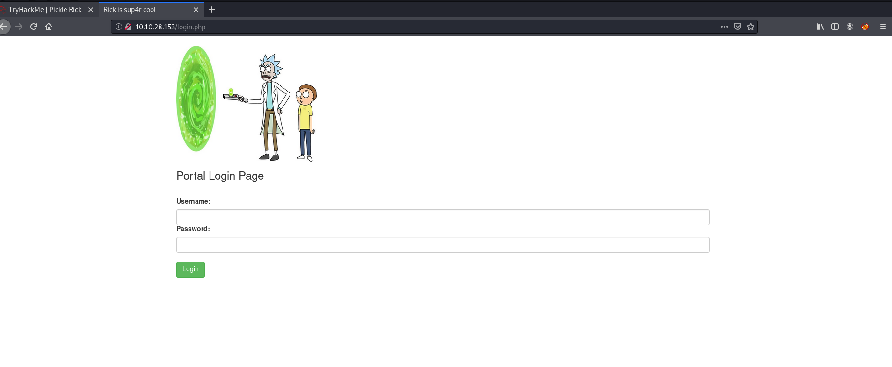

<br>

Going to **/portal.php** just redirects us back to **/login.php**. Looks like the next step would be to try brute-force our login using the username found earlier. We will be using **Hydra** to carry out the brute-force attempt.

However, before using Hydra, we need to see what error message appears when we log in with incorrect credentials:

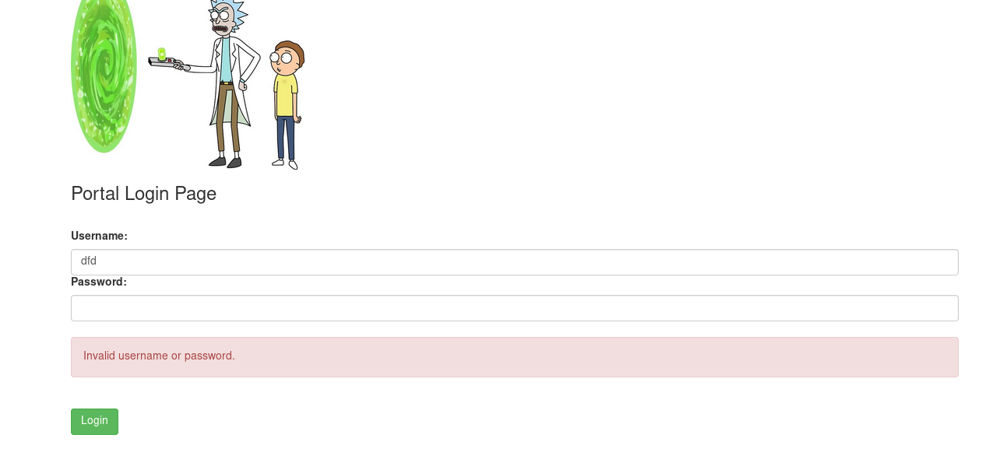

This is so that Hydra knows what to look out for when brute-forcing, to see whether its attempts are successful or not. Here, we can use the word **'Invalid'** to signal Hydra that an attempt failed.

After running Hydra with **rockyou.txt**, I was surprised to see that there were numerous passwords that could be used with the **R1ckRul3s** username:

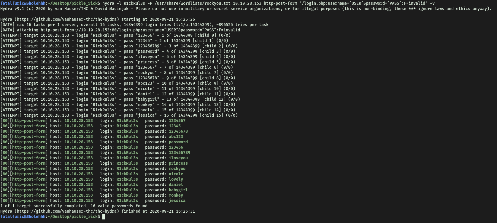

Unfortunately, none of the passwords worked! After doing some research, I believe what is happening is that because of the way I configured Hydra, it is not properly sending the HTTP-POST request to login. Hence, it is never coming to the page where it says 'Invalid username or password'. Thus, it just thinks that the first password passes. Since Hydra runs 16 threads, that means that the first passwords of each of those 16 threads will **pass**, resulting in 16 possible passwords.

One reason why it is not configured properly is that when our browser sends the POST request to login, it sends it with other **headers**. Therefore, in our hydra configuration, we need to include those headers.

We can do this with the **H** tag. First, let's see what are the headers involved in a HTTP-POST request. First, we open up the **network** of the **inspector** (ctrl-shift-i). We then enter a wrong username/password. The post request should be captured in the network tab.

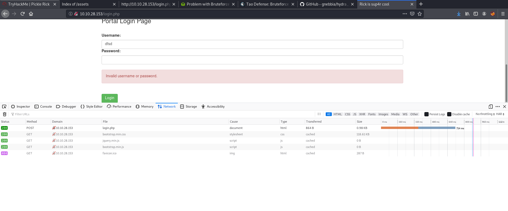

As we can see, the first captured entry is the http-post request. From here, we also know that hydra needs to use a **http-post-form** field. Clicking on it, we can look at the right to see the **request headers** (NOT RESPONSE HEADERS).

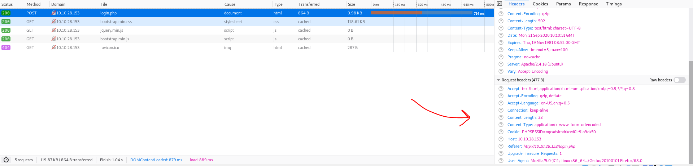

Based on my research, the most common header to add would be the **Cookie** header. With all of this information, we can now construct the hydra command. This is the command used:

```
hydra -l R1ckRul3s -P /usr/share/wordlists/rockyou.txt 10.10.28.153 http-post-form "/login.php:username=^USER^&password=^PASS^:F=Invalid:H=Cookie:PHPSESSID=ngcadslrndrkcvd0ir9io9ok50" -V
```

<br>

**Explanation:**

Everything remains the same as in past usages of Hydra, except now we have to specify a new header to be added into our request. Hence, after '**F=Invalid:**', we add **"H=Cookie::PHPSESSID=ngcadslrndrkcvd0ir9io9ok50"**. The "**Cookie::PHPSESSID=ngcadslrndrkcvd0ir9io9ok50"** is just a direct copy from the header value in the inspector. With all of this set, we can run Hydra properly now, and we will see that it is actually brute-forcing.

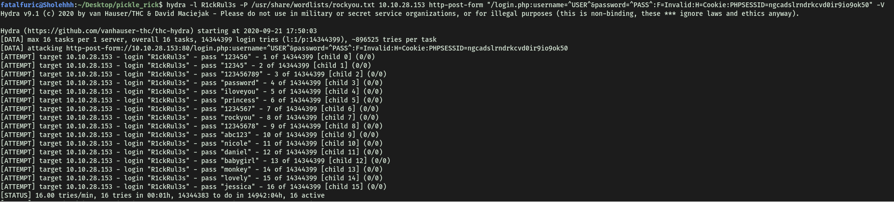

Unfortunately, Hydra was taking a very long time (only 1.07 tries/min). I started to think that perhaps brute-forcing the password was not the way to go. After consulting a write-up, I realized I had made a careless mistake. The funny phrase in the '**/robots.txt**' was actually the password. I should have considered that a possibility, instead of just writing it off as a random remark.

 <br>

Now we have the username (**R1ckRul3s**) and password (**Wubbalubbadubdub**). Let's log in.

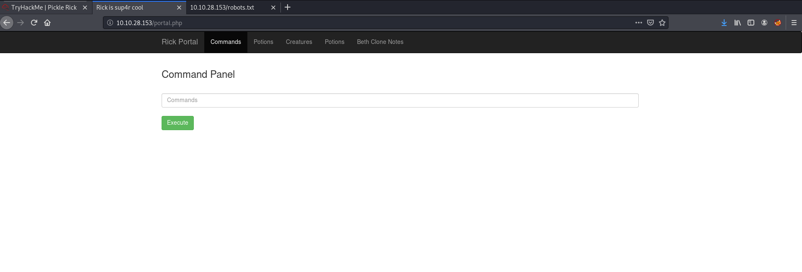

We come to a page where we have a command panel. Could we inject shell commands? 

Also, checking out the other pages, they all require us to have the **rick's account** to access:

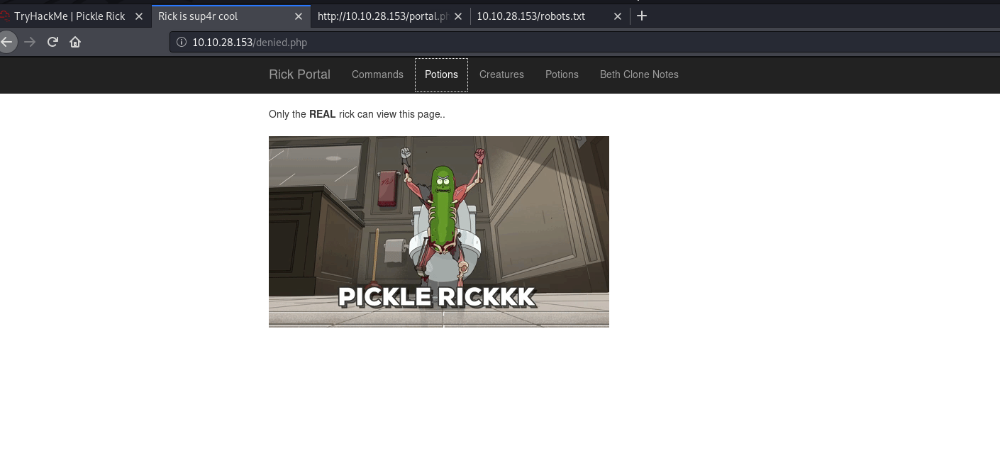

Let's try out that command panel. Running **whoami** gives us:

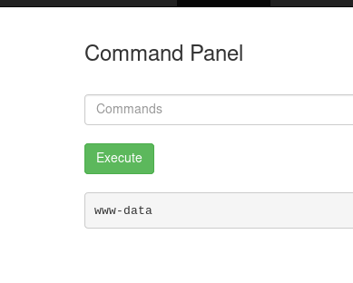

Nice. This proves that a command injection attack is possible. One possible thing we can do is to set up a reverse-shell script. Before we do that, let's check out the source code to make sure we don't miss anything:

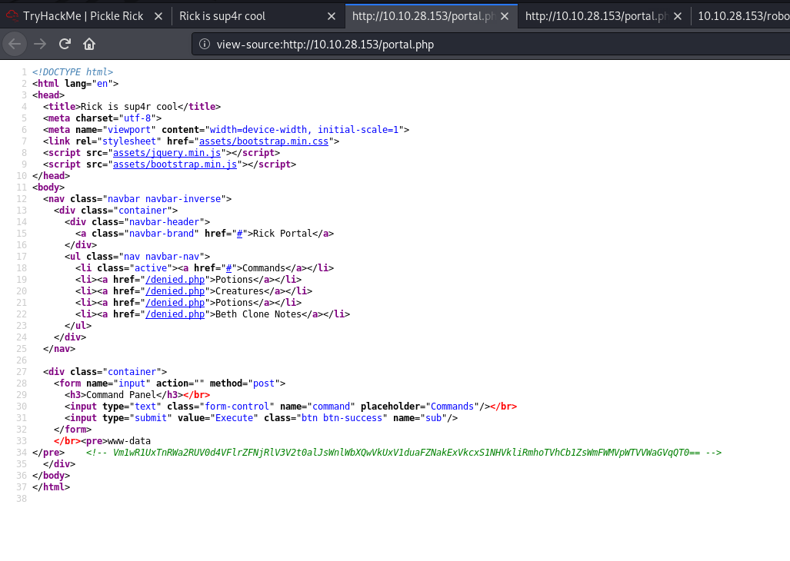

That's a weird string: **Vm1wR1UxTnRWa2RUV0d4VFlrZFNjRlV3V2t0alJsWnlWbXQwVkUxV1duaFZNakExVkcxS1NHVkliRmhoTVhCb1ZsWmFWMVpWTVVWaGVqQT0==**

Since this is base64 encoding, we can use an online base64 decoder to decode it. After decoding it once, I realized that this string has been base64 encode **multiple** times in a row. Hence, after decoding and decoding, we find out that the string is actually "**rabbit hole**. Looks like there's nothing else of interest with this string.

<br>

**After using ls:**

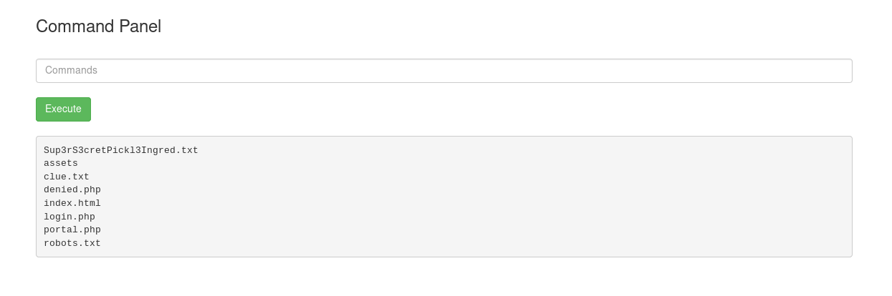

**Trying to cat Sup3rS3cretPickl3Ingred.txt**

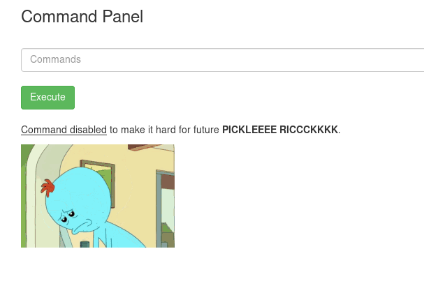

**Finding the Python3 --version**

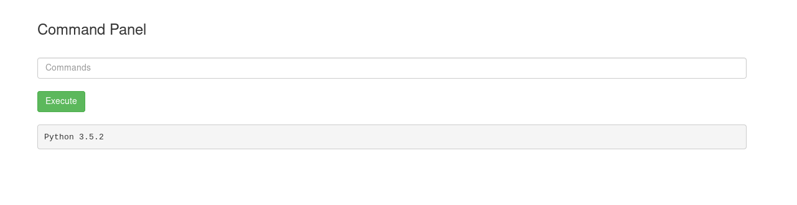

<br>

Let's try and set up a reverse shell script. We'll be using **pentestmonkey's** cheat sheet (https://pentestmonkey.net/cheat-sheet/shells/reverse-shell-cheat-sheet) to help us. Since python is installed, we can use the python command to do so:

 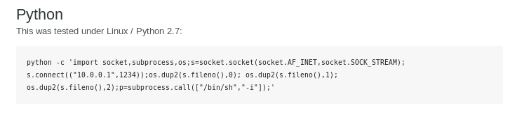


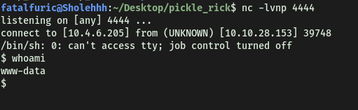

And we're in!

Since we'll now be running commands within our own shell, we should not be restricted to whatever can be displayed in the browser. That means that we'll be able to run the ```cat``` command.

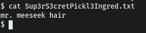

With that, we can obtain the first flag.

---

### [ Whats the second ingredient Rick needs? ]

Looking at **clue.txt**:

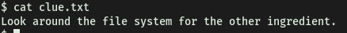

Checking for our **sudo privileges**, turns out that we actually have **full sudo privileges**:

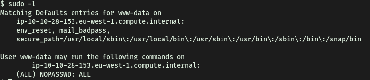

This could come in handy later on. For now, let's see what users are on this machine. Going to the **home** directory, there seems to be 2 users:

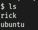

In rick's directory, we find the second ingredient:

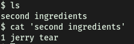

---

### [ Whats the final ingredient Rick needs? ]

I'm guessing the last ingredient will be found in the **root** folder. Since we can run **sudo** fully, we can just open up another bash shell as root. This can be done with a simple ```sudo bash```. From here, we can cd into the root folder and obtain the last flag.

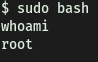

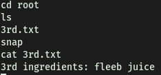

