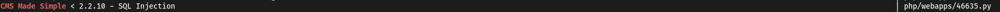

# Simple CTF

##### Difficulty: [ Easy ]

**Tags:** `Linux`,  `nmap`,  `gobuster`,  `cms_made_simple`,  `searchsploit`,  `sqli`,  `hashcat`,  `ftp`,   `ssh`,  `vim`

---

##### Written: 16/09/2020

##### IP Address: 10.10.225.30

---

### [ How many services are running under port 1000? ]

Running a basic (only top 1000 ports) nmap scan, we obtain the following results.

```
sudo nmap -sC -sV -vv 10.10.225.30
```


No of services running under port 1000: **2**

---

### [ What is running on the higher port? ]

**ssh** is running on the higher port.

---

### [ What's the CVE you're using against the application? ] 

At first, I was trying to see if there was any exploit associated with the FTP server running on port 21 (**vsftpd 3.0.3**). However, I was unable to find a good exploit to use.

Fortunately, my **Gobuster** scan (which I had running earlier) revealed that there was a directory called **/simple**.

<br>

Navigating to the directory on my web browser, we can see the following webpage:


Seems like a default **CMS MADE SIMPLE** page. 

*CMS Made Simple is a free, open source content management system to provide developers, programmers and site owners a web-based development and administration area.*

Scrolling down the page, we find out that the server is running **CMS Made Simple Version 2.2.8**.


With that information, we can try finding an appropriate exploit that we can use.

<br>

Using **Searchsploit**, we obtain the following exploits for the CMS Made Simple version.


Based on the version we found out, the only possible exploit we can use is:



To find out the CVE number, we can use the following command in Searchsploit:

```
searchsploit php/webapps/46635.py --examine
```

Result:


CVE we are using against the application: **CVE-2019-9053**

---

### [ To what kind of vulnerability is the application vulnerable? ]

**sqli** (sql injection)

---

### [ What's the password? ]

Before running the exploit, I wanted to understand how it worked first. 

From what I could gather, the exploit worked by achieving **unauthenticated blind time-based SQL injection** through the **m1_idlist** parameter within the **news** module.


This is a good example of how blind sql injections work. I believe that the exploit works the same way.


<br>

Hence, by injecting certain sql commands into the m1_idlist parameter, the exploit can obtain information like the users, password hashes and even emails from the server!

<br>

**Base url *(options.url is the input by the user)*:**


**SQL injection payload:**


The entire process is repeated, with changing input from a dictionary of the different characters.


It repeats the SQL injection, checking for the response to determine whether the bit inputted is correct, before forming the final result. In this case, the final result being the username!


This logic applies for finding the passwords and emails.

<br>

After running the exploit, we managed to obtain the username and password.


However, it seems that the password found is not actually the password, but a **hash** (md5 hash based on research). Hence, we will use the password cracker that comes with the exploit to try and crack the password.

Unfortunately, I experienced a lot of issues with the password-cracking portion of the exploit. I could not seem to get it working. Instead, we can just use **Hashcat** to do the decoding for us. The command used will be:

```
hashcat -a 0 -m 20 0c01f4468bd75d7a84c7eb73846e8d96:1dac0d92e9fa6bb2 /usr/share/wordlists/rockyou.txt
```

**Notes:**

**-a sets the attack mode. In this case, mode 0 = straight mode**

**-m sets the hash format. In this case, format 20 = md5(salt.pass)**


**IMPORTANT:**

Even though we know that the salt prepends the password, in Hashcat, the way we enter the salt & password combo must be: hash:salt (not salt:hash).


<br>


<br>

Password: **secret**

---

### [ Where can you login with the details obtained? ]

First, I made sure to check the FTP server first. Since **anonymous login** is enabled, we should not require a password to enter.


After entering the server, we see nothing of interest. Hence, the next logical place to check would be the **SSH server** running at port **2222.**

It turns out that we can login into **SSH.**

---

### [ What's the user flag? ]

After logging into the SSH server (using -p to specify port 2222), we can then easily retrieve **user.txt**.


---

### [ Is there any other user in the home directory? What's its name? ]


Other user: **sunbath**

---

### [ What can you leverage to spawn a privileged shell? ]

Checking our sudo privileges with ```sudo -l```, we can see that **vim** is the program that we can leverage to spawn a privileged shell. This is because  we can actually spawn shells **within** vim.


---

### [ What's the root flag? ]

First, we open up vim with sudo.

Then, we press **esc** to activate command mode, before typing **:sh** to open up a shell.


<br>

With that, we have managed to spawn a shell as root. We can then grab root.txt from the root home directory and complete the room.


