# Looking Glass

##### Difficulty: [ Medium ]

**Tags:** `Linux`,  `nmap`,  `ssh`,  `vigenere cipher`,  `cronjob`,  `misconfigured directory permissions`,  `ssh private key`,  `reverse shell`,  `host change during sudo`

---

##### Written: 08/12/2021

##### IP Address: 10.10.135.105

---

### [ Get the user flag. ]

As always, let's run a full **nmap** scan on the target machine so as to enumerate the services that are running.

```
sudo nmap -p- -vv 10.10.26.122
```

 **Results:**

```
PORT      STATE SERVICE          REASON
22/tcp    open  ssh              syn-ack ttl 61
9000/tcp  open  cslistener       syn-ack ttl 61
9001/tcp  open  tor-orport       syn-ack ttl 61
9002/tcp  open  dynamid          syn-ack ttl 61
9003/tcp  open  unknown          syn-ack ttl 61
9004/tcp  open  unknown          syn-ack ttl 61
...
...
...
13995/tcp open  unknown          syn-ack ttl 61
13996/tcp open  unknown          syn-ack ttl 61
13997/tcp open  unknown          syn-ack ttl 61
13998/tcp open  unknown          syn-ack ttl 61
13999/tcp open  unknown          syn-ack ttl 61
```

Turns out we have a whole slew of ports open, ranging from port **9000** to **13999**. The usual port **22** for SSH is also open.

Nmap didn't manage to enumerate the actual service running on these ports, so let's try to connect to one of them.

```
telnet 10.10.135.105 9000
```

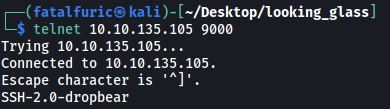

Looks like these ports are running SSH as well! With that, let's try to connect using `ssh`. 

```
ssh -p 9000 root@10.10.135.105
```

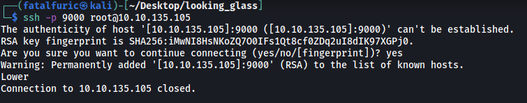

We get an interesting message: **Lower**

I first thought that we had to connect to a lower port, but this wouldn't make sense as I had connected to port 9000, which was the lowest port of the range. 

Let's try the highest port of the range:

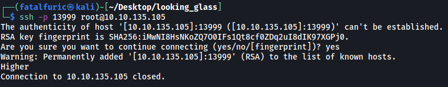

Now we get another message: **Higher**. Maybe it's reversed and I had to go the opposite direction as to what was returned? Basically higher = lower and lower = higher.

<br>

Using this logic and after much trial and error, I finally found the port that showed a different message. *(Note that the port differs every time the machine is rebooted.)*

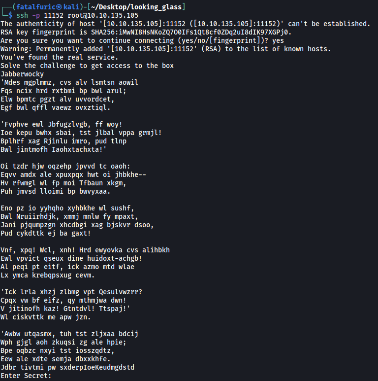

The message seems to be encrypted. Using an online cipher identifier (https://www.dcode.fr/cipher-identifier), I found out that the encryption was done using the **Vigenere Cipher**.

Luckily for us, **Boxentriq** provides a nifty Vigenere Cipher brute-forcing tool: https://www.boxentriq.com/code-breaking/vigenere-cipher

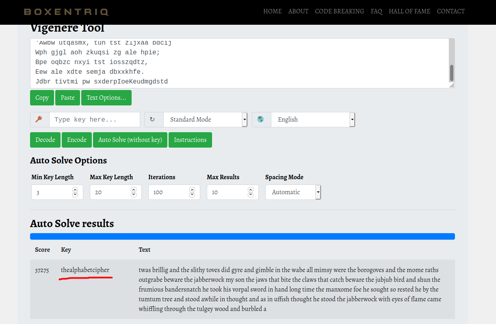

After some time, the key used in the encryption was found: **thealphabetcipher**

We can then use the key to decode the entire ciphertext:

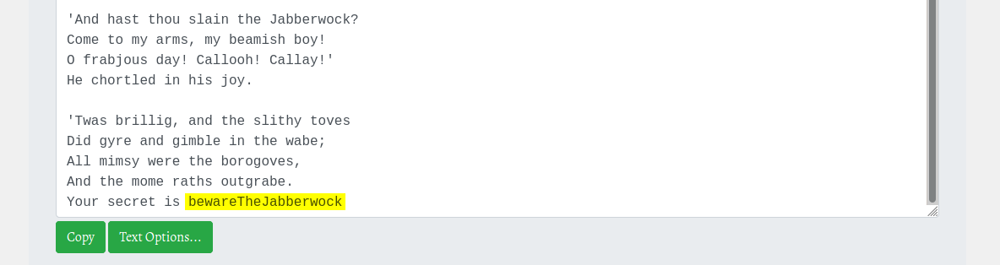

At the bottom of the decrypted message, we get the secret: **bewareTheJabberwock**

<br>

Let's now go back to the service and input the secret:

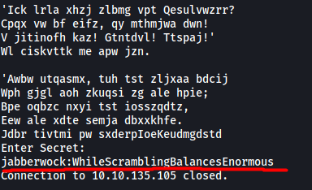

And we get a set of SSH credentials! With these creds, we can log into jabberwock's account on the SSH server (port 22). 

*(Note that the password also changes everytime the machine is rebooted!)*

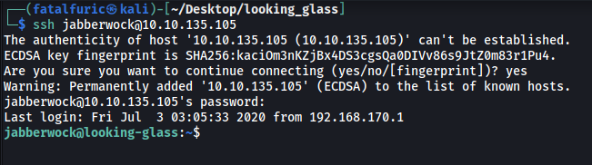

The user flag can be found in the **home** directory of **jabberwock**.

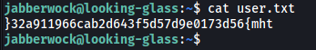

However, it seems to be reversed. All we have to do is reverse it back and we get the flag!

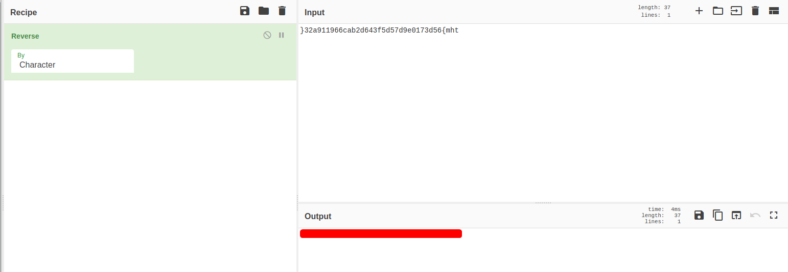

<br>

---

### [ Get the root flag. ]

 Now that we are in, let's do some manual enumeration.

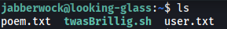

jabberwock's home directory contains two other files: **poem.txt** and **twasBrillig.sh**:

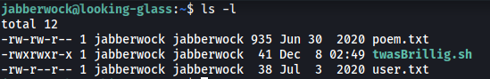

**poem.txt** did not contain anything useful.

**twasBrillig.sh** simply writes the contents of poem.txt to all users on the machine. What's important to note is that we can write to this script:

<br>

Next, from the **/home** directory, we know that there are **5** other users:

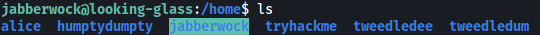

Unfortunately, we do not have the permissions to navigate to their respective directories.

<br>

Let's check jabberwock's **sudo privileges**:

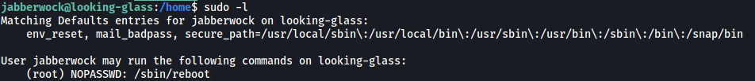

Interesting... jabberwock is able to run `/sbin/reboot` as root! Furthermore, we do not need to input a password when doing so. As the name suggests, this binary will reboot the entire machine.

<br>

After digging around further, I found something interesting in **/etc/crontab**:

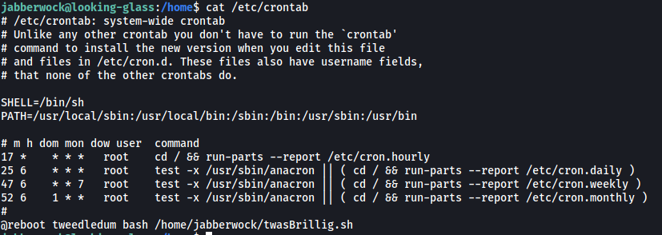

it seems that every time the machine is rebooted, the user **tweedledum** will run the **twasBrillig.sh** script! With this, let's overwrite the contents of twasBrillig.sh with a **reverse shell script**.

*(found from https://github.com/swisskyrepo/PayloadsAllTheThings/blob/master/Methodology%20and%20Resources/Reverse%20Shell%20Cheatsheet.md)*

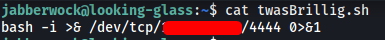

Now we just have to set up a netcat listener on our local machine, reboot the machine by running `/sbin/reboot` and we should be able to open a reverse shell as the user **tweedledum**.

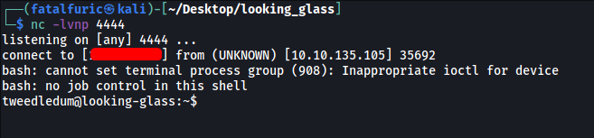

And we're in **tweededum's** account!

<br>

tweedledum's home directory contains 2 other files: **humptydumpty.txt** and **poem.txt**.

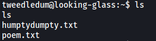

Once again, **poem.txt** does not contain anything particularly useful.

**humptydumpty.txt**, on the other hand, contains what seems to be hashes:

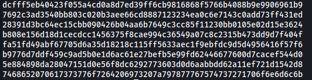

Let's use an online hash cracker to crack these hashes. My go-to website is https://hashes.com/en/decrypt/hash:

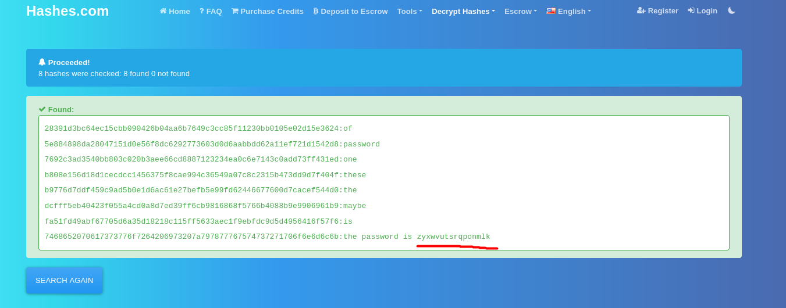

And we've gained another password: **zyxwvutsrqponmlk**

<br>

Since there is a user called **humptydumpty** on our target machine, perhaps this is his password? Let's try to `su` into his account *(you have to upgrade your shell into a fully-interactive one first)*:

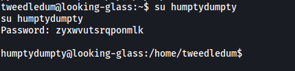

And we're now humpty dumpty!

humptydumpty's home directory only contains one file: **poetry.txt**:

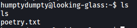

It did not contain anything useful, so let's skip it.

It took me awhile at this point before I realized something odd in **/home**.

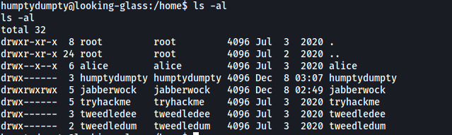

Notice how both **alice's** and **jabberwock's** home directories are **executable** by other users? This is a clear misconfiguration as this actually allows us to run commands within those directories, even though we cannot actually navigate into them. We'll ignore jabberwock as we have already compromised that account. Let's see if we can read out any files within alice's directory.

The first file that came to mind was alice's **private ssh key**. This is normally found in **~/.ssh/id_rsa**. However, we should not be able to read the file as it should be owned by alice. With that said, let's check if the file even exists, and if it does, what are its permissions.

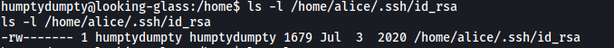

Nice! alice's private key file does exist and it's actually owned by humptydumpty! :smile:

With that, we can read out the key:

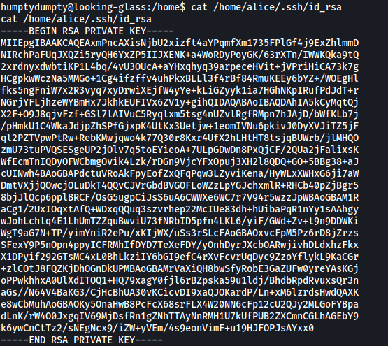

I then copied the key to a file on my local machine, changed the file's permissions to the correct value (either 400 or 600), then used it to log into alice's ssh account.

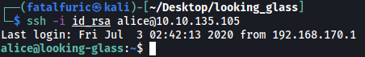

Now we're alice!

<br>

alice's home directory contains a single file: **kitten.txt**. Once again, it was simply telling a story so nothing we can use there.

We cannot check alice's **sudo privileges** as we do not know her password. However, there is another method to check.

Let's visit **/etc/sudoers.d**:

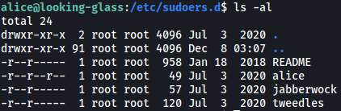

This directory contains the sudo privileges for users on the machine. As we can see, the file for alice is actually world-readable!

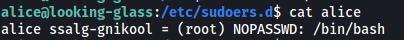

Turns out alice can actually run `/bin/bash` as root! No password is required as well. However, one thing to note is that we cannot simply run `sudo /bin/bash` as the **host** has been changed from '**looking-glass**' to '**ssalg-gnikool**', as seen in the file above. Hence, we have to specify the host when running `sudo`, which can be done with the `-h` option.

With that, all we have to do is to run the following command:

```
sudo -h ssalg-gnikool /bin/bash
```

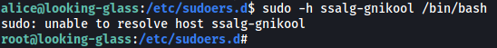

And we're now in root's account! 

The root flag can be found in **/root**.

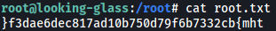

It has been reversed again, so lset's reverse it back and obtain the flag:

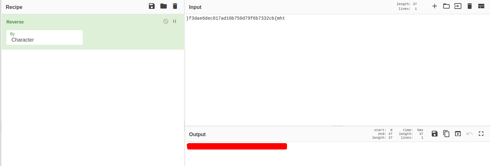
