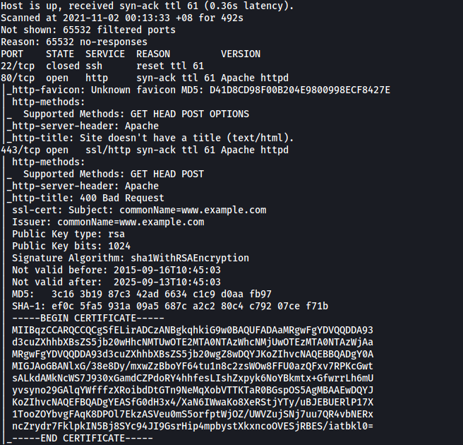
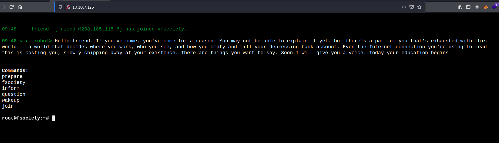

# Mr Robot CTF

##### Written: 03/11/2021

##### IP Address: 10.10.7.125

======================

### What is key 1?

Let's start off with an **Nmap** scan on the target machine. We run the scan with standard scripts loaded and version enumeration enabled. We can also do a full scan on all ports.

```
sudo nmap -sC -sV -vv -T4 -p- 10.10.7.125
```

**Results:**



From the results, we can see that there are **two** ports:

**Port 22**: SSH server (closed)

**Port 80**: HTTP Web Server

<br>

Let's first take a look at the HTTP web page:




```
wpscan --url 10.10.242.214 --enumerate u --users-list /home/fatalfuric/Downloads/fsocity.dic -t 50

wpscan --url http://10.10.90.145 -U elliot -P /usr/share/wordlists/rockyou.txt -o wpscan_password_result
```

**Results:**


