# Agent Sudo

#### IP Address: 10.10.63.185

<br>

**Deploy the machine**

Done.

<br>

**Enumerate the machine and get all the important information**

**How many open ports?**

I ran a basic nmap scan (top 1000 ports).

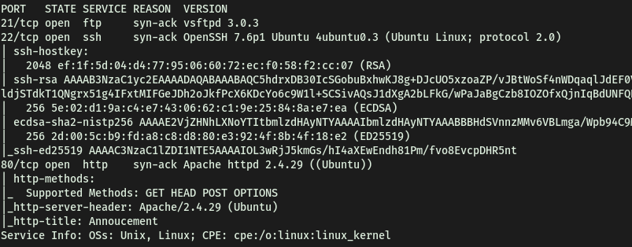

Seems like **ftp**, **ssh** and a **web server** is up and running.

No of open ports: **3**

<br>

**How do you redirect yourself to a secret page?**

Let's check out that webserver.

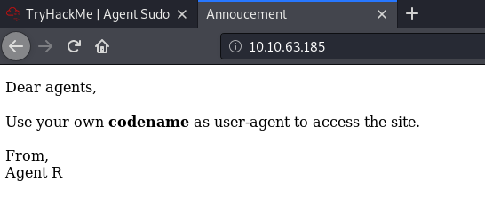

Interesting. Let's run a gobuster directory brute-force to see if we can access a login page within the site. I wanted to try adding extensions to the search list, and we can do this using the '**-x**' option, followed by the extensions to check for! Command used:

```
gobuster dir -u http://10.10.63.185/ -x .php,.html -w /usr/share/wordlists/dirbuster/directory-list-2.3-medium.txt
```

In the mean time, I checked the source code and console to see if there were any hidden information we can use. No luck there.

 <br>

Gobuster wasn't giving any promising results, so I thought of using the information given on the main page. They mention using the logging in to the webpage with the agent's name as the user-agent. I found some useful information on this website: https://betanews.com/2017/03/22/user-agent-based-attacks-are-a-low-key-risk-that-shouldnt-be-overlooked/

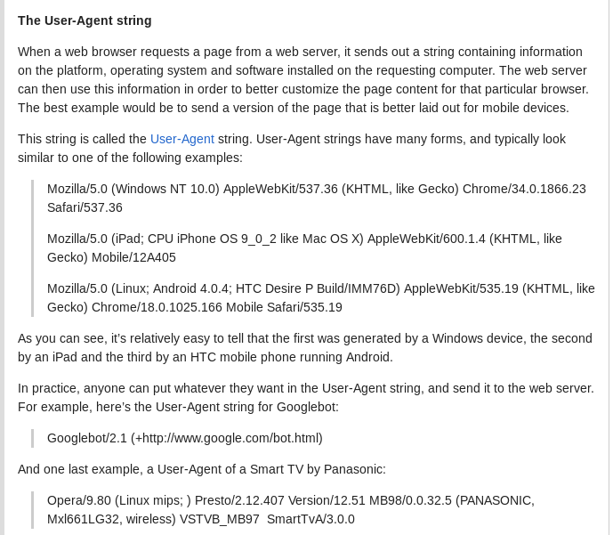

<br>

We can redirect ourself to a secret page through the **user-agent**.

<br>

**What is the agent name?**

Let’s use **Burpsuite** to intercept the request and change the user-agent! 

Intercepted Request:

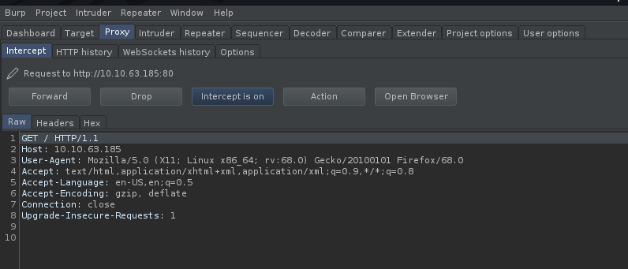

We can see the **User-Agent: Mozilla/5.0 (X11; Linux x86_64; rv:68.0) Gecko/20100101 Firefox/68.0**

We will send this to repeater so that we can change the user-agent field multiple times. From the webpage, we know that there is a agent called 'Agent R'. Trying that, it seems like nothing happens.

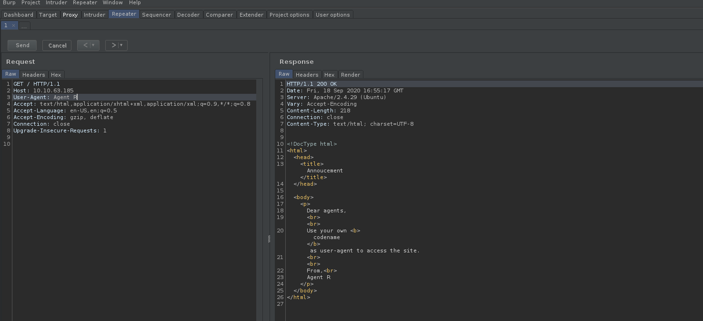

After trying out a few variations, I managed to obtain new info with just changing the field to '**R**'!

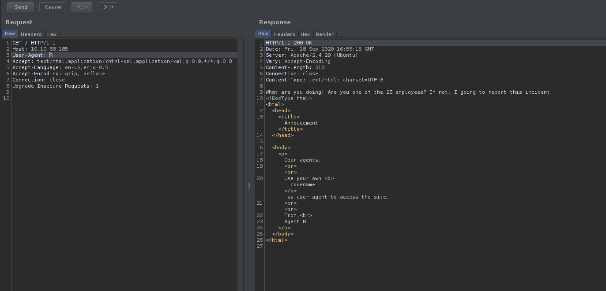

Looks like to access the agent's pages, we just have to change the user-agent to the agent's codename/letter accordingly. It is also mentioned that there are 25 employees… Minusing 'R', that would account for the rest of the english alphabet. Does that mean that every letter has an existing agent page?

I will brute-force through every alphabet using the '**Intruder**' feature of Burpsuite.

I first send the intercepted request to Intruder. Then, I set a simple payload of all the alphabets in uppercase (A-Z). I highlight the location in which I want Intruder to set the payload (User-Agent field). Once that is done, I can just start the attack!

<br>

Result:

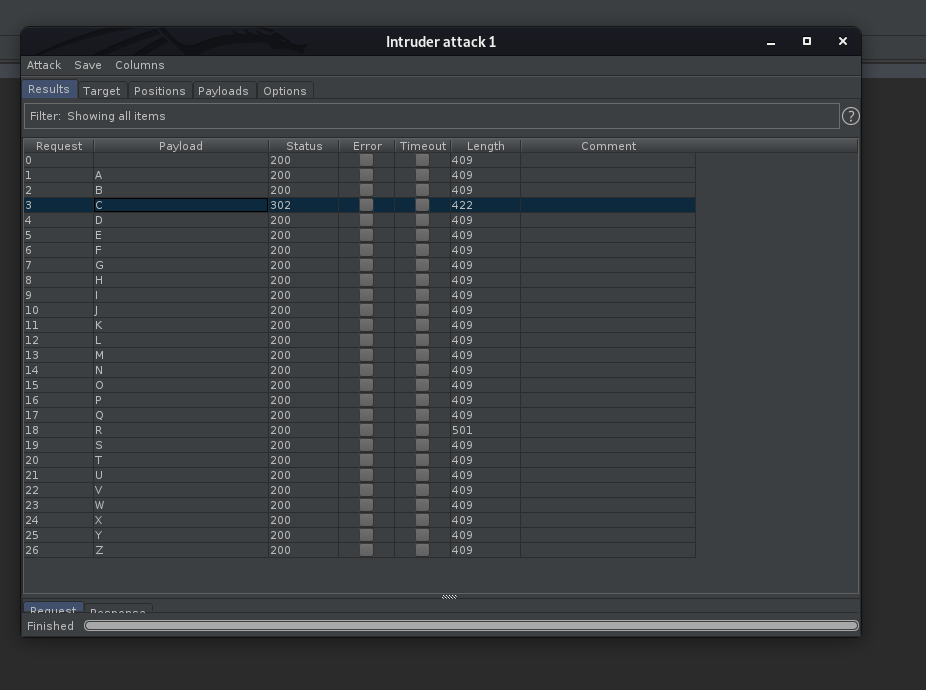

With this, I can look through all of the responses. 

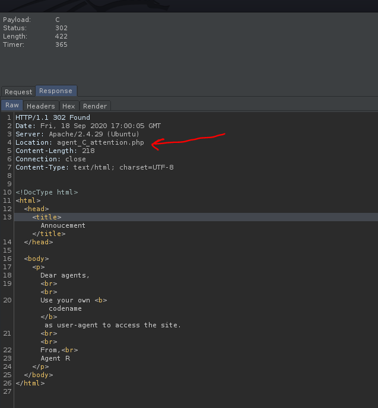

Bingo! When '**C**' is used as the user-agent, I get a redirect code from the webserver, bringing me to '**/agent_C_attention.php**'. Let's check it out:

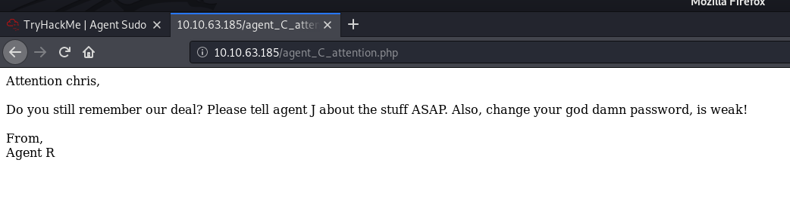

Now I know agent C's real name! Along with the fact that his password is weak, I can probably brute-force our way into the **ssh/ftp** server that is also running. Agent J is also mentioned. Interesting stuff.

Agent's name: **chris**

<br>

**Done enumerate the machine? Time to brute your way out**

**FTP password**

First, let's try to see if anonymous login is enabled.

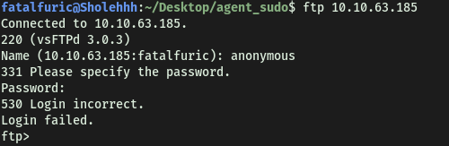

Looks like it's not. Since I know a potential password (chris), I will use **Hydra** to crack the password for the ftp server.

***NEW IP ADDRESS: 10.10.54.221***

 <br>

Command used: 

```
hydra -l chris -P /usr/share/wordlists/rockyou.txt -o ftp_pass ftp://10.10.54.221
```

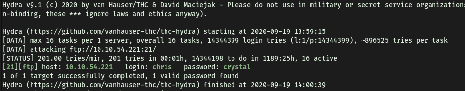

Password found: **crystal**

<br>

**Obtain the Zip file password**

With the password cracked, I can now login as chris into the ftp server.

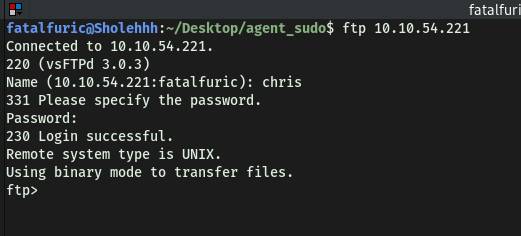

Looking at the contents of the ftp server:

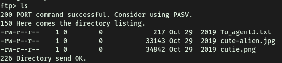

Using **pwd**, I can see that this is the root directory. Hence, looks like there isn't any further directories within the ftp server to enumerate. I will now download all of the files in the current directory to my local machine, using the '**get**' command.

<br>

Looking at the text file:

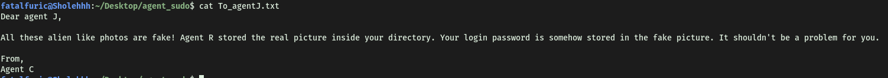

Clearly, there is some secret data embed within the photos.

There doesn't seem to be any zip files though…Perhaps the zip file is embed in one of the images. 

Before I tried extracting the data, I first did some basic checks. I used the command '**strings**' to check for any human-readable strings within the image files. However, there was nothing of interest.

Next, I used **exiftool** to extract the metadata from the images. However, there was also nothing of interesting there. With that, I decided to move on to using steganography tools to extract any hidden data within the images!

 The process of trying to extract secret contents from the image files took quite some time, as this was the first time I am doing this. However, I learnt a lot and got to try various tools! The tools I tried were: **steghide**, **stegcracker**, **zsteg**, **binwalk**.

Also I learned that **steghide** only works for **JPEG, BMP, WAV and AU** files. If we want to potentially extract data from **PNG** files, we can use another tool called **zsteg**!

I first tried using **steghide**:

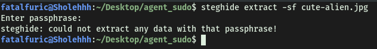

I tried just inputting an empty passphrase, but no data could be extracted. So the next thing I did was to use stegcracker to try and crack the passphrase. Note that stegcracker is a python module, so it has to be run with "**python3 -m stegcracker …**"

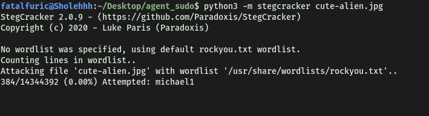

I let it run for some time, but I soon stopped it as no passphrase was found.

Next, I decided to try working on the '**cutie.png**' file. I used **zsteg** to try and extract any hidden data from within the file. I used the '**-a**' tag to denote to use all methods:

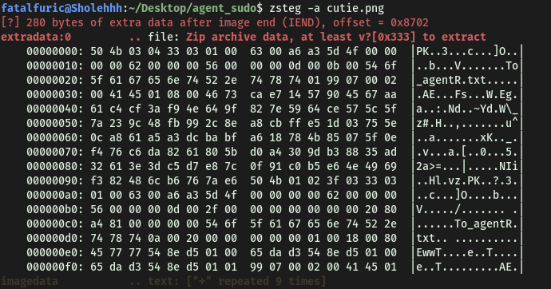

However, it was unable to find any hidden data within the photo, as if there was, then there would be more content under the '**imagedata**' section. However, one interesting thing is that at the '**extradata**' section, it does mention '**file: Zip archive data…**' Is this the zip file that I have been looking for? With that said, I was unable to find out a way to extract it, if that really was the case.

Next, I tried using **binwalk,** which is another tool for searching binary files like images and audio files for embedded files and data. I will use the '**-e**' tag to automatically extract any hidden data.

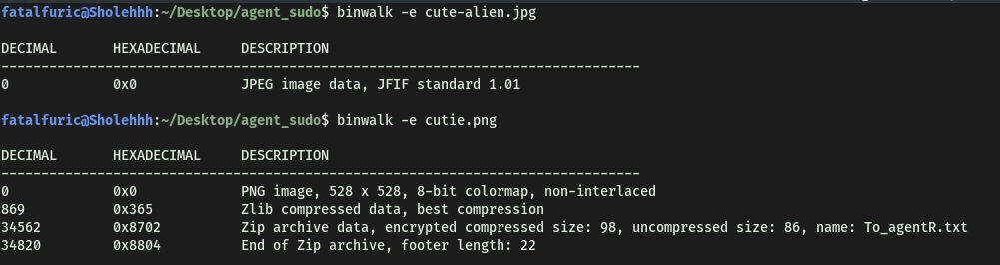

We did it! I managed to extract the zip file (**8702.zip**) within the 'cutie.png' file. Let's try to open it:

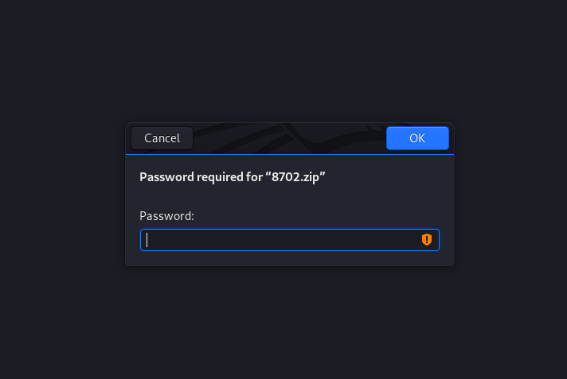

Looks like I need a password to unzip the file. I can use **John The Ripper** to try and brute-force this password. First, I will need to use the **zip2john** tool to convert the zip file into one that can be cracked by John.

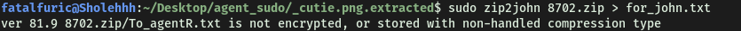

After this, I can just run John on the **for_john.txt** file that was outputted.

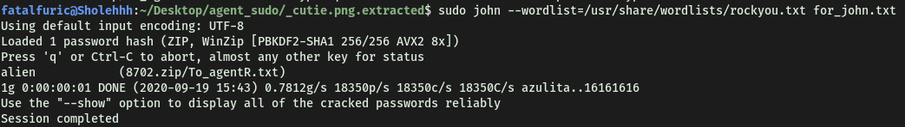

Using the rockyou.txt wordlist, I managed to obtain the zip file password: **alien**

 <br>

**Obtain the steg password**

After extracting the zip file, I managed to obtain the text file within: '**To_agentR.txt**'.

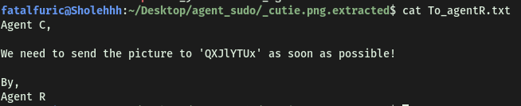

The weird phrase in the text file could be the passphrase of the "**cute-alien.jpg**" file!

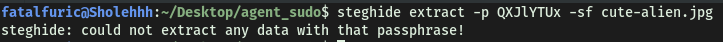

Oops… looks like it isn't.

 <br>

I figured that it was some sort of code then, but I was unsure of what encoding was used to create that phrase. I tried using **crackstation** to see if it was a hash format, but I should have known then it wasn’t based on the length itself. I then tried using **caesar rotation ciphers** but that didn't yield anything as well. At the end, after referring to a write-up, I realised it was just simple **base64 encoding**! I then decoded it in the command-line:

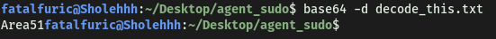

*(I had to put the phrase in a text file first!)*

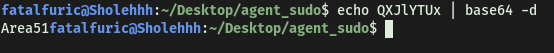

*(This method can also be done)*

Looks like we got the passphrase: **Area51**

<br>

**Who is the other agent (in full name)?**

I then used **steghide** (once again) to extract the hidden data within the '**cute-alien.jpg**' file.

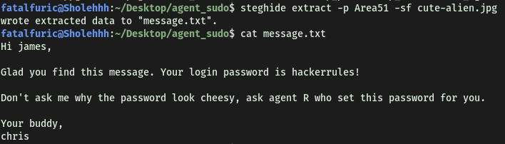

We found agent J's name: **James**

<br>

**SSH password**

His password is: **hackerrules!**

<br>

**You know the drill.**

**What is the user flag?**

With James's username and password, I can log into ssh with his account:

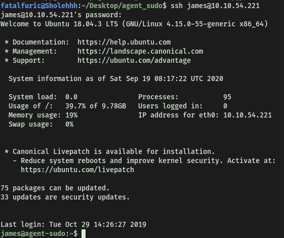

I'm in!

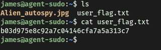

<br>

**What is the incident of the photo called?**

I noticed another JPEG file called '**Alien_autospy.jpg**'. Seeing as python3 is installed on the remote machine, I can set up a simple python http server, and download that image file from my local machine. 

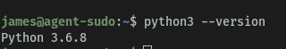

However, I wanted to practice using the '**scp**' command more. To download the image file from the ssh server with scp, I run the following computer on my local machine:

```
scp james@10.10.54.221:/home/james/Alien_autospy.jpg /home/fatalfuric/Desktop/agent_sudo
```

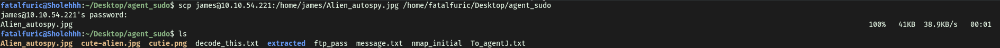

<br>

The image:

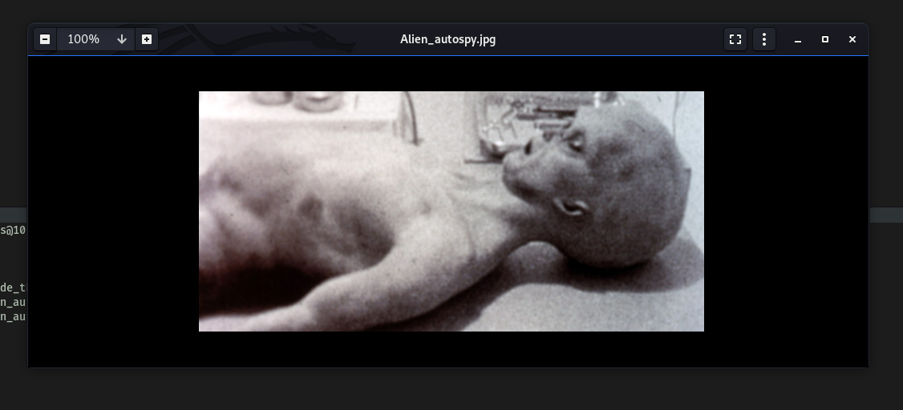

First thing I thought to do was to use google reverse-image search. This was the following results:

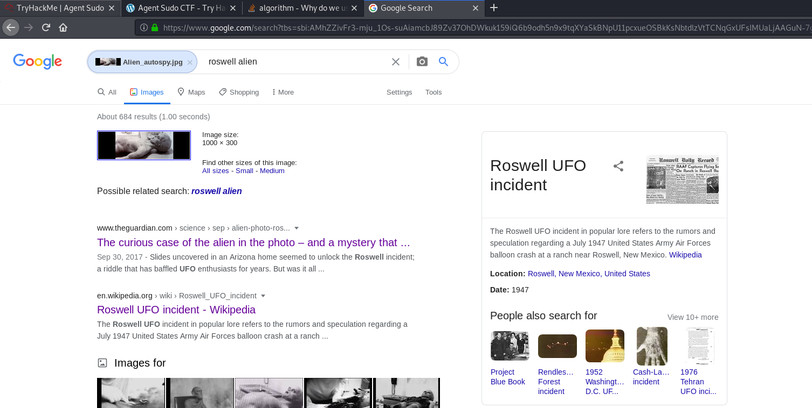

I tried inputting the answer as "**Roswell UFO incident**", but that was not it.

After looking at numerous different articles, I decided to use the hint, which mentioned **fox news**. Searching for fox news articles on the matter, I came across this article:


Incident of the photo: **Roswell Alien Autopsy**

<br>

**Enough with the extraordinary stuff? Time to get real.**

**CVE number for the escalation (Format: CVE-xxxx-xxxx)**

First, I checked the sudo privileges that James has on the machine:

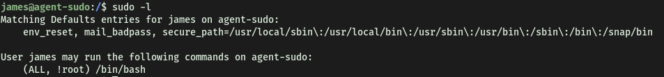

The '**(ALL, !root)**' tells me that James can run programs as any other users **OTHER THAN ROOT**. This means that he does not have the permission to run **/bin/bash** as root. Let's try it regardless:

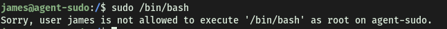

Expected. Doing a simple google search, I found the following exploit on **exploit-db**.

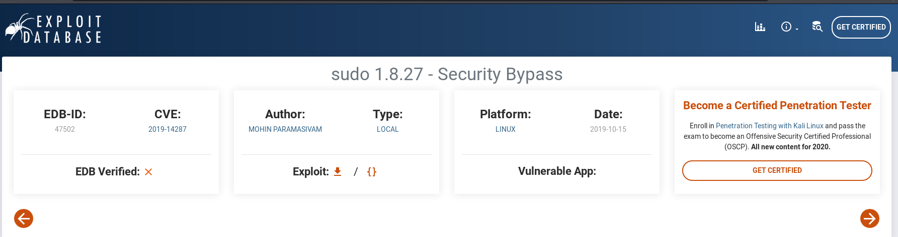

This is the exploit I will be using to allow us to run /bin/bash as root!

CVE number: **2019-14287** 

<br>

**What is the root flag?**

One thing to note is that this exploit only works for **Sudo < 1.2.28**. Let's check our sudo version on the remote machine. 

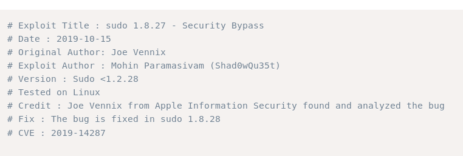

This can be done with '**sudo -V**'

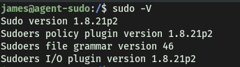

Looks like the exploit will work! This is how the exploit works:

It works by using the **-u** option when running sudo, which specifies a user/user ID to run sudo as.

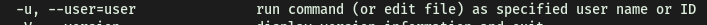

In this case, for these outdated versions of sudo, when we use **userid = -1**, sudo will incorrectly treat the userid as **0** instead. Since userid 0 belongs to root, that means that we will actually run the command as root!

Let's carry out this exploit:

(Note that when using ID as input, you need to use the **#** prefix)

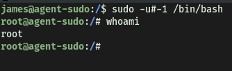

And we have root access!

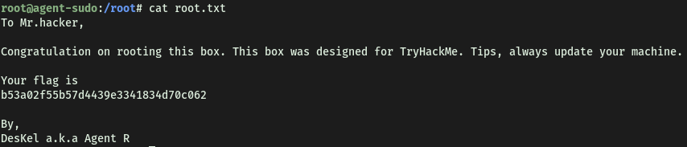

<br>

**(Bonus) Who is Agent R?**

**DesKel**

