# IGNITE

##### Written: 06/09/2020

##### IP Address: 10.10.162.4

<br>

First, I ran a basic nmap scan (only most common ports) on the machine, and saw that only **port 80** is open, serving **Apache httpd 2.4.18**.

An interesting to note is that there is a disallowed entry "**/fuel/**" in the robots.txt file.

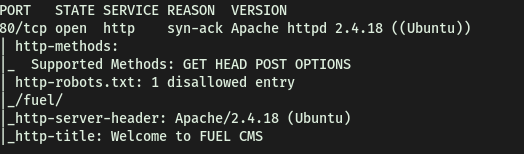

<br>

Navigating to the IP in my browser, I can see a FUEL CMS webpage:

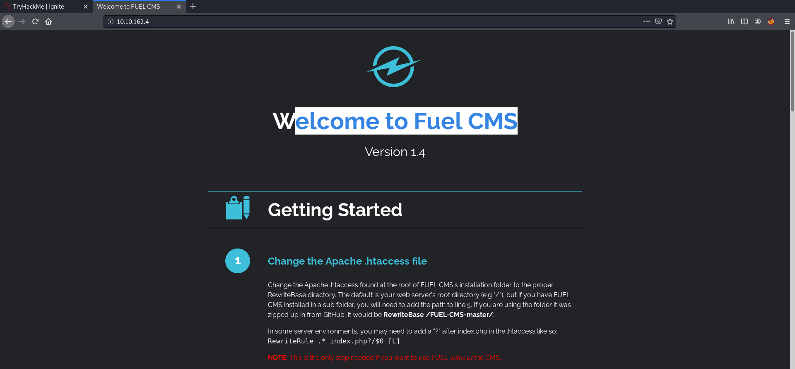

I first looked at the source code, but there was not any useful comments or other information that was left behind by the owner. I also made sure to check out the static files like the .css files, but nothing in there too.

I then proceeded to do a happy-path enumeration, clicking the various links the website had. While I was doing this, I also ran a **gobuster directory scan** on the website, using the dirbuster's medium-sized wordlist.

I found something useful during my happy-path enumeration. It seems that the default admin credentials for this service is **admin:admin**

We can also access the log in page in the **/fuel/** directory (discovered by nmap earlier)

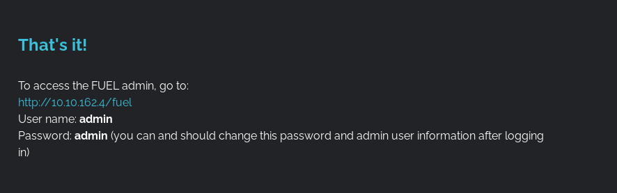

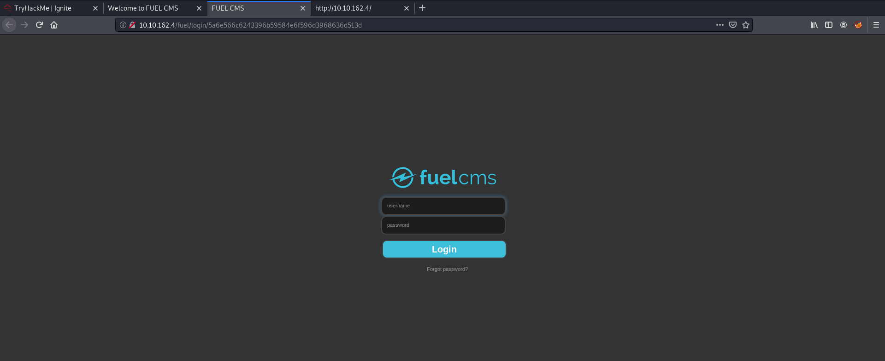

<br>

Fortunately, the admin did not change his/her password! Hence, I was able to log in with the default credentials:

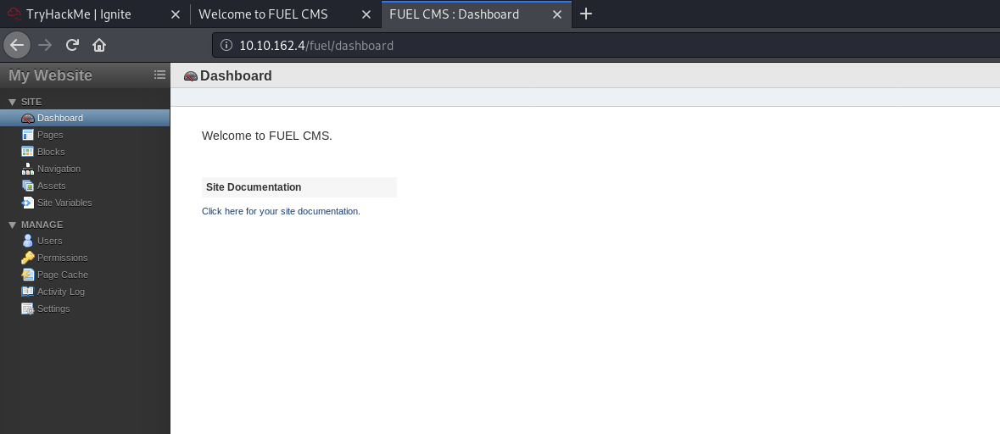

<br>

Clicking on "**Click here for your site documentation**" , I can see that the site is running **FUEL CMS 1.4**.

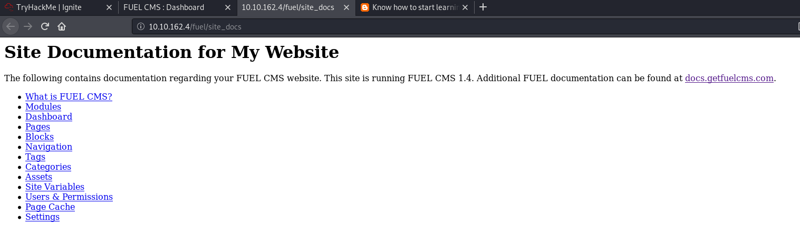

<br>

With the knowledge of the version number, I can start looking for an exploit using **searchsploit.** The command used is:

```
searchsploit fuel 1.4
```

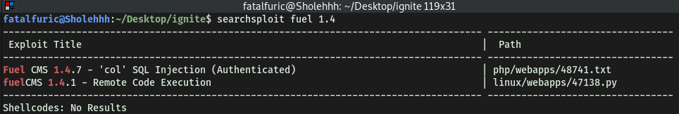

 The first exploit looked like something I could use, as I have the username and password to become an authenticated user.

To copy the exploit, I can use the command:

```
searchsploit -m php/webapps/48741.txt
```

to mirror/copy the exploit onto my local machine. From there, I can simply view it with any text editor. Since this is a .txt file, it is most probably not an executable file, but more of a guide on how to run the exploit on the site.

<br>

Looking at the exploit:

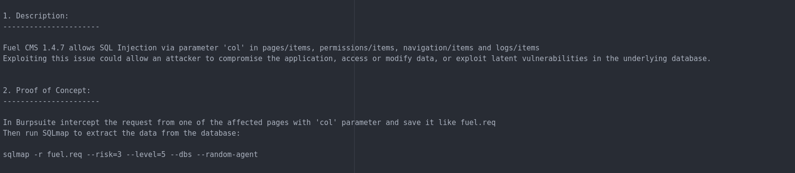

Seems like there is an SQL-injectable field in '**pages/items**', '**permissions/items**', '**navigation/items**' and '**logs/items**', via the parameter '**col**'. Hence, we will be using **sqlmap** to automate the process of injection.

At first, I tried the usual sqlmap command:

```
sqlmap -u http://10.10.162.4/fuel/pages/items --forms --dump --dbs --batch
```

However, it was not working:

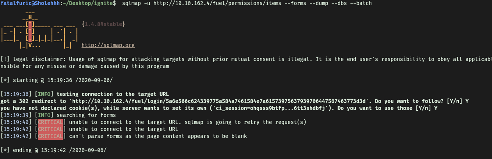

The reason why I could not locate the form, was because sqlmap does not have the authentication to access the admin page! Thus, as seen from the "**got a 302 redirect to …./login/…**" sqlmap is actually being redirected to the login page instead. 

To allow sqlmap to access the admin page, I needed to find out what is the cookie given to me after I log in as admin and pass that information along to sqlmap using the **--cookies** tag.

I used **Burp Suite** to look at the response given by the server after I logged in as admin:

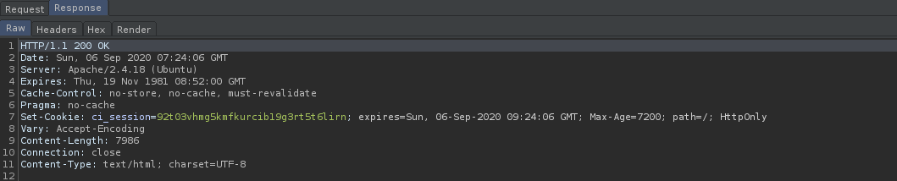

Hence, I can see that the authentication cookie: **ci_session=92t03vhmg5kmfkurcib19g3rt5t6lirn** has been given to my browser. Let's try sqlmap again.

Unfortunately, I was still having some errors with sqlmap. Hence, I decided to follow the exploit instructions more carefully. They instructed to intercept one of the affected pages with the 'col' parameter via burp, and save it as a **req** file for sqlmap to work on. 

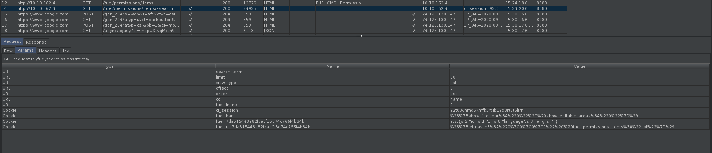

**No 14** was the request that I saved. As you can see, under the '**Params**' tab, there is the '**col**' parameter. All I had to do was to right click on the entry, and click '**Save item**'.

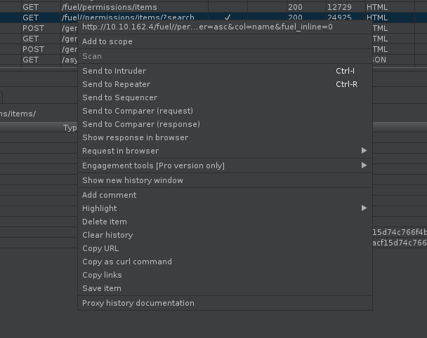

I saved it as '**fuel.req**', and used sqlmap as follows:

 ```
 sqlmap -r fuel.req --dbs --dump --batch --level=5 --risk=3 -p "col"
 ```

**notes:**

-r means that we are loading a HTTP request from a file

--level = number of checks to be done

--risk = type of checks (the higher the more riskier/heavier)

-p = sets the specific parameter to be tested (since col is specified to be the injectable param, then I would like to just focus on this)

<br>

**Unfortunately, the SQL Injection did not work**

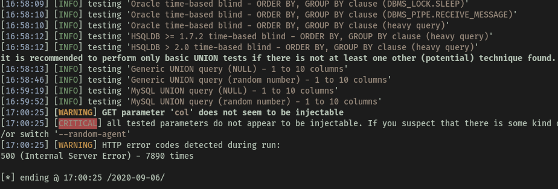

After hitting this dead end, I will be try looking at the other exploit that was provided by searchsploit instead.

<br>

Since the first exploit did not work, I shall be trying out the second exploit, which is supposed to let me gain RCE on the machine.


It also seems to be a python script. Let's take a look at the code:

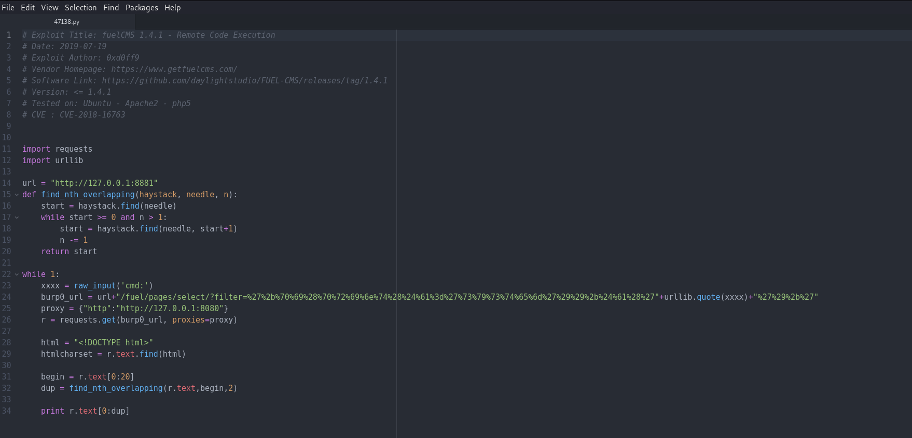

Seems like we just have to change the **url** to the victim's IP address. Also, the code runs the connection through burp proxy. I will try to remove that as I believe that is unnecessary. Below are the changes made:

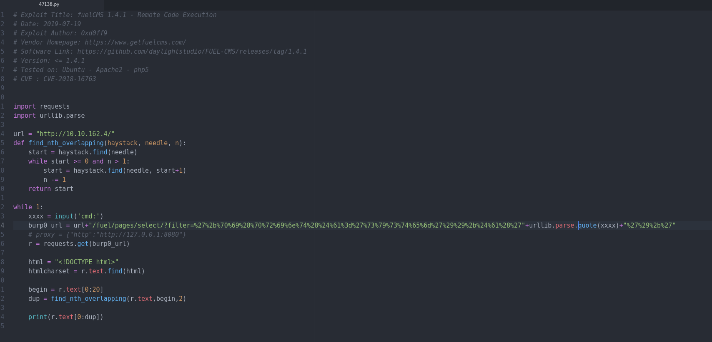

- **url** changed

- **raw_input()** changed to **input()**  -> for python3, input replaces raw_input

- **quote()** changed to **parse.quote()** -> for python3, we have to **import urllib.parse** and use **urllib.parse.quote()** instead

- **print r.text[0:dup]** changed to **print(r.text[0:dup])**

**Lesson learnt: As many exploits were written in past python versions, alterations are needed**

<br>

Running the exploit, we can see that it works:

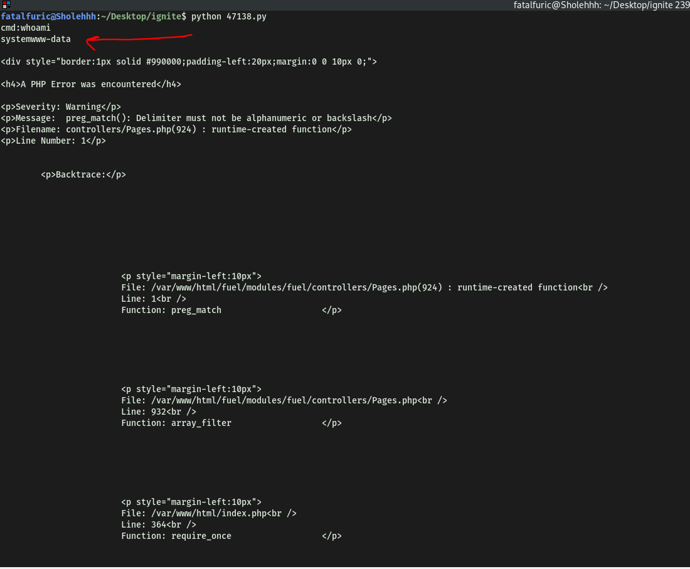

Now we will try to set-up a reverse shell. Using PenTestMonkey's reverse shell cheatsheet, I tried many different ones before I found one that worked:

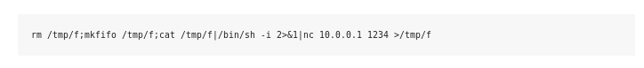

Running this on the exploit allowed me to gain access:

 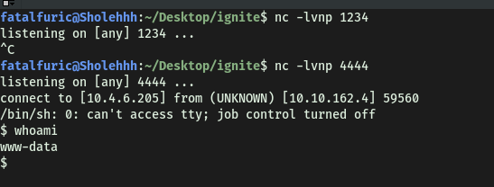


**First flag can be found in www-data's home directory.**

<br>

To find any potential privesc attack vectors, I went into **/dev/shm** and downloaded the **.linpeas.sh** script from my local host. This will help speed up the process of finding such attack vectors.

Looking through the privesc enumeration results, I come across a very interesting file! Let's take a look.

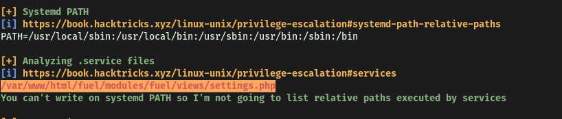

Exploring this file yielded nothing of interest. However, I decided to look around the neighbouring directories and files. 
After looking for a very long time, I finally found a file in **/var/www/html/fuel/application/config/database.php** that had the **root** password inside:

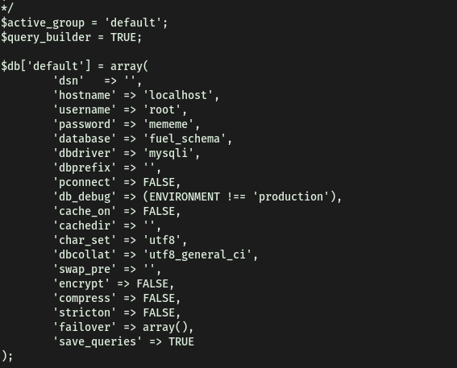

Hence, sometimes to find important information, we just have to be smart and think about which file might contain important information, and which file might not.

With the root password, I can log in as root and obtain the final flag in root.txt.

 <br>

When I was trying to log in via '**su root**', an error "**must be run from a terminal**" kept popping up, disallowing me from logging in as root. Doing some research, this seems to be because the shell spawned from our reverse shell code is just a simple one, and not a fully-interactive TTY shell.

In order to upgrade the shell, I can use python:

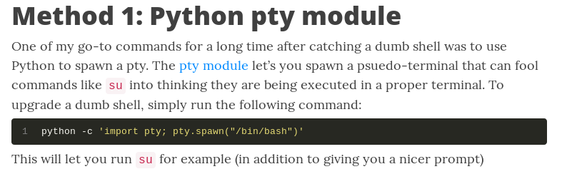

Using this code in my shell, it easily upgrades to a nicer one that looks more similar to the ones on my localhost. I can then su into root.

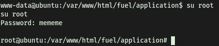

<Br>

**The final flag can then be obtained from root.txt in the home directory of root**

