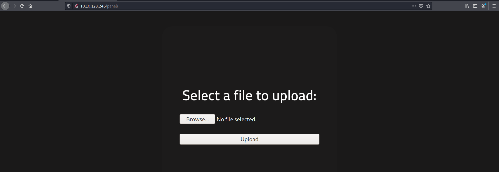
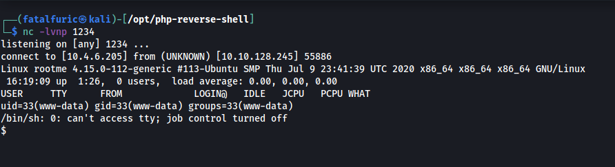

# RootMe

##### Written: 07/05/2021

##### IP Address: 10.10.128.245

First, I ran a basic NMAP scan on the machine (Top 1000 ports) using the command:

```
sudo nmap -sC -sV -vv -oN initial_scan.log 10.10.128.245 
```

From the nmap results, we can see that **2** ports are open: **22 (ssh)** and **80 (http)**:


Looking closely, I saw that the http server is running on **Apache/2.4.29**

Visiting the address in my web browser, I can see the following page:


After trying out some low-hanging fruit (eg /admin, /robots.txt, /login...), I decided to use Gobuster to enumerate possible directories that the web server is hosting. Gobuster is used as such:

```
gobuster dir -u http://10.10.128.245 -x "php,js" -w /usr/share/wordlists/dirbuster/directory-list-2.3-medium.txt 
```

The **'-x'** tag is used to indicate any extensions to add on to our attempts. In this case, I added .php and .js extensions as they are very commonly used. I also used the dirbuster provided wordlist for the enumeration. After some time, I obtained the following results:


As we can see, there is one very interesting directory called **'/panel'**. After accessing this directory in our web browser, we can see the following page:



Looks like we have a place where we can upload files! The first possible step that I thought of is to upload a .php file which sets up a reverse shell into our machine. There is already a php reverse shell template file available on Github by pentestmonkey. After downloading the php reverse shell template, all I had to do was to change the relevant fields within the template, such as the IP address of my machine.

After changing the relevant fields, I then uploaded the reverse shell .php file into the webserver. After doing so, we can see that it has been successfully uploaded by checking the **'/uploads'** directory:


Uh oh. Looks like they do not allow for .php code to be uploaded. We need to find a way to bypass this check.

After doing some research, I came upon this website which had a lot of useful information on upload bypassing:

https://www.exploit-db.com/docs/english/45074-file-upload-restrictions-bypass.pdf

From here, one way I learnt how web servers handled invalid file extensions was by providing either a **whitelist** or **blacklist**.

Blacklisting file extensions is when the server bans specific types of file extensions. Whitelisting file extensions is the opposite; specific types of file extensions are allowed.

One way to bypass blacklists is to change the .php to something less common, yet will still allow the file to be run as a php file. One extension is the **'.phtml'** extension. I decided to try changing the file extension to .phtml and uploaded onto the server.

It worked!

We can see that the file has been successfully uploaded onto the web server by checking the /uploads/ directory:

 


 When I click on this file, it should execute it. However, before doing so, I made sure to set up a Netcat server that will be waiting for the incoming connection from the web server. This can be done with the following command:

```
nc -lvnp 1234
```

In this case, the port that we wait on is set to **1234**, which we denoted earlier on within the php file.


Once I've done that, I then executed the uploaded php file. We have access!



With access gained, I now needed to find the **user.txt** file. After manually searching through some directories, I decided to speed up the process by using the **find** command. The command is as such:

```
find / -name user.txt
```

The results show that the **user.txt** file is actually located in the **/var/www/** directory:


With that, we have obtained the user flag!

#### User Flag = THM{y0u_g0t_a_sh3ll}


Now, we need to conduct our privilege escalation procedure. There are a few ways to go about this. Normally, I would import the **linpeas** enumeration script to help speed up and automate the process for me. However, the prompts given by the room state to search for files with SUID bit set. Hence, I shall do a manual search using the **find** command:

```
find / -perm /u=s
```

From the results, we can see that strangely, the **python** program has its SUID bit set! This means that when we run python, we are actually running as root:


To exploit this SUID-set Python binary, I then looked on GTFOBins to find out what I could do to break out of the restricted shell and create a new shell as root. After looking through GTFOBins, I came across this method:


Since we already have an existing SUID binary for python, we can skip the first line and execute the second line in the console.

After doing some research, I learnt what **os.execl()** does. It executes a new program which replaces the current process. The new executable is loaded into the current process and will have the **same process id as the caller.** In this case, since the caller is **root**, considering that python was run as root, we can then start up a new shell as root. 

The arguments to **os.execl()** indicate that we wish to replace the **'/bin/sh'** program with **'sh -p'**. The **-p** tag is used with **sh** to run in privileged mode.

After running the command, we get a new shell as root!


We can now access the 'root' directory in the system and obtain the root flag.

#### Root Flag = THM{pr1v1l3g3_3sc4l4t10n}

