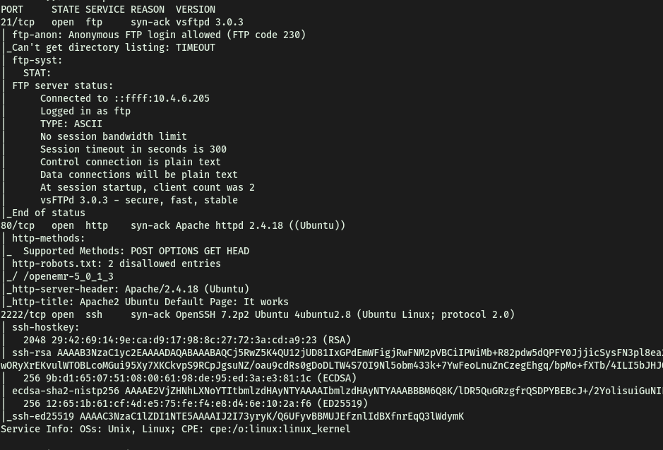
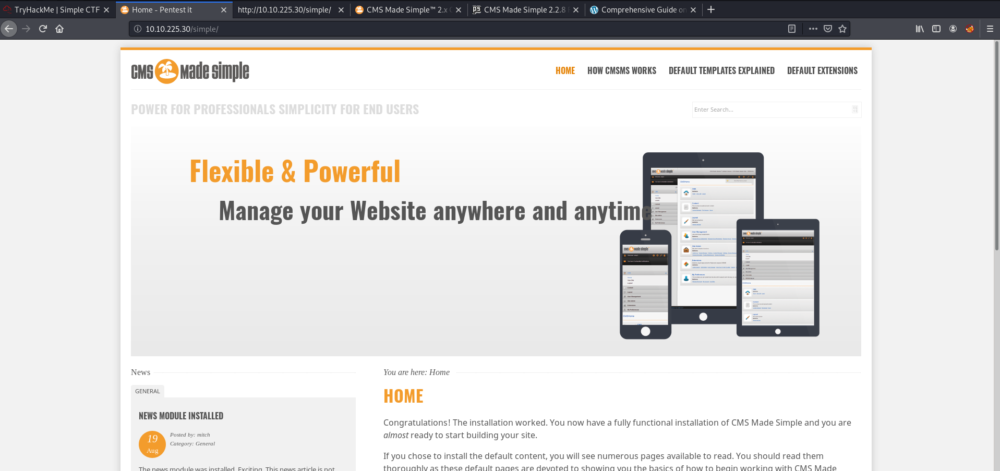
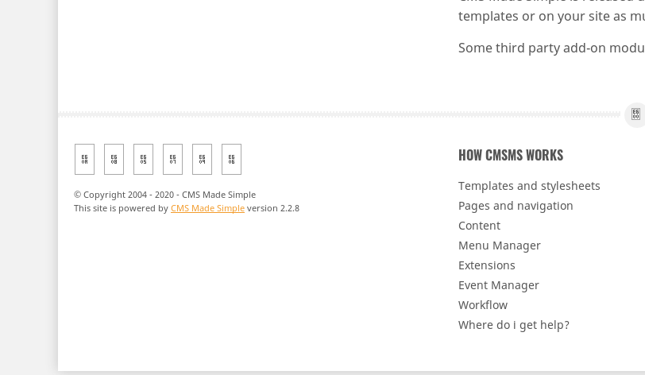
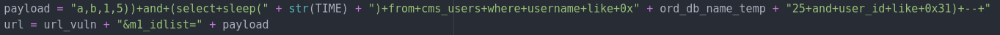
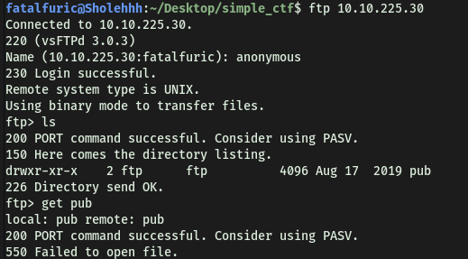
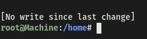

# Simple CTF

##### Written: 16/09/2020

#### IP Address: 10.10.225.30

<br>

**How many services are running under port 1000?**

Running a basic (only top 1000 ports) nmap scan, I obtained the following results:



No of services running under port 1000: **2**

<br>

**What is running on the higher port?**

**ssh**

<br>

**What's the CVE you're using against the application?** 

At first, I was trying to see if there was any exploit associated with the ftp server running on port 21. (**vsftpd 3.0.3**) However, I had no luck finding a good exploit to use.

Fortunately, my gobuster scan (which I had running earlier) revealed that there was a directory called "**simple**"!


Navigating to the directory on my web browser, I can see the following webpage:



Seems like a default **CMS MADE SIMPLE** page! CMS Made Simple is a free, open source content management system to provide developers, programmers and site owners a web-based development and administration area.

Scrolling down the page, I found out that the server is running **CMS Made Simple Version 2.2.8**.



With that, I can try finding an appropriate exploit!

<br>

Using **Searchsploit**, I obtained the following exploits:


Based on the version we found out, the only possible exploit we can use is:


To find out the CVE number, we can use the following command in Searchsploit!

```
searchsploit php/webapps/46635.py --examine
```

Result:


CVE we are using against the application: **CVE-2019-9053**

<br>

**To what kind of vulnerability is the application vulnerable?**

**sqli** (sql injection)

<br>

**What's the password?**

Before I ran the exploit, I tried to understand how it worked first. 

From what I could gather, the exploit worked by achieving unauthenticated blind time-based SQL injection through the m1_idlist parameter with the news module.


This is a good example of how blind sql injections work. I believe that the exploit works the same way.


<br>

Hence, by injecting certain sql commands into the m1_idlist parameter, the exploit can obtain information like the users, password hashes and even emails from the server!

<br>

Base url *(options.url is the input by the user)*


SQL injection payload



The entire process is repeated, with changing input from a dictionary of the different characters.


It repeats the SQL injection, checking for the response to determine whether the bit inputted is correct, before forming the final result. In this case, the final result being the username!


This logic applies for finding the passwords and emails.

After running the exploit, I obtained the username and password!


However, it seems that the password found is not actually the password, but a hash (md5 hash based on research). Hence, I will use the password cracker that comes with the exploit (nifty) to try and crack the password!

Unfortunately, I experienced a lot of issues with the password-cracking portion of the exploit. I could not seem to get it working… Fortunately, after reading some write ups, I found that I can use **hashcat** to do the decoding for us. The command used will be:

```
hashcat -a 0 -m 20 0c01f4468bd75d7a84c7eb73846e8d96:1dac0d92e9fa6bb2 /usr/share/wordlists/rockyou.txt
```

**notes:**

**-a sets the attack mode. In this case, mode 0 = straight mode**

**-m sets the hash format. In this case, format 20 = md5(salt.pass)**


IMPORTANT:

**Even though we know that the salt prepends the password, in hashcat, the way we enter the salt & password combo must be**: **hash:salt  (not salt:hash)**


<br>


Password: **secret**

<br>

**Where can you login with the details obtained?**

First, I made sure to check the ftp server first. Since anonymous login is enabled, I should not require a password to enter.



After entering the server, I could see nothing of interest. Hence, the next logical place to check would be the ssh server running at port **2222.**

It turns out that we can login into **ssh.**

<br>

**What's the user flag?**

After logging into the ssh server (using -p to specify port 2222), I could easily retrieve the user.txt.


<br>

**Is there any other user in the home directory? What's its name?**


Other user: **sunbath**

<br>

**What can you leverage to spawn a privileged shell?**

Checking my sudo privileges with '**sudo -l**', I can see that **vim** is the program that I can leverage to spawn a privileged shell. This is because I know that we can spawn shells within vim/vi.


<br>

**What's the root flag?**

First, we open up vim with sudo enabled.

Then, we press '**esc**' to activate command mode, before typing '**:sh**' to open up a shell.




<br>

We got root! :smile:


